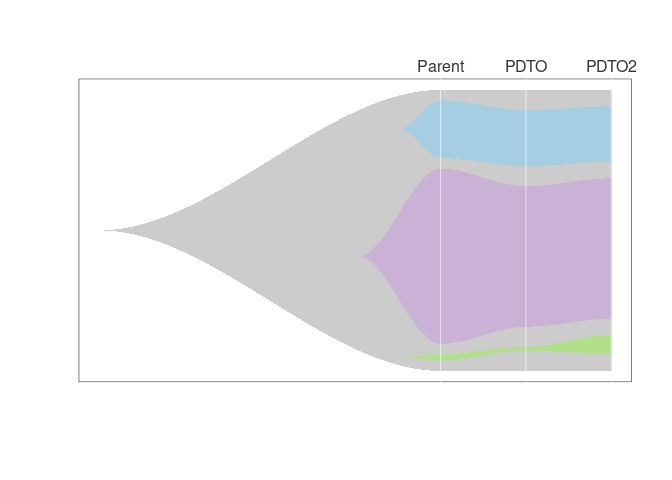
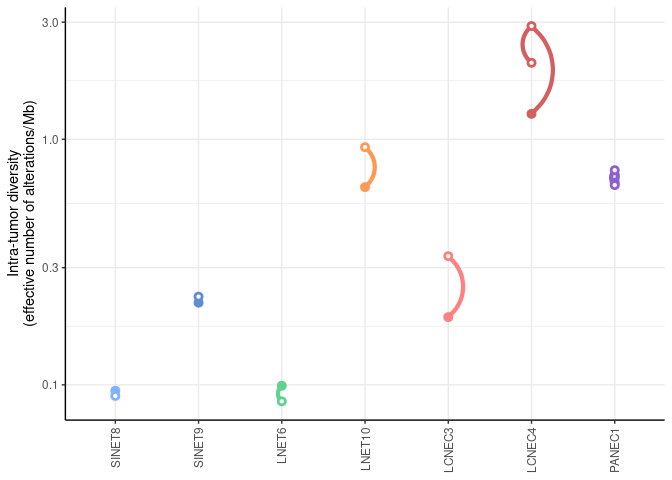
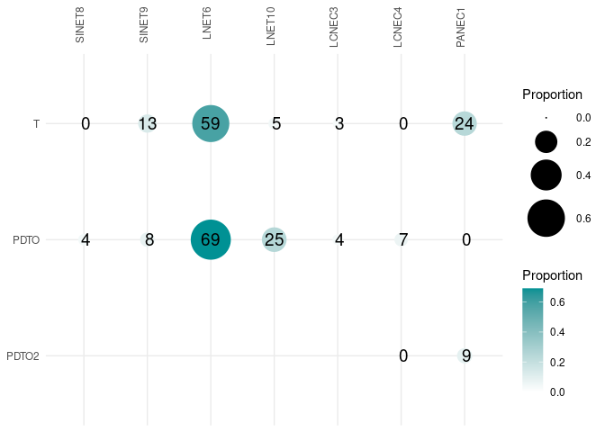

# PanNEN manuscript scripts
This repository contains the data and scripts used to produce the genomic Figures in the panNEN organoids manuscript Dayton et al. (In press; https://www.biorxiv.org/content/10.1101/2022.10.31.514549v1) and its associated data note Alcala et al. biorxiv (2023; https://www.biorxiv.org/content/10.1101/2023.08.31.555732v1).

## Data pre-processing
We provide here the command lines used to process the RNA-sequencing and whole-genome sequencing (WGS) data. All processing was performed using the Nextflow pipelines freely available on the github account of the bioinformatics platform of the international agency for research on cancer (https://github.com/IARCbioinfo).

### RNA-seq

#### Step 1: mapping
We first map raw reads to the reference genome GRCh38 with annotation gencode v33 (CTAT library of April 062020, plug-n-play versions available at https://data.broadinstitute.org/Trinity/CTAT_RESOURCE_LIB/) using pipeline [IARCbioinfo/RNAseq-nf](https://github.com/IARCbioinfo/RNAseq-nf):
```
 nextflow run iarcbioinfo/RNAseq-nf -r v2.3 -with-singularity RNAseq-nf_v2.3.sif --output_folder RNAseq-nf_organoids -params-file params-RNAseq-nf.yml
```
where params-RNAseq-nf.yml contains the location of the reference genome file ref_genome.fa from the CTAT library (parameter ref), the location of the folder with the corresponding STAR index (parameter ref_folder), the location of the gencode v33 gtf file ref_annot.gtf from the CTAT library (parameter gtf), the location of a bed file with transcript locations (parameter bed) used by RSeQC, the mapping quality to be used by STAR for uniquely mapped reads (parameter STAR_mapqUnique: 60), and the reads trimming with cutadapt option enabled (parameter cutadapt: true).


#### Step 2: post-processing
We then do local realignment using pipeline [abra-nf](https://github.com/IARCbioinfo/abra-nf):
```
nextflow run iarcbioinfo/abra-nf -r v3.0 -with-singularity abra-nf_v3.0.sif --output_folder RNAseq-nf_organoids_abra  -params-file params-abra-nf.yml
```
where params-abra-nf.yml contains the location of the bam files (parameter bam_folder), the location of the same reference and annotation used for mapping with STAR (from the CTAT library; parameters ref and gtf), and junction and RNA modes enabled (parameters junctions: true and rna: true).

We finally perform base quality score recalibration using pipeline BQSR-nf:
```
 nextflow run iarcbioinfo/BQSR-nf -r v1.1 -with-singularity BQSR-nf_v1.1.sif --output_folder RNAseq-nf_organoids_abra_BQSR -params-file params-bqsr-nf.yml
 ```
where parameters-bqsr-nf.yml contain the location of the bam files (parameter input_folder), the location of the CTAT reference genome (parameter ref), and the location of lists of known snps (dbsnp_146.hg38.vcf.gz) and indels (Mills_and_1000G_gold_standard.indels.hg38.vcf.gz) from the GATK bundle (parameters snp_vcf and indel_vcf).

#### Step 3: expression quantification

```
nextflow run iarcbioinfo/RNAseq-transcript-nf -r v2.2 -with-singularity RNAseq-transcript-nf_v2.2.sif --output_folder RNAseq-nf_1pass_organoids_abra_BQSR -params-file params-4-RNAseq-transcript-nf.yml 
 ```

### WGS

#### Step 1: mapping
Alignment of reads to reference genome hg38 (using the decoy + alt genome hs38.fa from the [bwakit repository](https://github.com/lh3/bwa/blob/master/bwakit/README.md)), using pipeline [IARCbioinfo/alignment-nf](https://github.com/IARCbioinfo/alignment-nf) release v1.2 and its [singularity image](https://datasets.datalad.org/?dir=/shub/IARCbioinfo/alignment-nf):
```
nextflow run IARCbioinfo/alignment-nf -r v1.2 -with-singularity alignment-nf_v1.2.sif -params-file params-alignment-nf.yml --output_folder BAM_organoids
```
where params-alignment-nf.yml contains the location of the reference genome (parameter ref), GATK bundle file location parameters (snp_vcf dbsnp_146.hg38.vcf.gz, and indel_vcf Mills_and_1000G_gold_standard.indels.hg38.vcf.gz), specify the recalibration and alt options, and provide the path to the bwa postalignment script bwa-postalt.js from bwakit.

Note that this step performes quality controls with fastqc, samtools, and qualimap and the associated multiqc reports presented in [Alcala et al. 2023](https://www.biorxiv.org/content/10.1101/2023.08.31.555732v1).

#### Step 2: variant calling
##### Small variant calling
With Strelka2 using the pipeline [IARCbioinfo/strelka2-nf](https://github.com/IARCbioinfo/strelka2-nf) release v1.1 and its [singularity image](https://datasets.datalad.org/?dir=/shub/IARCbioinfo/strelka2-nf):
```
nextflow run IARCbioinfo/strelka2-nf -r v1.1 -with-singularity strelka2-nf_v1.1.sif -params-file params-strelka2-nf.yml --output_folder strelka2_somatic_organoids
```
where params-strelka2-nf.yml contains the parameters of the pipeline (AF: true, outputCallableRegions: true, mode: somatic, ref: location of hs38DH.fa from bwakit, input_file: path to tsv file with tumor and normal bam file locations), 

With mutect2 using the pipeline [IARCbioinfo/mutect2-nf](https://github.com/IARCbioinfo/mutect-nf) release v2.2 and its [singularity image](https://datasets.datalad.org/?dir=/shub/IARCbioinfo/mutect-nf)
```
nextflow run IARCbioinfo/mutect-nf -r v2.2 -with-singularity mutect-nf_v2.2.sif -params-file params-mutect2-nf.yml
nextflow run IARCbioinfo/vcf_normalization-nf -r v1.1 -with-singularity vcf_normalization-nf_v1.1.sif -params-file params-vcf_normalization-nf-organoids-somatic-mutect.yml --output_folder mutect2_somatic_organoids_normalized
nextflow run IARCbioinfo/table_annovar-nf -r v1.1 -with-singularity table_annovar-nf_v1.1.sif -params-file params-table_annovar-nf-organoids-mutect.yml --output_folder mutect2_somatic_organoids_normalized_annotated 
```
where params-mutect2-nf.yml contains the parameters of the pipeline (ref: location of reference hs38DH.fa, known_snp: location of Mutect2 bundle file af-only-gnomad.hg38.vcf.gz, snp_contam: location of Mutect2 bundle file small_exac_common_3.hg38.vcf.gz, 
tn_file: location of tsv file with tumor and normal bam file locations, estimate_contamination: true, filter_readorientation: false). params-vcf_normalization-nf-organoids-somatic-mutect.yml contain the parameters of the normalization step (ref: location of hs38DH.fa, vcf_ext: extension of VCF files), and (table_extension: vcf.gz, annovar_db: location of annovar database folder, annovar_params: '--codingarg -includesnp -protocol ensGene,exac03nontcga,esp6500siv2_all,1000g2015aug_all,gnomad30_genome,gnomad211_genome,gnomad211_exome,clinvar_20200316,revel,dbnsfp35c,dbnsfp31a_interpro,intervar_20180118,cosmic92_coding,cosmic92_noncoding,avsnp150,phastConsElements100way,wgRna -operation g,f,f,f,f,f,f,f,f,f,f,f,f,f,f,r,r -otherinfo' ).

##### Copy Number Variant calling
Copy number variant calling with pipeline [iarcbioinfo/purple-nf](https://github.com/IARCbioinfo/purple-nf/tree/dev_multi-sample) branch dev_multi-sample, using the same genome reference as for the mapping step:
```
nextflow run iarcbioinfo/purple-nf -r dev_multi-sample --tn_file input_purple-nf-multisample-vcf.tsv --cohort_dir / --ref references/hs38DH/hs38DH.fa --ref_dict references/hs38DH/hs38DH.dict --output_folder PURPLE_multisample_organoids --multisample_seg
```

##### Structural variant calling
Structural variant calling with pipeline [IARCbioinfo/sv_somatic_cns]() release v1.0 and its associated [singularity image]():
```
nextflow run iarcbioinfo/sv_somatic_cns -r v1.0 -with-singularity sv_somatic_cns_v1.0.sif -params-file params-sv-somatic-cnv-nf.yml
```
where params-sv-somatic-cnv-nf.yml contains the parameters of the pipeline (ref: location of hs38DH.fa, input_folder, tn_file: location of tsv file with tumor normal bam files, all_sv_cns: true).

## Data
The data folder contains tab-separated files with processed data:
- *gene_expression_PDTOs_parents.tsv* contains the final gene expression matrix, with read counts for the 59607 features and 47 samples sequenced in the Dayton et al. study
- *gene_expression_PDTOs_parents.tsv* contains the annotation of the 59607 features (gene name, ensembl ID, protein ID, gene type, etc)
- *small_variants_WGS_PDTOs_parents.tsv* contains the somatic variants called from WGS from Table S4 of Dayton et al. 2023
- *small_variants_drivers_RNAseq_PDTOs_parents.tsv* contains the somatic variants in driver genes called from RNA-seq from Table S4 of Dayton et al. 2023

## Rscripts
The Rscripts folder contains markdown files detailing R commands used to produce the figures. Major package dependencies are mentioned below; see a list of all dependencies at the beginning of each script.

### Figure 2. NET and LCNEC PDTOs retain histologic features and relative growth-rate of parental tumor subtypes
#### [Figure2D.md](Rscripts/Fig2/Fig2D.md)
- requires [ggridges R package](https://cran.r-project.org/web/packages/ggridges/)

Produces density plots of expression levels of *MKI67* in organoids and reference tumors (data in Table S1).


#### [Figure2E-F.md](Rscripts/Fig2/Fig2E-F.md)
- requires [trend R package](https://cran.r-project.org/web/packages/trend/index.html)

Produces plots of passage times, computes temporal trend tests and writes results (Table S1).


### Figure 3. High-purity NEN PDTOs recapitulate the gene expression of original tumors
#### [Figure3B_S3BCE.md](Rscripts/Fig3/Fig3B_S3BCE.md)
- requires [ggbeeswarm R package](https://cran.r-project.org/web/packages/ggbeeswarm/index.html)

Produces violin plots of gene expression for various markers from Table S2, producing Figure 3B, S3B, C, and E.


#### [Figure3CD_S3FGHI.md](Rscripts/Fig3/Fig3CD_S3FGHI.md)
- requires [umap R package](https://cran.r-project.org/web/packages/umap/vignettes/umap.html)
- requires [mixOmics R package](http://mixomics.org/)

Produces the unsupervised (UMAP representations) and supervised (PLS) analyses of lung and pancreatic NENs and small intestine NETs presented in Figures 3CD and S3F-I.


### Figure 4. NEN PDTOs retain genomic features of parental tumors
#### [Figure4BC_S4BC.md](Rscripts/Fig4/Fig4BC_S4BC.md)
- requires [maftools R package](https://https://bioconductor.org/packages/release/bioc/html/maftools.html)

Produces oncoplots of somatic alterations from whole-genome and RNA-seq data and tumor mutational burden plots. 


#### [Figure4D_S4D.md](Rscripts/Fig4/Fig4D_S4D.md)
- requires [circlize R package](https://jokergoo.github.io/circlize_book/book/)

Produces circos plots of copy number variants and structural variants in high-purity (Fig. 4D) and mixed (Fig. S4D) samples. 


### Figure 5. NEN PDTOs recapitulate the intra-tumor heterogeneity of the parental tumor
#### [Fig5_S5.md](Rscripts/Fig5/Fig5_S5.md)
- requires [DPclust R package](https://github.com/Wedge-lab/dpclust)

Produces Venn-Euler diagrams of shared variants (Fig. 5A and S5B) and joint plots of cancer cell fractions (CCFs).






### Figure 7. LNETs express EGFR
#### [FigureS7B.md](Rscripts/Fig7/FigS7B.md)
- requires [ggbeeswarm R package](https://cran.r-project.org/web/packages/ggbeeswarm/index.html)

Produces violin plots of EGFR gene expression from Table S2, producing Figure S7B.


### Data Note Figure 6. RNA-seq variant classification using a random forest algorithm
#### [DataNote_Fig6.md](Rscripts/DataNoteFig6/DataNote_Fig6.md)
- requires [caret R package](https://cran.r-project.org/web/packages/caret/index.html)

Produces ROC curve, confusion matrices, and feature importance metrics in Figure 6.


## Citations
Dayton*, Alcala, ... , Foll, Fernandez-Cuesta*, Clevers*. Druggable Growth Dependencies and Tumor Evolution Analysis in Patient-Derived Organoids of Neuroendocrine Cancer. biorxiv 2022. doi: https://doi.org/10.1101/2022.10.31.514549

Alcala*, Voegele, ..., Dayton, Foll*. Multi-omic dataset of patient-derived tumor organoids of neuroendocrine neoplasms. biorxiv 2023. doi: https://doi.org/10.1101/2023.08.31.555732

