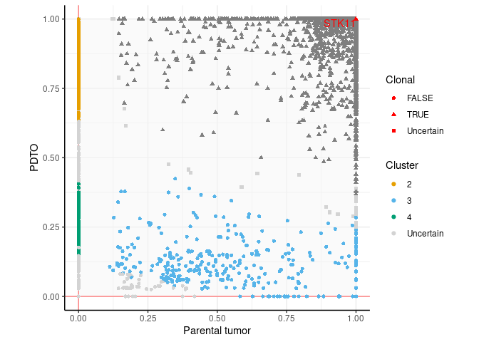

# PanNEN manuscript scripts
This repository contains the scripts used to produce the genomic Figures in the panNEN organoids manuscript Dayton et al. (Submitted).

## Rscripts
The Rscripts folder contains markdown files detailing R commands used to produce the figures. Major package dependencies are mentioned below; see a list of all dependencies at the beginning of each script.

### Figure 2. NET and LCNEC PDTOs retain histologic features and relative growth-rate of parental tumor subtypes
#### [Figure2D.md](Rscripts/Fig2/Fig2D.md)
- requires [ggridges R package](https://cran.r-project.org/web/packages/ggridges/)

Produces density plots of expression levels of *MKI67* in organoids and reference tumors (data in Table S1).

#### [Figure2E-F.md](Rscripts/Fig2/Fig2E-F.md)
- requires [trend R package](https://cran.r-project.org/web/packages/trend/index.html)

Produces plots of passage times, computes temporal trend tests and writes results (Table S1).

### Figure 3. High-purity NEN PDTOs recapitulate the gene expression of original tumors
#### [Figure3B_S3BCE.md](Rscripts/Fig3/Fig3B_S3BCE.md)
- requires [ggbeeswarm R package](https://cran.r-project.org/web/packages/ggbeeswarm/index.html)

Produces violin plots of gene expression for various markers from Table S2, producing Figure 3B, S3B, C, and E.

#### [Figure3CD_S3FGHI.md](Rscripts/Fig3/Fig3CD_S3FGHI.md)
- requires [umap R package](https://cran.r-project.org/web/packages/umap/vignettes/umap.html)
- requires [mixOmics R package](http://mixomics.org/)

Produces the unsupervised (UMAP representations) and supervised (PLS) analyses of lung and pancreatic NENs and small intestine NETs presented in Figures 3CD and S3F-I.

### Figure 4. NEN PDTOs retain genomic features of parental tumors
#### [Figure4BC_S4BC.md](Rscripts/Fig4/Fig4BC_S4BC.md)
- requires [maftools R package](https://https://bioconductor.org/packages/release/bioc/html/maftools.html)

Produces oncoplots of somatic alterations from whole-genome and RNA-seq data and tumor mutational burden plots. 

#### [Figure4D_S4D.md](Rscripts/Fig4/Fig4D_S4D.md)
- requires [circlize R package](https://jokergoo.github.io/circlize_book/book/)

Produces circos plots of copy number variants and structural variants in high-purity (Fig. 4D) and mixed (Fig. S4D) samples. 

### Figure 5. NEN PDTOs recapitulate the intra-tumor heterogeneity of the parental tumor
#### [Fig5_S5.md](Rscripts/Fig5/Fig5_S5.md)
- requires [DPclust R package](https://github.com/Wedge-lab/dpclust)

Produces Venn-Euler diagrams of shared variants (Fig. 5A and S5B) and joint plots of cancer cell fractions (CCFs).

### Figure 7. LNETs express EGFR
#### [FigureS7B.md](Rscripts/Fig7/FigS7B.md)
- requires [ggbeeswarm R package](https://cran.r-project.org/web/packages/ggbeeswarm/index.html)

Produces violin plots of EGFR gene expression from Table S2, producing Figure S7B.

## Citation
Dayton*, Alcala, ... , Foll, Fernandez-Cuesta*, Clevers*. 2022 Submitted.
