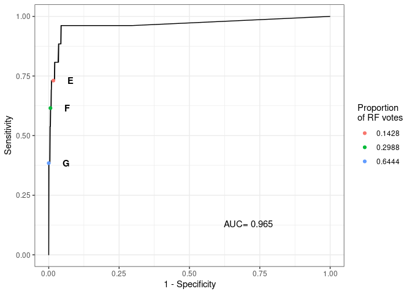

# Code to produce Fig. 6 from Alcala et al. (Submitted)
This code produces Fig. 6 from Alcala et al, which presents the results of a random forest (RF) classifier to determine the somatic status of small variants (SNVs and indels) called from tumor-only RNA-seq.

## load libraries 

```r
# for data wrangling
library(tidyverse)
library(readxl)
# for genomic data
library(SummarizedExperiment)
library(AnnotationDbi)
library(VariantAnnotation)
library(maftools)
# for machine learning
library(randomForest)
library(randomForestExplainer)
library(caret)
library(reprtree)
# for plotting
library(ggplotify)
library(ggrepel)
library(patchwork)
```

## Read files
### Read list of driver genes
Read list of driver genes from the literature from Table S4 of Dayton et al. 

```r
drivers = read_xlsx("TableS4.xlsx",sheet = 3,skip=2) %>% mutate(Type=as.factor(Type))
```

### Read RNA-seq variant calls
We open each RNA-seq VCF output from mutect and extract exonic mutations in driver genes

```r
vcf_Tonly_RNA = list.files("/data/lungNENomics/work/organoids/integration/small_variants_RNAseq/release2/",full.names = T,pattern = "vcf.gz$")

# select only VCF INFO fields used in the remainder of the script
info.fields = c("DP","MPOS", "TLOD", "Gene.ensGene", "GeneDetail.ensGene", "ExonicFunc.ensGene", "AAChange.ensGene",
                "Func.ensGene", "ExAC_nontcga_ALL", "CLNALLELEID","CLNDN","REVEL", "InterVar_automated" ,
                "cosmic92_coding","cosmic92_noncoding")

## open VCFs in succession and extract exonic variants in driver gene list, excluding synonymous SNVs
input.RNA.status.all = NULL
for(i in 1:length(vcf_Tonly_RNA)){
  RNA.file = TabixFile(vcf_Tonly_RNA[i])
  svp <- ScanVcfParam(info=info.fields)

  RNA_tmp = readVcf(RNA.file,genome = "hg38",param = svp)
  Samples = colnames(geno(RNA_tmp)$GT)
  RNA_tmp.exonic.coding = RNA_tmp[unlist(info(RNA_tmp)$Func.ensGene) %in%c("exonic") & !(unlist(info(RNA_tmp)$ExonicFunc.ensGene) %in% c("synonymous_SNV")) & unlist(info(RNA_tmp)$Gene.ensGene) %in% drivers$`Gene name`,]
  
  ## we format the input for the RF algo, in particular splitting geno columns with multiple values (AD)
  input.RNA.allsamples = c()
  for(j in 1:ncol(RNA_tmp.exonic.coding)){ #for each sample in the VCF
    RNA_tmp.exonic.coding.tmp = RNA_tmp.exonic.coding[,j]
    input.RNA = data.frame(variant = names(rowRanges(RNA_tmp.exonic.coding.tmp)) , 
                           Chr     = seqnames(rowRanges(RNA_tmp.exonic.coding.tmp)),
                           Start   = start(rowRanges(RNA_tmp.exonic.coding.tmp)), 
                           End     = end(rowRanges(RNA_tmp.exonic.coding.tmp)),
                           Ref = as.character(rowRanges(RNA_tmp.exonic.coding.tmp)$REF),
                           Alt = as.character(unlist(rowRanges(RNA_tmp.exonic.coding.tmp)$ALT)),
                           Sample = Samples[j],
                           RNA.AD1    = sapply(geno(RNA_tmp.exonic.coding.tmp)$AD,function(x)x[1]), 
                           RNA.AD2    = sapply(geno(RNA_tmp.exonic.coding.tmp)$AD,function(x)x[2]),
                           RNA.AF     = unlist(geno(RNA_tmp.exonic.coding.tmp)$AF),
                           RNA.DP     = geno(RNA_tmp.exonic.coding.tmp)$DP[,1]
                   )
    
  # add and reformat VCF info fields
  input.RNA = cbind(input.RNA , as.data.frame(info(RNA_tmp.exonic.coding.tmp)) )
  input.RNA = input.RNA %>% mutate(
    Func.ensGene = as.character(Func.ensGene),
    Gene.ensGene = str_replace(as.character(Gene.ensGene),"\\\\x3b",";") ,
    GeneDetail.ensGene = str_replace_all(str_replace_all( as.character( GeneDetail.ensGene),"\\\\x3d",":"),"\\\\x3b",";"),
    ExonicFunc.ensGene = as.character(ExonicFunc.ensGene),
    AAChange.ensGene = sapply( AAChange.ensGene, function(x) paste(x,collapse = ";")), 
    CLNDN = sapply(CLNDN, function(x) paste(x,collapse = "")), 
    cosmic92_coding = sapply(cosmic92_coding, function(x) paste(x,collapse = "")),
    cosmic92_noncoding = sapply(cosmic92_noncoding, function(x) paste(x,collapse = "")) )
  
  for(k in (1:ncol(input.RNA)) ) input.RNA[[k]] = unlist(input.RNA[[k]])
  
  ###check and repair missing values
  input.RNA$ExAC_nontcga_ALL[is.na(input.RNA$ExAC_nontcga_ALL)]  = 0
  
  # concatenate rows of each sample
  input.RNA.allsamples = rbind(input.RNA.allsamples,input.RNA)
  }
  # concatenate rows of each VCF
  input.RNA.status.all = rbind(input.RNA.status.all,input.RNA.allsamples)
}

# only keep damaging mutations
input.RNA.status.all = input.RNA.status.all[input.RNA.status.all$REVEL>=0.5 | input.RNA.status.all$REVEL==".",]
```

## Assign status to RNA-seq variants
We now compare RNA-seq variants with somatic and germline WGS variants to know the somatic status of each variant.

```r
# add status column and experiment column, and order categorical annotations from least to most damaging
input.RNA.status.all = input.RNA.status.all %>% mutate(status = "UNKNOWN", Experiment= str_remove(Sample,"[MNT]p*[0-9.]*$"),
                                                       cosmic92_coding_nonnull = cosmic92_coding!=".",
                                                       cosmic92_coding_lung = str_detect(cosmic92_coding,"lung"),
                                                       REVEL = as.numeric(REVEL),
                                                       ExonicFunc.ensGene = factor(ExonicFunc.ensGene,
                                                                                   levels=c("nonsynonymous_SNV","nonframeshift_substitution",
                                                                                            "nonframeshift_deletion","nonframeshift_insertion",
                                                                                            "frameshift_deletion","frameshift_insertion",
                                                                                            "stopgain","stoploss","startloss")),
                                                       InterVar_automated = factor(InterVar_automated,
                                                                                   levels=c("Benign","Likely_benign","Uncertain_significance",
                                                                                            ".","Likely_pathogenic","Pathogenic"))
                                                       )
```

```
## Warning: There was 1 warning in `mutate()`.
## ℹ In argument: `REVEL = as.numeric(REVEL)`.
## Caused by warning:
## ! NAs introduced by coercion
```

```r
# revel scores of . correspond to damaging variants (nonsense, indels, ...) so we give them a different score
input.RNA.status.all$REVEL[is.na(input.RNA.status.all$REVEL)] = -1

# read WGS small variants
smallmuts = read_xlsx("TableS4.xlsx",sheet = 1,skip=2) %>% mutate(ID = #paste(
                                                                       paste(paste(paste(Chromosome,Start_Position,sep = ":") ,
                                                                                         Reference_Allele , sep="_") ,Tumor_Seq_Allele2,
                                                                                   sep="/"),
                                                                  Experiment = str_remove(Tumor_Sample_Barcode,"[MNT]p*[0-9.]*$"))#, Tumor_Sample_Barcode,sep="_") )

# variants in a sample with WGS by default have the "NON-SOMATIC" status that covers both germline variants and sequencing artifacts
input.RNA.status.all$status[input.RNA.status.all$Experiment %in% smallmuts$Experiment] = "NON-SOMATIC"

# variants found in somatic WGS variants have the SOMATIC status
input.RNA.status.all$status[input.RNA.status.all$variant %in% smallmuts$ID] = "SOMATIC"

# check Statuses of experiments
table(input.RNA.status.all$status,input.RNA.status.all$Sample)
```

```
##              
##               LCNEC11M LCNEC11Mp3 LCNEC23Mp3 LCNEC3T LCNEC3Tp17.2 LCNEC3Tp24
##   NON-SOMATIC        0          0          0      89           89         89
##   SOMATIC            0          0          0       4            4          4
##   UNKNOWN           93         93         41       0            0          0
##              
##               LCNEC4T LCNEC4Tp24 LCNEC4Tp7 LNET10T LNET10Tp11 LNET10Tp4 LNET13T
##   NON-SOMATIC      71         71        71      78         78        78       0
##   SOMATIC           3          3         3       2          2         2       0
##   UNKNOWN           0          0         0       0          0         0      60
##              
##               LNET13Tp1 LNET14T LNET14Tp1 LNET15M LNET15Mp2 LNET16M LNET16Mp1
##   NON-SOMATIC         0       0         0       0         0       0         0
##   SOMATIC             0       0         0       0         0       0         0
##   UNKNOWN            60      45        45      77        77     113       113
##              
##               LNET16T LNET16Tp2 LNET18Tp2 LNET19T LNET19Tp2 LNET20M LNET20Mp2
##   NON-SOMATIC       0         0         0       0         0       0         0
##   SOMATIC           0         0         0       0         0       0         0
##   UNKNOWN         113       113        32      94        94      61        61
##              
##               LNET5T LNET5Tp2.2 LNET5Tp4 LNET5Tp7 LNET6T LNET6Tp1 PANEC1T
##   NON-SOMATIC    107        107      107      107     88       88      48
##   SOMATIC          1          1        1        1      0        0       1
##   UNKNOWN          0          0        0        0      0        0       0
##              
##               PANEC1Tp14 PANEC1Tp4 SINET12M SINET12Mp1.1 SINET12Mp1.3 SINET21M
##   NON-SOMATIC         48        48        0            0            0        0
##   SOMATIC              1         1        0            0            0        0
##   UNKNOWN              0         0      104          104          104       72
##              
##               SINET21Mp2 SINET22M SINET22Mp2 SINET7M SINET7Mp2 SINET8M
##   NON-SOMATIC          0        0          0      84        84     103
##   SOMATIC              0        0          0       0         0       2
##   UNKNOWN             72       60         60       0         0       0
##              
##               SINET8Mp2
##   NON-SOMATIC       103
##   SOMATIC             2
##   UNKNOWN             0
```

```r
# save results
save(input.RNA.status.all,file = "input.RNA.status.all.Rdata")
```

## Random Forest (RF) classification
### Train Random Forest algorithm
We train the classifier on variants with known status from WGS data

```r
# set seed for bagging
set.seed(1234)

# create input from mutations with known status with variant detected (AD2>0)
input = input.RNA.status.all %>% filter(status!="UNKNOWN",RNA.AD2>0) %>% mutate(status=factor(status))

predict.folds = c()
predict.folds.votes = c()
for(exp_tmp in unique(input$Experiment)){
  train.k = input %>% filter(Experiment!=exp_tmp)
  test.k  = input %>% filter(Experiment==exp_tmp)
  # train on all experiments except exp_tmp
  rf <- randomForest(status ~ ExAC_nontcga_ALL+REVEL+cosmic92_coding_nonnull+cosmic92_coding_lung+
                       MPOS+TLOD+RNA.DP+RNA.AF +InterVar_automated + ExonicFunc.ensGene, data=train.k,ntree=5000)
  # predict on retained experiment
  predict.test = predict(rf,newdata = test.k,type = "prob")
  predict.folds.votes = bind_rows(predict.folds.votes,bind_cols(predict.test, status=test.k$status,variant=test.k$variant))
}
```

### Evaluate the classification performance
We now compute confusion matrices and the ROC curve of the classification, for different thresholds

```r
# function to find status based on a threshold number of votes for the SOMATIC class
predict_thres<-function(thres){
  res = rep("NON-SOMATIC",nrow(predict.folds.votes))
  res[predict.folds.votes$SOMATIC>=thres] = "SOMATIC"
  res = factor(res,levels=c("SOMATIC","NON-SOMATIC"))
  return(res)
}

conf_mat.RF.l = lapply(sort(unique(c(predict.folds.votes$SOMATIC,1))),
                       function(x) confusionMatrix(predict_thres(x), factor(predict.folds.votes$status,,levels = c("SOMATIC","NON-SOMATIC")) ))
```

We compute the ROC curve as a function of the proportion of votes for the SOMATIC class, for each reported value of the proportion of RF votes for the SOMATIC class. We compute the AUC using the trapezoid rule.

```r
conf_mat.RF.stats = bind_cols(prob=sort(unique(c(predict.folds.votes$SOMATIC,1))), 
                              as_tibble(t(sapply( conf_mat.RF.l, function(x) x$byClass[1:2]))) )
AUC   = sum( diff(1-rev(conf_mat.RF.stats$Specificity))*
               ( rev(conf_mat.RF.stats$Sensitivity)[-1] + rev(conf_mat.RF.stats$Sensitivity)[-nrow(conf_mat.RF.stats)] )/2 )/sum(diff(1-rev(conf_mat.RF.stats$Specificity)))

ggROC = ggplot(conf_mat.RF.stats,aes(y=Sensitivity,x=1-Specificity) ) + geom_line() + 
  geom_point(data=conf_mat.RF.stats[c(124,138,151),],aes(col=as.factor(prob) )) + 
  geom_text(data = tibble(Sensitivity=c(0.13,conf_mat.RF.stats$Sensitivity[c(124,138,151)]),
                          Specificity=c(0.35,conf_mat.RF.stats$Specificity[c(124,138,151)])-0.06,
                          label=c(paste("AUC=",format(AUC,digits=3)),"E","F","G")),aes(label=label),fontface=c("plain","bold","bold","bold") )+
  labs(color="Proportion\nof RF votes") + theme_bw() + coord_cartesian(xlim=c(0,1),ylim=c(0,1))

ggROC
```

<!-- -->

```r
conf_mat.RF.high   = conf_mat.RF.l[[124]]
conf_mat.RF.medium = conf_mat.RF.l[[138]]
conf_mat.RF.low    = conf_mat.RF.l[[151]]

# Print metrics, including the Balanced accuracy reported in the manuscript
print(conf_mat.RF.high)
```

```
## Confusion Matrix and Statistics
## 
##              Reference
## Prediction    SOMATIC NON-SOMATIC
##   SOMATIC          19          19
##   NON-SOMATIC       7        1129
##                                           
##                Accuracy : 0.9779          
##                  95% CI : (0.9677, 0.9855)
##     No Information Rate : 0.9779          
##     P-Value [Acc > NIR] : 0.55191         
##                                           
##                   Kappa : 0.5828          
##                                           
##  Mcnemar's Test P-Value : 0.03098         
##                                           
##             Sensitivity : 0.73077         
##             Specificity : 0.98345         
##          Pos Pred Value : 0.50000         
##          Neg Pred Value : 0.99384         
##              Prevalence : 0.02215         
##          Detection Rate : 0.01618         
##    Detection Prevalence : 0.03237         
##       Balanced Accuracy : 0.85711         
##                                           
##        'Positive' Class : SOMATIC         
## 
```

We plot some confusion matrices

```r
ggconfmat.RF.high = ggplot( as_tibble(conf_mat.RF.high$table ) %>%
                               mutate(Proportion_prediction=case_when(Reference=="SOMATIC"~n/sum(conf_mat.RF.high$table[,1]),
                                                                      Reference=="NON-SOMATIC"~n/sum(conf_mat.RF.high$table[,2])),
                                      Proportion_reference=case_when(Prediction=="SOMATIC"~n/sum(conf_mat.RF.high$table[1,]),
                                      Prediction=="NON-SOMATIC"~n/sum(conf_mat.RF.high$table[2,]) ) ),
                             aes(x=Prediction,y=Reference,label=n,fill=Proportion_reference)) + geom_tile() + 
  geom_text(fontface=2,size=5) +  
  geom_text(mapping = aes(label=paste0(format(Proportion_reference*100,digits=0,nsmall=0,scientific=F),"%"),
                                                          y=as.numeric(as.factor(Reference))-0.4)) +
  geom_text(mapping = aes(label=paste0(format(Proportion_prediction*100,digits=0,nsmall=0,scientific=F),"%"),
                          x=as.numeric(as.factor(Prediction))+0.4),angle=90) + 
  scale_fill_gradient(low="white",high="red") + theme_classic()


ggconfmat.RF.medium = ggplot( as_tibble(conf_mat.RF.medium$table ) %>%
                               mutate(Proportion_prediction=case_when(Reference=="SOMATIC"~n/sum(conf_mat.RF.medium$table[,1]),                                          Reference=="NON-SOMATIC"~n/sum(conf_mat.RF.medium$table[,2]) ),
                               Proportion_reference=case_when(Prediction=="SOMATIC"~n/sum(conf_mat.RF.medium$table[1,]),
                               Prediction=="NON-SOMATIC"~n/sum(conf_mat.RF.medium$table[2,]) ) ), 
                             aes(x=Prediction,y=Reference,label=n,fill=Proportion_reference)) + geom_tile() + 
  geom_text(fontface=2,size=5) +
  geom_text(mapping = aes(label=paste0(format(Proportion_reference*100,digits=0,nsmall=0,scientific=F),"%"),
                          y=as.numeric(as.factor(Reference))-0.4)) +
  geom_text(mapping = aes(label=paste0(format(Proportion_prediction*100,digits=0,nsmall=0,scientific=F),"%"),
                          x=as.numeric(as.factor(Prediction))+0.4),angle=90) + 
  scale_fill_gradient(low="white",high="red") + theme_classic()


ggconfmat.RF.low = ggplot( as_tibble(conf_mat.RF.low$table ) %>%
                              mutate(Proportion_prediction=case_when(Reference=="SOMATIC"~n/sum(conf_mat.RF.low$table[,1]),                                           Reference=="NON-SOMATIC"~n/sum(conf_mat.RF.low$table[,2]) ), 
                                     Proportion_reference =case_when(Prediction=="SOMATIC"~n/sum(conf_mat.RF.low$table[1,]),
                                                                     Prediction=="NON-SOMATIC"~n/sum(conf_mat.RF.low$table[2,]) ) ),
                            aes(x=Prediction,y=Reference,label=n,fill=Proportion_reference)) + geom_tile() + 
  geom_text(fontface=2,size=5) +
  geom_text(mapping = aes(label=paste0(format(Proportion_reference*100,digits=0,nsmall=0,scientific=F),"%"),y=as.numeric(as.factor(Reference))-0.4)) +
  geom_text(mapping = aes(label=paste0(format(Proportion_prediction*100,digits=0,nsmall=0,scientific=F),"%") ,x=as.numeric(as.factor(Prediction))+0.4),angle=90) + 
  scale_fill_gradient(low="white",high="red") + theme_classic()

ggconfmat.RF.high 
```

<!-- -->

```r
ggconfmat.RF.medium
```

<!-- -->

```r
ggconfmat.RF.low
```

<!-- -->

### Predict status for RNA-seq only data
We now fit the model on all training data and predict status for samples without WGS

```r
rf <- randomForest(status ~ ExAC_nontcga_ALL+REVEL+cosmic92_coding_nonnull+cosmic92_coding_lung+
                     MPOS+TLOD+DP+RNA.AF+InterVar_automated + ExonicFunc.ensGene, data=input,localImp = TRUE)
predict.RNAonly = predict(rf,newdata = input.RNA.status.all %>% filter(status=="UNKNOWN",RNA.AD2>0) %>% mutate(status=factor(status)),
                          type = "prob")

RNAvars.predicted = bind_cols(input.RNA.status.all %>% filter(status=="UNKNOWN",RNA.AD2>0) ,predict.RNAonly) %>% 
  mutate(confidence=case_when(SOMATIC>=conf_mat.RF.stats$prob[151]~"***",
                              SOMATIC>=conf_mat.RF.stats$prob[138]~"**",
                              SOMATIC>=conf_mat.RF.stats$prob[124]~"*"
                              ))

# retain only alterations with higher confidence
RNAvars.predicted.highconf = RNAvars.predicted %>% filter(!is.na(confidence))

# add positions without variant found but without coverage
RNAvars.predicted.highconf.nocov = bind_rows(RNAvars.predicted.highconf, input.RNA.status.all %>%
                                               filter(status=="UNKNOWN",RNA.AD2==0,RNA.DP<=10,variant%in%RNAvars.predicted.highconf$variant) ) %>% 
  mutate(ExonicFunc.ensGene = str_replace(ExonicFunc.ensGene, "_", " "), 
         cosmic92_coding = str_replace_all(str_replace_all(cosmic92_coding,"\\\\x3d","="),"\\\\x3b",";" ), # we replace special characters
         cosmic92_noncoding = str_replace_all(str_replace_all(cosmic92_noncoding,"\\\\x3d","="),"\\\\x3b",";" ))

write_tsv(RNAvars.predicted.highconf.nocov,file = "RNAvars_predicted.tsv")
```

We convert the file into a maftools-ready input

```r
RNAvars.predicted.maf = annovarToMaf(annovar = "RNAvars_predicted.tsv", Center = 'Utrecht', refBuild = 'hg38', 
                                 tsbCol = 'Sample', table = 'ensGene',MAFobj = TRUE,ens2hugo = FALSE, )
```

```
## -Reading annovar files
## -Processing Exonic variants
## --Adding Variant_Classification
## --Parsing aa-change
## -Adding Variant_Type
## Finished in 0.092s elapsed (0.047s cpu)
```

```r
write_tsv(bind_rows(RNAvars.predicted.maf@maf.silent,RNAvars.predicted.maf@data), "RNAvars_predicted.maf" )
```


### Evaluate feature importance
We look at several metrics of feature importance

```r
importance_tab =  measure_importance(rf)
colnames(importance_tab)[1] = "Feature"

ggimportance = ggplot(as_tibble(importance_tab),aes(x=accuracy_decrease,y=mean_min_depth,
                                                    size=no_of_trees,label=Feature,col=no_of_trees)) + 
  geom_point() +geom_label_repel(size=3)+
  theme_bw() + xlab("Mean accuracy decrease")+ ylab("Mean minimum depth") + guides(size=guide_legend(title="# of trees"))+
  theme(legend.key.size = unit(0.5, 'cm'))

ggimportance

# Create report of feature importance
explain_forest(rf, interactions = TRUE, data = input[,-1])
```

```
## 
## 
## processing file: Explain_forest_template.Rmd
```

```
## 
  |                                                                            
  |                                                                      |   0%
  |                                                                            
  |....                                                                  |   5%
##    inline R code fragments
## 
## 
  |                                                                            
  |.......                                                               |  10%
## label: setup (with options) 
## List of 1
##  $ include: logi FALSE
## 
## 
  |                                                                            
  |..........                                                            |  15%
##   ordinary text without R code
## 
## 
  |                                                                            
  |..............                                                        |  20%
## label: unnamed-chunk-1
```

```
## Warning: `funs()` was deprecated in dplyr 0.8.0.
## ℹ Please use a list of either functions or lambdas:
## 
## # Simple named list: list(mean = mean, median = median)
## 
## # Auto named with `tibble::lst()`: tibble::lst(mean, median)
## 
## # Using lambdas list(~ mean(., trim = .2), ~ median(., na.rm = TRUE))
## ℹ The deprecated feature was likely used in the randomForestExplainer package.
##   Please report the issue to the authors.
## This warning is displayed once every 8 hours.
## Call `lifecycle::last_lifecycle_warnings()` to see where this warning was
## generated.
```

```
## Warning: There were 1225 warnings in `summarise()`.
## The first warning was:
## ℹ In argument: `REVEL = max(REVEL, na.rm = TRUE)`.
## ℹ In group 6: `tree = 6`.
## Caused by warning in `max()`:
## ! no non-missing arguments to max; returning -Inf
## ℹ Run `dplyr::last_dplyr_warnings()` to see the 1224 remaining warnings.
```

```
## Warning: There were 27751 warnings in `summarise()`.
## The first warning was:
## ℹ In argument: `REVEL = min(REVEL, na.rm = TRUE)`.
## ℹ In group 4: `tree = 1`, `split var = "cosmic92_coding_lung"`.
## Caused by warning in `min()`:
## ! no non-missing arguments to min; returning Inf
## ℹ Run `dplyr::last_dplyr_warnings()` to see the 27750 remaining warnings.
```

```
## 
  |                                                                            
  |..................                                                    |  25%
##   ordinary text without R code
## 
## 
  |                                                                            
  |.....................                                                 |  30%
## label: unnamed-chunk-2
## 
  |                                                                            
  |........................                                              |  35%
##   ordinary text without R code
## 
## 
  |                                                                            
  |............................                                          |  40%
## label: unnamed-chunk-3
```

```
## 
  |                                                                            
  |................................                                      |  45%
##   ordinary text without R code
## 
## 
  |                                                                            
  |...................................                                   |  50%
## label: unnamed-chunk-4
## 
  |                                                                            
  |......................................                                |  55%
##   ordinary text without R code
## 
## 
  |                                                                            
  |..........................................                            |  60%
## label: unnamed-chunk-5
```

```
## 
  |                                                                            
  |..............................................                        |  65%
##    inline R code fragments
## 
## 
  |                                                                            
  |.................................................                     |  70%
## label: unnamed-chunk-6
```

```
## Warning: Using alpha for a discrete variable is not advised.
```

```
## 
  |                                                                            
  |....................................................                  |  75%
##    inline R code fragments
## 
## 
  |                                                                            
  |........................................................              |  80%
## label: unnamed-chunk-7 (with options) 
## List of 2
##  $ fig.width : num 10
##  $ fig.height: num 9
```

```
## 
  |                                                                            
  |............................................................          |  85%
##   ordinary text without R code
## 
## 
  |                                                                            
  |...............................................................       |  90%
## label: unnamed-chunk-8 (with options) 
## List of 2
##  $ fig.width : num 10
##  $ fig.height: num 9
```

```
## `geom_smooth()` using formula 'y ~ x'
```

```
## `geom_smooth()` using formula 'y ~ x'
## `geom_smooth()` using formula 'y ~ x'
## `geom_smooth()` using formula 'y ~ x'
## `geom_smooth()` using formula 'y ~ x'
## `geom_smooth()` using formula 'y ~ x'
## `geom_smooth()` using formula 'y ~ x'
## `geom_smooth()` using formula 'y ~ x'
## `geom_smooth()` using formula 'y ~ x'
## `geom_smooth()` using formula 'y ~ x'
```

```
## 
  |                                                                            
  |..................................................................    |  95%
##   ordinary text without R code
## 
## 
  |                                                                            
  |......................................................................| 100%
## label: conditional_print (with options) 
## List of 2
##  $ child: chr "Explain_forest_template_interactions.Rmd"
##  $ eval : logi TRUE
```

```
## 
## 
## processing file: ./Explain_forest_template_interactions.Rmd
```

```
## 
  |                                                                            
  |                                                                      |   0%
  |                                                                            
  |..........                                                            |  14%
##    inline R code fragments
## 
## 
  |                                                                            
  |....................                                                  |  29%
## label: unnamed-chunk-9
```

```
## 
  |                                                                            
  |..............................                                        |  43%
##   ordinary text without R code
## 
## 
  |                                                                            
  |........................................                              |  57%
## label: unnamed-chunk-10
## 
  |                                                                            
  |..................................................                    |  71%
##    inline R code fragments
## 
## 
  |                                                                            
  |............................................................          |  86%
## label: unnamed-chunk-11
```

```
## 
  |                                                                            
  |......................................................................| 100%
##   ordinary text without R code
```

```
## output file: Explain_forest_template.knit.md
```

```
## /usr/lib/rstudio-server/bin/pandoc/pandoc +RTS -K512m -RTS Explain_forest_template.knit.md --to html4 --from markdown+autolink_bare_uris+tex_math_single_backslash --output /home/alcalan/organoids/Your_forest_explained.html --lua-filter /opt/R/4.1.2/lib/R/library/rmarkdown/rmarkdown/lua/pagebreak.lua --lua-filter /opt/R/4.1.2/lib/R/library/rmarkdown/rmarkdown/lua/latex-div.lua --self-contained --variable bs3=TRUE --section-divs --table-of-contents --toc-depth 3 --variable toc_float=1 --variable toc_selectors=h1,h2,h3 --variable toc_collapsed=1 --variable toc_smooth_scroll=1 --variable toc_print=1 --template /opt/R/4.1.2/lib/R/library/rmarkdown/rmd/h/default.html --no-highlight --variable highlightjs=1 --variable theme=bootstrap --mathjax --variable 'mathjax-url=https://mathjax.rstudio.com/latest/MathJax.js?config=TeX-AMS-MML_HTMLorMML' --include-in-header /tmp/RtmpQ2Xbcs/rmarkdown-str1d4d25428b3d.html
```

```
## 
## Output created: Your_forest_explained.html
```

<!-- -->

We finally find the most representative tree of the forest based on the d2 metric

```r
representative_tree = ReprTree(rf,newdata = input.RNA.status.all %>% filter(status!="UNKNOWN",RNA.AD2>0) %>% mutate(status=factor(status)), metric="d2")
```

```
## [1] "Constructing distance matrix..."
## [1] "Finding representative trees..."
```

```r
x=representative_tree["trees"][[1]][[1]]
ggrepr_tree = as.ggplot(function(){
par(cex=0.6)
plot(x, type = "uniform")
text(x, split = FALSE)
reprtree:::labelBG(x)
reprtree:::labelYN(x)
})

ggrepr_tree
```

<!-- -->

## Plot Fig. 6
We finally plot all together to create Fig. 6

```r
layout <- "
##AD
##BE
##CF
"

ggRFstats = ggROC + ggimportance + ggrepr_tree +
  (ggconfmat.RF.high + guides(fill="none")+ggtitle("Sens.=73%, spec.=98%") ) + 
  (ggconfmat.RF.medium+guides(fill="none") +ggtitle("Sens.=62%, spec.=99%"))+ 
  (ggconfmat.RF.low+ggtitle("Sensitivity=38%, spec.=100%")+guides(fill="none")) + 
  plot_annotation(tag_levels = list(c("B", "C", "D", "E","F","G"))) + 
  plot_layout(design=layout) & theme(plot.tag = element_text(face = 'bold',size=27),plot.title = element_text(hjust = 1))

ggRFstats
```

```
## Warning: ggrepel: 9 unlabeled data points (too many overlaps). Consider
## increasing max.overlaps
```

<!-- -->

```r
ggsave("/data/lungNENomics/work/organoids/figures/FigS_RF_ROC.png",ggRFstats,h=3*3,w=3.5*4)
ggsave("/data/lungNENomics/work/organoids/figures/FigS_RF_ROC.pdf",ggRFstats,h=3*3,w=3.5*4)
ggsave("/data/lungNENomics/work/organoids/figures/FigS_RF_ROC.svg",ggRFstats,h=3*3,w=3.5*4)
```
