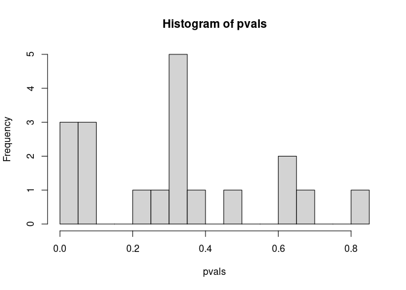

# Code to produce Fig. 2E-F from Dayton et al. (Submitted)

## load libraries 

```r
library(tidyverse)
```

```
## ── Attaching packages ─────────────────────────────────────── tidyverse 1.3.1 ──
```

```
## ✓ ggplot2 3.3.5     ✓ purrr   0.3.4
## ✓ tibble  3.1.6     ✓ dplyr   1.0.8
## ✓ tidyr   1.2.0     ✓ stringr 1.4.0
## ✓ readr   2.1.2     ✓ forcats 0.5.1
```

```
## ── Conflicts ────────────────────────────────────────── tidyverse_conflicts() ──
## x dplyr::filter() masks stats::filter()
## x dplyr::lag()    masks stats::lag()
```

```r
library(readxl)
library(trend)
```

## Load and format data 

```r
PassageTimes = read_xlsx("TableS1.xlsx",sheet = 2,skip = 2)
PassageTimes = PassageTimes %>% pivot_longer(-c(Experiment,Grade),names_to = "Passage",values_to = "Date")
PassageTimes = PassageTimes %>% group_by(Experiment) %>% mutate(Time.secs = Date-min(Date,na.rm=T)) %>% ungroup()

## correct LNET24 manually because thawed so dates do not accurately account for passage time
PassageTimes[PassageTimes$Experiment=="LNET 24" & PassageTimes$Passage %in% paste0("P",2:20),]$Time.secs = PassageTimes[PassageTimes$Experiment=="LNET 24" & PassageTimes$Passage %in% paste0("P",2:20),]$Time.secs - (377-152)*60*60*24
```

## Plot Figure 2E

```r
ggplot(PassageTimes, aes(x=Time.secs/60/60/24,y=Experiment,col=Experiment)) + geom_point() + geom_line()+ theme_bw() + 
  geom_vline(xintercept = 365) + xlab("Cumulative days after isolation") + facet_grid(Grade~., scales = "free_y") + guides(col=F)
```

```
## Warning: `guides(<scale> = FALSE)` is deprecated. Please use `guides(<scale> =
## "none")` instead.
```

```
## Don't know how to automatically pick scale for object of type difftime. Defaulting to continuous.
```

```
## Warning: Removed 106 rows containing missing values (geom_point).
```

```
## Warning: Removed 106 row(s) containing missing values (geom_path).
```

<!-- -->

## Test temporal trend in passage times
We use the Mann-Kendall trend test for each experiment

```r
mkl  = lapply(unique(PassageTimes$Experiment) , function(x) mk.test(PassageTimes %>% filter(Experiment==x,!is.na(Time.secs)) %>% pull(Time.secs) %>% as.numeric() %>% diff()))
pvals = sapply(mkl,function(x) x$p.val)
qvals = p.adjust(pvals,method = "BH")
```

We plot the p-value distribution to manually check its uniformity


```r
hist(pvals,nclass = 20) # relatively uniform
```

<!-- -->

We find the minimal q-value (reported in text)


```r
min(qvals)
```

```
## [1] 0.1809287
```


## Write results 
These results are part of Table S1

```r
mk.tab = sapply(mkl,function(x) unlist(x[c(3,5:6,2)]))
colnames(mk.tab) = unique(PassageTimes$Experiment)
mk.tab = rbind(mk.tab,q.value=qvals)

write.table(mk.tab,file = "TableS1_MKtests.tsv",sep = "\t")
```


# Plot Figure 2F
Plot passage 5 times (note: SINETs did not have P5 times)

```r
P5.times = PassageTimes %>% filter(Passage=="P5", !str_detect(Experiment,"SINET"))
ggplot(P5.times, aes(x=paste0("G",Grade),y=Time.secs/60/60/24,col=Grade)) + geom_point()  + coord_cartesian(ylim=c(0,600)) + theme_bw() + ylab("Time in Days")+
  xlab("Grade")
```

```
## Don't know how to automatically pick scale for object of type difftime. Defaulting to continuous.
```

```
## Warning: Removed 1 rows containing missing values (geom_point).
```

<!-- -->

## Test difference in passage 5 times 

```r
anova(lm(as.numeric(P5.times$Time.secs)/60/60/24~P5.times$Grade)) 
```

```
## Analysis of Variance Table
## 
## Response: as.numeric(P5.times$Time.secs)/60/60/24
##                Df Sum Sq Mean Sq F value  Pr(>F)  
## P5.times$Grade  2  86567   43284    6.46 0.01821 *
## Residuals       9  60302    6700                  
## ---
## Signif. codes:  0 '***' 0.001 '**' 0.01 '*' 0.05 '.' 0.1 ' ' 1
```

```r
summary(lm(as.numeric(P5.times$Time.secs)/60/60/24~P5.times$Grade)) 
```

```
## 
## Call:
## lm(formula = as.numeric(P5.times$Time.secs)/60/60/24 ~ P5.times$Grade)
## 
## Residuals:
##     Min      1Q  Median      3Q     Max 
## -98.000 -55.938   3.625  27.812 156.500 
## 
## Coefficients:
##                   Estimate Std. Error t value Pr(>|t|)    
## (Intercept)         358.50      40.93   8.759 1.07e-05 ***
## P5.times$Grade2.0  -113.50      57.88  -1.961  0.08152 .  
## P5.times$Grade3.0  -207.75      57.88  -3.589  0.00584 ** 
## ---
## Signif. codes:  0 '***' 0.001 '**' 0.01 '*' 0.05 '.' 0.1 ' ' 1
## 
## Residual standard error: 81.85 on 9 degrees of freedom
##   (1 observation deleted due to missingness)
## Multiple R-squared:  0.5894,	Adjusted R-squared:  0.4982 
## F-statistic:  6.46 on 2 and 9 DF,  p-value: 0.01821
```

```r
(kruskal.test(as.numeric(P5.times$Time.secs)/60/60/24~P5.times$Grade)) 
```

```
## 
## 	Kruskal-Wallis rank sum test
## 
## data:  as.numeric(P5.times$Time.secs)/60/60/24 by P5.times$Grade
## Kruskal-Wallis chi-squared = 7.5385, df = 2, p-value = 0.02307
```
