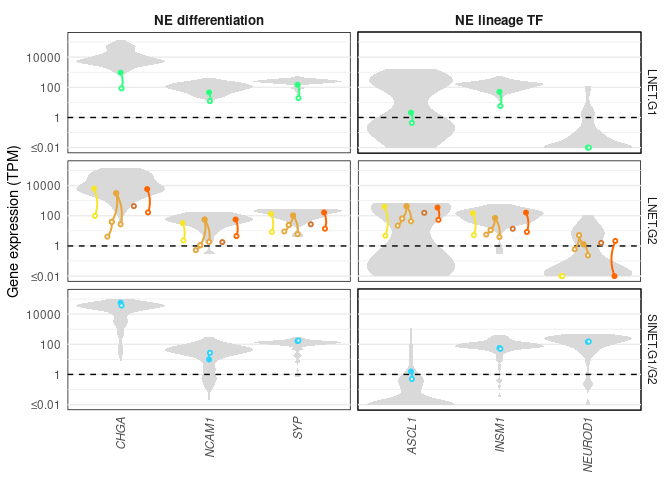
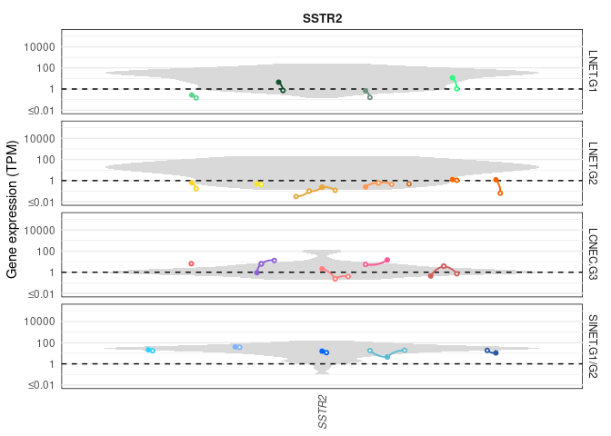
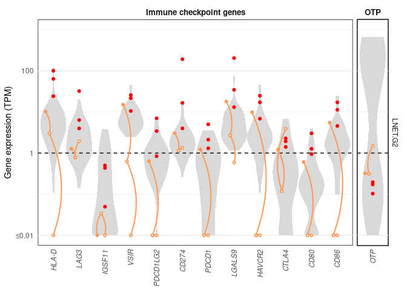

# Code to produce Figs. 3B and S3B, C, and E from Dayton et al. (Submitted)

## load libraries 

```r
library(tidyverse)
library(ggbeeswarm)
library(readxl)
```


## Create useful vectors
Colors for each experiment (organoid and parental tumor families), type, and grades:

```r
colors_org = c(LNET2="#aade87ff",LNET6="#5fd38dff",LNET13="#16502dff",LNET14="#6f917cff",
               LNET5="#e6a73cff",LNET10="#ff9955ff",LNET15="#ffd42aff", LNET16 = "#ff6600ff", LNET18= "#d0742fff", 
               LNET19="#2aff80ff", 
               LNET20 = "#f6e62bff", 
               LCNEC3="#ff8080ff",LCNEC4="#d35f5fff", LCNEC23 = "#ff5555ff", 
               LCNEC11="#ff5599ff",PANEC1="#8d5fd3ff",
               SINET7="#2ad4ffff",SINET8="#80b3ffff",SINET9="#5f8dd3ff",SINET12="#5fbcd3ff", SINET21="#0066ffff", SINET22="#2c5aa0ff")
```

List of grade 1 and grade 2 tumors 

```r
org_LNETg1 = c("LNET13T","LNET13Tp1","LNET14T","LNET14Tp1","LNET19T","LNET19Tp2","LNET6T","LNET6Tp1")
org_LNETg2 = c("LNET5T","LNET5Tp2.2","LNET5Tp4","LNET5Tp7","LNET10T","LNET10Tp11","LNET10Tp4","LNET15M","LNET15Mp2","LNET16M","LNET16Mp1","LNET16T","LNET16Tp2",
               "LNET18Tp2","LNET20M","LNET20Mp2")
```

List high-purity tumors

```r
high_pur_samples = c("LNET13T","LNET13Tp1","LNET14T","LNET14Tp1","LNET6T","LNET6Tp1","LNET10T","LNET10Tp11","LNET10Tp4","LNET15M","LNET15Mp2","LNET16M","LNET16Mp1")
```

## Define function for plotting expression trajectories
This function takes an expression table and 2 sample names and creates a curve linking the 2 samples

```r
traject_RNA <- function(dat=expr_genes.tib,samples,col=colors_org[2],xpos=1-0.30,xoff=-0.001,fills=c(col,"white"),lty=1){
  res = list(trajRNA = geom_curve(data = left_join(dat[dat$Sample==samples[1],],dat[dat$Sample==samples[2],],
                                                   by=c("Type","Experiment","name","Gene_group"),suffix=c("",".y")) %>% mutate(xpos=xpos), 
                                  aes(x =  xpos, y = Expression , xend = xpos+xoff,yend = Expression.y), size=0.7,colour = col,inherit.aes = T ,curvature = -0.2,lineend = "round") , 
             posRNA =  geom_point(data = dat[sapply(samples[1], function(x) which(dat$Sample==x)),]%>% mutate(Sample=factor(Sample,levels=samples)) %>% mutate(xpos=xpos), 
                                    aes(x = xpos, y = Expression), inherit.aes = F, lty=lty, lwd=0.8,stroke=1,shape=21,
                                    colour = col,fill=fills[1]) ,
             posRNA2 =  geom_point(data = dat[sapply(samples[2], function(x) which(dat$Sample==x)),]%>% mutate(Sample=factor(Sample,levels=samples)) %>% 
                                       mutate(xpos=xpos+xoff), 
                                     aes(x = xpos, y = Expression), inherit.aes = F, lty=lty, lwd=0.8,stroke=1,shape=21,
                                     colour = col,fill=fills[2])
  )
  
  return(res)
}
```

## Load data 
Load data and force expression values below 0.01 TPM to 0.01 category to avoid very small and infinite values in log scale

```r
expr_genes.tib = read_xlsx("/data/lungNENomics/work/organoids/SI/TableS2.xlsx",sheet = 1,skip=2,col_types = c(rep("text",2),"numeric",rep("text",4) )) %>% 
  mutate(TypeGrade = factor(paste(Type,Grade,sep="."),levels=c("LNET.G1","LNET.G2","LCNEC.G3","SINET.G1/G2")) )
expr_genes.tib$Expression[expr_genes.tib$Expression<0.01] = 0.01
```

## Figure 3B: mRNA expression of neuroendocrine markers in high-purity samples
We first subset the neuroendocrine genes presented in Figure 3B

```r
expr_genes_NE.tib <- expr_genes.tib %>% filter(Gene_group%in%c("NE differentiation","NE lineage TF"),Grade!="NA")
```

We then create the trajectories linking parental tumors and organoids:

```r
traj6 = traject_RNA(dat=expr_genes_NE.tib,samples=c("LNET6T","LNET6Tp1"),col=colors_org["LNET6"],xpos = 1-0.2+rep(0:2,2),xoff=0.01)
traj13 = traject_RNA(dat=expr_genes_NE.tib,samples=c("LNET13T","LNET13Tp1"),col=colors_org["LNET13"],xpos = 1+0+rep(0:2,2),xoff=0.01)
traj14 = traject_RNA(dat=expr_genes_NE.tib,samples=c("LNET14T","LNET14Tp1"),col=colors_org["LNET14"],xpos = 1+0.2+rep(0:2,2),xoff=0.01)
traj15 = traject_RNA(dat=expr_genes_NE.tib,samples=c("LNET15M","LNET15Mp2"),col=colors_org["LNET15"],xpos = 1-0.25+rep(0:2,2),xoff=0.01)
traj10.4 = traject_RNA(dat=expr_genes_NE.tib,samples=c("LNET10T","LNET10Tp4"),col=colors_org["LNET10"],xpos = 1-0.025+rep(0:2,2),xoff=0.05)
traj10.11 = traject_RNA(dat=expr_genes_NE.tib,samples=c("LNET10Tp4","LNET10Tp11"),col=colors_org["LNET10"],xpos = 1+0.025+rep(0:2,2),xoff=0.05,fills = c("white","white"))
traj16M = traject_RNA(dat=expr_genes_NE.tib,samples=c("LNET16M","LNET16Mp1"),col=colors_org["LNET16"],xpos = 1+0.25+rep(0:2,2),xoff=0.01,lty=1)
traj1.4  = traject_RNA(dat=expr_genes_NE.tib,samples=c("PANEC1T","PANEC1Tp4"),col=colors_org["PANEC1"],xpos = 1-0.15+rep(0:2,2),xoff=+0.01)
traj1.14 = traject_RNA(dat=expr_genes_NE.tib,samples=c("PANEC1Tp4","PANEC1Tp14"),col=colors_org["PANEC1"],xpos = 1+rep(0:2,2)-0.15+0.01,xoff=+0.03,fills = c("white","white"))
traj3.17 = traject_RNA(dat=expr_genes_NE.tib,samples=c("LCNEC3T","LCNEC3Tp17.2"),col=colors_org["LCNEC3"],xpos = 1+rep(0:2,2),xoff=0.03)
traj3.24 = traject_RNA(dat=expr_genes_NE.tib,samples=c("LCNEC3Tp17.2","LCNEC3Tp24"),col=colors_org["LCNEC3"],xpos = 1+rep(0:2,2)+0.03,xoff=0.03,fills = c("white","white"))
traj11   = traject_RNA(dat=expr_genes_NE.tib,samples=c("LCNEC11M","LCNEC11Mp3"),col=colors_org["LCNEC11"],xpos = 1+rep(0:2,2)+0.15,xoff=-0.05,lty=1)
traj4.7  = traject_RNA(dat=expr_genes_NE.tib,samples=c("LCNEC4T","LCNEC4Tp7"),col=colors_org["LCNEC4"],xpos = 1+rep(0:2,2)+0.25,xoff=0.03)
traj4.24 = traject_RNA(dat=expr_genes_NE.tib,samples=c("LCNEC4Tp7","LCNEC4Tp24"),col=colors_org["LCNEC4"],xpos = 1+rep(0:2,2)+0.28,xoff=0.03,fills = c("white","white"))
traj8  = traject_RNA(dat=expr_genes_NE.tib,samples=c("SINET8M","SINET8Mp2"),col=colors_org["SINET8"],xpos = 1+rep(0:2,2)-0.3,xoff=0.01,lty=1)
traj21 = traject_RNA(dat=expr_genes_NE.tib,samples=c("SINET21M","SINET21Mp2"),col=colors_org["SINET21"],xpos = 1+rep(0:2,2)-0.1,xoff=0.01,lty=1)
traj12.1 = traject_RNA(dat=expr_genes_NE.tib,samples=c("SINET12M","SINET12Mp1.1"),col=colors_org["SINET12"],xpos = 1.1+rep(0:2,2),xoff=-0.04,lty=1)
traj12.3 = traject_RNA(dat=expr_genes_NE.tib,samples=c("SINET12M","SINET12Mp1.3"),col=colors_org["SINET12"],xpos = 1.1+rep(0:2,2),xoff=0.04,lty=1)
traj22 = traject_RNA(dat=expr_genes_NE.tib,samples=c("SINET22M","SINET22Mp2"),col=colors_org["SINET22"],xpos = 1+rep(0:2,2)+0.3,xoff=-0.02,lty=1)
```

We then plot the figure presenting the expression of neuronal markers in organoids and reference tumors:

```r
Fig3B_raw <- ggplot( expr_genes_NE.tib %>% filter(Experiment=="Reference",Type!="SCLC",!is.na(Grade)) , aes(x=name,y=Expression,color=Experiment) ) + 
  geom_violin(aes(x=name,y=Expression,color=NA),draw_quantiles = c(0.25,0.5,0.75), color=NA,scale = "width",fill=rgb(0.85,0.85,0.85),width=1,position=position_dodge(width=1)) + 
  geom_hline(yintercept =1,linetype="dashed")+
  traj6 + traj13 +traj14 + 
  traj10.4 + traj10.11 + traj15 + traj16M + 
  traj3.17 + traj3.24 + traj4.7 + traj4.24 + traj11 +
  traj1.4 + traj1.14+
  traj8 + traj12.1 + traj12.3 +traj21 +traj22 +
  geom_point(data = expr_genes_NE.tib %>% filter(Sample=="LCNEC23Mp3") %>% mutate(xpos=1+rep(0:2,2)-0.30-0.001), aes(x = xpos, y = Expression), inherit.aes = F, lwd=0.8,stroke=1,colour = colors_org["LCNEC23"],fill="white",shape=21) +
  theme_minimal() + theme(legend.title=element_blank() ,axis.text.x = element_text(face="italic",angle = 90, vjust = 0.5, hjust=1), 
                          strip.text.x =element_text(face = "bold",size = 10),axis.title.x = element_blank() , panel.grid.major.x = element_blank() ) + 
  facet_grid(TypeGrade~Gene_group,scales = "free_x", space = "free",drop = T) + 
  theme(panel.background = element_rect(fill = NA, color = "black"))+
  labs(x="Markers",y="Gene expression (TPM)" ) + 
  scale_y_log10(breaks=c(0.01,1,10**2,10**4),limits=c(0.01,200000),labels=c("≤0.01",1,100,10000)) + 
  scale_color_manual(values=c(colors_org, Reference=rgb(0.75,0.75,0.75))[unique(expr_genes_NE.tib$Experiment)],
                     limits = unique(expr_genes_NE.tib$Experiment), 
                     labels = unique(expr_genes_NE.tib$Experiment) )

Fig3B_raw
```

<!-- -->

```r
ggsave("Fig3B_raw.pdf",Fig3B_raw,width = 3.8,height = 3.8*842/783)
```


## Figure S3B: Expression of neuroendocrine markers in mixed samples
We do the same with mixed samples

```r
traj19 = traject_RNA(dat=expr_genes_NE.tib,samples=c("LNET19T","LNET19Tp2"),col=colors_org["LNET19"],xpos = 1+rep(0:2,2),xoff=0.01)
traj5.1.4 = traject_RNA(dat=expr_genes_NE.tib,samples=c("LNET5T","LNET5Tp4"),col=colors_org["LNET5"],xpos = 1+rep(0:2,2)-0.05,xoff = -0.05)
traj5.1.7 = traject_RNA(dat=expr_genes_NE.tib,samples=c("LNET5Tp4","LNET5Tp7"),col=colors_org["LNET5"],xpos = 1+rep(0:2,2)-0.10,xoff = -0.05,fills = c("white","white"))
traj5.2   = traject_RNA(dat=expr_genes_NE.tib,samples=c("LNET5T","LNET5Tp2.2"),col=colors_org["LNET5"],xpos = 1+rep(0:2,2)-0.05,xoff = +0.05)
traj20 = traject_RNA(dat=expr_genes_NE.tib,samples=c("LNET20M","LNET20Mp2"),col=colors_org["LNET20"],xpos = 1+rep(0:2,2)-0.3,xoff=0.01)
traj16T = traject_RNA(dat=expr_genes_NE.tib,samples=c("LNET16T","LNET16Tp2"),col=colors_org["LNET16"],xpos = 1+rep(0:2,2)+0.3,xoff=0.01)
traj7  = traject_RNA(dat=expr_genes_NE.tib,samples=c("SINET7M","SINET7Mp2"),col=colors_org["SINET7"],xpos = 1+rep(0:2,2),xoff=0.01,lty=1)
```


We then plot the figure presenting the expression of neuronal markers in organoids and reference tumors:

```r
FigS3B_raw <- ggplot( expr_genes_NE.tib %>% filter(Experiment=="Reference",!Type%in%c("SCLC","LCNEC"),!is.na(Grade)) , aes(x=name,y=Expression,color=Experiment) ) + 
  geom_violin(aes(x=name,y=Expression,color=NA),draw_quantiles = c(0.25,0.5,0.75), color=NA,scale = "width",fill=rgb(0.85,0.85,0.85),width=1,position=position_dodge(width=1)) + 
  geom_hline(yintercept =1,linetype="dashed")+
  traj5.1.4 + traj5.1.7 +traj5.2 +
  traj19 +traj20+traj16T +
  traj7 + geom_point(data = expr_genes_NE.tib%>% filter( Sample=="LNET18Tp2" ),
                     aes(x = 1+rep(0:2,2)+0.15, y = Expression), inherit.aes = F,lty=1, lwd=0.8,stroke=1,shape=21,
                                     colour = colors_org["LNET18"],fill="white") + 
  theme_minimal() + theme(legend.title=element_blank() ,axis.text.x = element_text(face="italic",angle = 90, vjust = 0.5, hjust=1), 
                          strip.text.x =element_text(face = "bold",size = 10),axis.title.x = element_blank() , panel.grid.major.x = element_blank() ) + 
  facet_grid(TypeGrade~Gene_group,scales = "free_x", space = "free",drop = T) + 
  theme(panel.background = element_rect(fill = NA, color = "black"))+
  labs(x="Markers",y="Gene expression (TPM)" ) + 
  scale_y_log10(breaks=c(0.01,1,10**2,10**4),limits=c(0.01,200000),labels=c("≤0.01",1,100,10000)) + 
  scale_color_manual(values=c(colors_org, Reference=rgb(0.75,0.75,0.75))[unique(expr_genes_NE.tib$Experiment)],
                     limits = unique(expr_genes_NE.tib$Experiment), 
                     labels = unique(expr_genes_NE.tib$Experiment) )

FigS3B_raw
```

<!-- -->

```r
ggsave("FigS3B_raw.pdf",FigS3B_raw,width = 3.8,height = 3.8*842/783)
```


## Figure S3C: Expression of SSTR2 in all samples
We do the same figure but for SSTR2 and with all samples. We get the SSTR2 rows from the expression table

```r
expr_genes_SSTR2.tib <- expr_genes.tib %>% filter(Gene_group=="SSTR2",Grade!="NA")
```

We then create the trajectories linking parental tumors and organoids:

```r
traj6 = traject_RNA(dat=expr_genes_SSTR2.tib,samples=c("LNET6T","LNET6Tp1"),col=colors_org["LNET6"],xpos = 1-0.3,xoff=0.01)
traj13 = traject_RNA(dat=expr_genes_SSTR2.tib,samples=c("LNET13T","LNET13Tp1"),col=colors_org["LNET13"],xpos = 1-0.1,xoff=0.01)
traj14 = traject_RNA(dat=expr_genes_SSTR2.tib,samples=c("LNET14T","LNET14Tp1"),col=colors_org["LNET14"],xpos = 1+0.1,xoff=0.01)
traj19 = traject_RNA(dat=expr_genes_SSTR2.tib,samples=c("LNET19T","LNET19Tp2"),col=colors_org["LNET19"],xpos = 1+0.3,xoff=0.01)


traj15 = traject_RNA(dat=expr_genes_SSTR2.tib,samples=c("LNET15M","LNET15Mp2"),col=colors_org["LNET15"],xpos = 1-0.3,xoff=0.01)
traj20 = traject_RNA(dat=expr_genes_SSTR2.tib,samples=c("LNET20M","LNET20Mp2"),col=colors_org["LNET20"],xpos = 1-0.15,xoff=0.01)
traj5.1.4 = traject_RNA(dat=expr_genes_SSTR2.tib,samples=c("LNET5T","LNET5Tp4"),col=colors_org["LNET5"],xpos = 1,xoff = -0.03)
traj5.1.7 = traject_RNA(dat=expr_genes_SSTR2.tib,samples=c("LNET5Tp4","LNET5Tp7"),col=colors_org["LNET5"],xpos = 1-0.03,xoff = -0.03,fills = c("white","white"))
traj5.2   = traject_RNA(dat=expr_genes_SSTR2.tib,samples=c("LNET5T","LNET5Tp2.2"),col=colors_org["LNET5"],xpos = 1,xoff = +0.03)
traj10.4 = traject_RNA(dat=expr_genes_SSTR2.tib,samples=c("LNET10T","LNET10Tp4"),col=colors_org["LNET10"],xpos = 1+0.1,xoff=0.03)
traj10.11 = traject_RNA(dat=expr_genes_SSTR2.tib,samples=c("LNET10Tp4","LNET10Tp11"),col=colors_org["LNET10"],xpos = 1+0.13,xoff=0.03,fills = c("white","white"))

traj16M = traject_RNA(dat=expr_genes_SSTR2.tib,samples=c("LNET16M","LNET16Mp1"),col=colors_org["LNET16"],xpos = 1+0.3,xoff=0.01,lty=1)
traj16T = traject_RNA(dat=expr_genes_SSTR2.tib,samples=c("LNET16T","LNET16Tp2"),col=colors_org["LNET16"],xpos = 1+0.4,xoff=0.01)

traj1.4  = traject_RNA(dat=expr_genes_SSTR2.tib,samples=c("PANEC1T","PANEC1Tp4"),col=colors_org["PANEC1"],xpos = 1-0.15,xoff=+0.01)
traj1.14 = traject_RNA(dat=expr_genes_SSTR2.tib,samples=c("PANEC1Tp4","PANEC1Tp14"),col=colors_org["PANEC1"],xpos = 1-0.15+0.01,xoff=+0.03,fills = c("white","white"))
traj3.17 = traject_RNA(dat=expr_genes_SSTR2.tib,samples=c("LCNEC3T","LCNEC3Tp17.2"),col=colors_org["LCNEC3"],xpos = 1,xoff=0.03)
traj3.24 = traject_RNA(dat=expr_genes_SSTR2.tib,samples=c("LCNEC3Tp17.2","LCNEC3Tp24"),col=colors_org["LCNEC3"],xpos = 1+0.03,xoff=0.03,fills = c("white","white"))
traj11   = traject_RNA(dat=expr_genes_SSTR2.tib,samples=c("LCNEC11M","LCNEC11Mp3"),col=colors_org["LCNEC11"],xpos = 1+0.15,xoff=-0.05,lty=1)
traj4.7  = traject_RNA(dat=expr_genes_SSTR2.tib,samples=c("LCNEC4T","LCNEC4Tp7"),col=colors_org["LCNEC4"],xpos = 1+0.25,xoff=0.03)
traj4.24 = traject_RNA(dat=expr_genes_SSTR2.tib,samples=c("LCNEC4Tp7","LCNEC4Tp24"),col=colors_org["LCNEC4"],xpos = 1+0.28,xoff=0.03,fills = c("white","white"))

traj7  = traject_RNA(dat=expr_genes_SSTR2.tib,samples=c("SINET7M","SINET7Mp2"),col=colors_org["SINET7"],xpos = 1-0.4,xoff=0.01,lty=1)
traj8  = traject_RNA(dat=expr_genes_SSTR2.tib,samples=c("SINET8M","SINET8Mp2"),col=colors_org["SINET8"],xpos = 1-0.2,xoff=0.01,lty=1)
traj21 = traject_RNA(dat=expr_genes_SSTR2.tib,samples=c("SINET21M","SINET21Mp2"),col=colors_org["SINET21"],xpos = 1,xoff=0.01,lty=1)
traj12.1 = traject_RNA(dat=expr_genes_SSTR2.tib,samples=c("SINET12M","SINET12Mp1.1"),col=colors_org["SINET12"],xpos = 1.15,xoff=-0.04,lty=1)
traj12.3 = traject_RNA(dat=expr_genes_SSTR2.tib,samples=c("SINET12M","SINET12Mp1.3"),col=colors_org["SINET12"],xpos = 1.15,xoff=0.04,lty=1)
traj22 = traject_RNA(dat=expr_genes_SSTR2.tib,samples=c("SINET22M","SINET22Mp2"),col=colors_org["SINET22"],xpos = 1+0.4,xoff=-0.02,lty=1)
```

We then plot the figure presenting the expression of SSTR2 in organoids and reference tumors:

```r
FigS3C_raw <- ggplot( expr_genes_SSTR2.tib %>% filter(Experiment=="Reference",Type!="SCLC",!is.na(Grade)) , aes(x=name,y=Expression,color=Experiment) ) + 
  geom_violin(aes(x=name,y=Expression,color=NA),draw_quantiles = c(0.25,0.5,0.75), color=NA,scale = "width",fill=rgb(0.85,0.85,0.85),width=1,position=position_dodge(width=1)) + 
  geom_hline(yintercept =1,linetype="dashed")+
  traj6 + traj13 +traj14 + 
  traj10.4 + traj10.11 + traj15 + traj16M + 
  traj3.17 + traj3.24 + traj4.7 + traj4.24 + traj11 +
  traj1.4 + traj1.14+
  traj8 + traj12.1 + traj12.3 +traj21 +traj22 +
  traj5.1.4 + traj5.1.7 +traj5.2 +
  traj19 +traj20+traj16T +
  traj7 + geom_point(data = expr_genes_SSTR2.tib%>% filter( Sample=="LNET18Tp2" ),
                     aes(x = 1+0.2, y = Expression), inherit.aes = F,lty=1, lwd=0.8,stroke=1,shape=21,
                                     colour = colors_org["LNET18"],fill="white") + 
  geom_point(data = expr_genes_SSTR2.tib %>% filter(Sample=="LCNEC23Mp3") %>% mutate(xpos=1-0.30-0.001), aes(x = xpos, y = Expression), inherit.aes = F, lwd=0.8,stroke=1,colour = colors_org["LCNEC23"],fill="white",shape=21) +
  theme_minimal() + theme(legend.title=element_blank() ,axis.text.x = element_text(face="italic",angle = 90, vjust = 0.5, hjust=1), 
                          strip.text.x =element_text(face = "bold",size = 10),axis.title.x = element_blank() , panel.grid.major.x = element_blank() ) + 
  facet_grid(TypeGrade~Gene_group,scales = "free_x", space = "free",drop = T) + 
  theme(panel.background = element_rect(fill = NA, color = "black"))+
  labs(x="Markers",y="Gene expression (TPM)" ) + 
  scale_y_log10(breaks=c(0.01,1,10**2,10**4),limits=c(0.01,200000),labels=c("≤0.01",1,100,10000)) + 
  scale_color_manual(values=c(colors_org, Reference=rgb(0.75,0.75,0.75))[unique(expr_genes_SSTR2.tib$Experiment)],
                     limits = unique(expr_genes_SSTR2.tib$Experiment), 
                     labels = unique(expr_genes_SSTR2.tib$Experiment) )

FigS3C_raw
```

<!-- -->

```r
ggsave("FigS3C_raw.pdf",FigS3C_raw,width = 2.5,height = 3.8*842/783)
```


## Figure S3E: Expression of OTP and immune checkpoint genes in lung tumors and organoids
We first subset the genes

```r
expr_genes_OTPIC.tib <- expr_genes.tib %>% filter(Gene_group%in%c("OTP","Immune checkpoint genes"),Grade!="NA",
                                                  Type%in%c("LCNEC","LNET")) 
```
We then average the expression of HLA-D genes, and order genes to put receptors and ligands next to each other, and flag known supra-carcinoids

```r
expr_genes_OTPIC.tib <- expr_genes_OTPIC.tib %>% filter(str_detect(name,"HLA")) %>% group_by(Sample) %>% summarize(name="HLA-D",Expression=median(Expression),Type=Type[1],Experiment=Experiment[1], Grade=Grade[1],Gene_group=Gene_group[1],TypeGrade=TypeGrade[1]) %>% bind_rows(expr_genes_OTPIC.tib %>% filter(!str_detect(name,"HLA"))) %>% mutate(name=factor(name, levels=c("OTP","HLA-D","LAG3","IGSF11","VSIR","PDCD1LG2","CD274","PDCD1","LGALS9","HAVCR2","CTLA4","CD80","CD86"))) %>% mutate(SupraCa=Sample%in%c("S01513","LNEN005","LNEN012"))
```

We compute the trajectories

```r
traj10.4 = traject_RNA(dat=expr_genes_OTPIC.tib %>% arrange(name),samples=c("LNET10T","LNET10Tp4"),col=colors_org["LNET10"],xpos = 1-0.3+c(0,0:11),xoff=0.15)
traj10.11 = traject_RNA(dat=expr_genes_OTPIC.tib%>% arrange(name),samples=c("LNET10Tp4","LNET10Tp11"),col=colors_org["LNET10"],xpos = 1-0.15+c(0,0:11),xoff=0.15,fills = c("white","white"))
```

We plot the expression

```r
FigS3E_raw <- ggplot( expr_genes_OTPIC.tib %>% filter(Experiment=="Reference",TypeGrade=="LNET.G2",!SupraCa) , aes(x=name,y=Expression,color=Experiment) ) + 
  geom_violin(aes(x=name,y=Expression,color=NA),draw_quantiles = c(0.25,0.5,0.75), color=NA,scale = "width",fill=rgb(0.85,0.85,0.85),width=1,position=position_dodge(width=1)) + 
  geom_hline(yintercept =1,linetype="dashed")+
  geom_point(data=expr_genes_OTPIC.tib%>% filter(SupraCa),col="red") + 
  traj10.4 + traj10.11 + 
  theme_minimal() + theme(legend.title=element_blank() ,axis.text.x = element_text(face="italic",angle = 90, vjust = 0.5, hjust=1), 
                          strip.text.x =element_text(face = "bold",size = 10),axis.title.x = element_blank() , panel.grid.major.x = element_blank() ) + 
  facet_grid(TypeGrade~Gene_group,scales = "free_x", space = "free",drop = T) + 
  theme(panel.background = element_rect(fill = NA, color = "black"))+
  labs(x="Markers",y="Gene expression (TPM)" ) + 
  scale_y_log10(breaks=c(0.01,1,10**2),limits=c(0.01,1000),labels=c("≤0.01",1,100)) + 
  scale_color_manual(values=c(colors_org, Reference=rgb(0.75,0.75,0.75))[unique(expr_genes_SSTR2.tib$Experiment)],
                     limits = unique(expr_genes_OTPIC.tib$Experiment), 
                     labels = unique(expr_genes_OTPIC.tib$Experiment) )

FigS3E_raw
```

<!-- -->

```r
ggsave("FigS3E_raw.pdf",FigS3E_raw,width = 3.8,height = 2.5)
```

## Session Info 

```r
sessionInfo()
```

```
## R version 4.1.2 (2021-11-01)
## Platform: x86_64-pc-linux-gnu (64-bit)
## Running under: CentOS Linux 7 (Core)
## 
## Matrix products: default
## BLAS/LAPACK: /usr/lib64/libopenblasp-r0.3.3.so
## 
## locale:
##  [1] LC_CTYPE=en_US.UTF-8       LC_NUMERIC=C              
##  [3] LC_TIME=en_US.UTF-8        LC_COLLATE=en_US.UTF-8    
##  [5] LC_MONETARY=en_US.UTF-8    LC_MESSAGES=en_US.UTF-8   
##  [7] LC_PAPER=en_US.UTF-8       LC_NAME=C                 
##  [9] LC_ADDRESS=C               LC_TELEPHONE=C            
## [11] LC_MEASUREMENT=en_US.UTF-8 LC_IDENTIFICATION=C       
## 
## attached base packages:
## [1] stats     graphics  grDevices utils     datasets  methods   base     
## 
## other attached packages:
##  [1] readxl_1.4.0     ggbeeswarm_0.6.0 forcats_0.5.1    stringr_1.4.0   
##  [5] dplyr_1.0.9      purrr_0.3.4      readr_2.1.2      tidyr_1.2.0     
##  [9] tibble_3.1.7     ggplot2_3.3.5    tidyverse_1.3.1 
## 
## loaded via a namespace (and not attached):
##  [1] beeswarm_0.4.0   tidyselect_1.1.2 xfun_0.30        bslib_0.3.1     
##  [5] haven_2.5.0      colorspace_2.0-3 vctrs_0.4.1      generics_0.1.2  
##  [9] htmltools_0.5.2  yaml_2.3.5       utf8_1.2.2       rlang_1.0.2     
## [13] jquerylib_0.1.4  pillar_1.7.0     withr_2.5.0      glue_1.6.2      
## [17] DBI_1.1.2        dbplyr_2.1.1     modelr_0.1.8     lifecycle_1.0.1 
## [21] munsell_0.5.0    gtable_0.3.0     cellranger_1.1.0 rvest_1.0.2     
## [25] evaluate_0.15    knitr_1.38       tzdb_0.3.0       fastmap_1.1.0   
## [29] vipor_0.4.5      fansi_1.0.3      highr_0.9        broom_0.8.0     
## [33] backports_1.4.1  scales_1.2.0     jsonlite_1.8.0   farver_2.1.0    
## [37] fs_1.5.2         hms_1.1.1        digest_0.6.29    stringi_1.7.6   
## [41] grid_4.1.2       cli_3.3.0        tools_4.1.2      magrittr_2.0.2  
## [45] sass_0.4.1       crayon_1.5.1     pkgconfig_2.0.3  ellipsis_0.3.2  
## [49] xml2_1.3.3       reprex_2.0.1     lubridate_1.8.0  assertthat_0.2.1
## [53] rmarkdown_2.14   httr_1.4.2       rstudioapi_0.13  R6_2.5.1        
## [57] compiler_4.1.2
```

