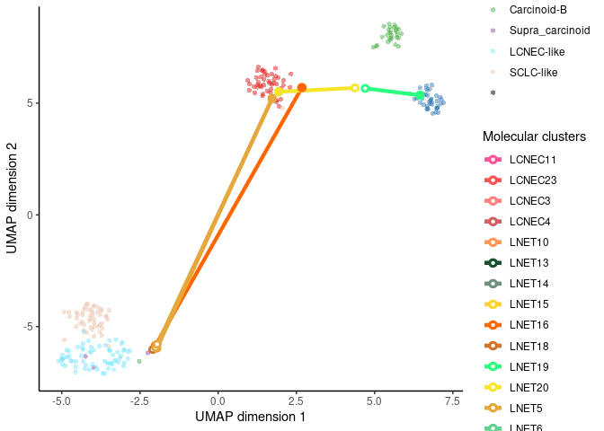
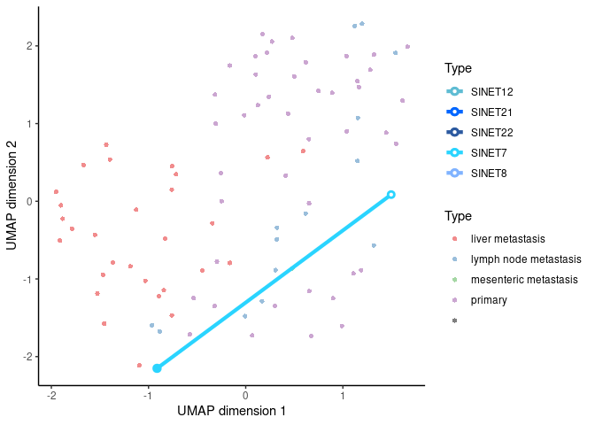
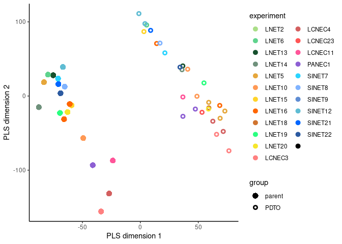

# Code to produce Figs. 3C and D and S3F, G, H, and I from Dayton et al. (Submitted)

## load libraries 

```r
library(tidyverse)
library(forcats)
library(ggbeeswarm)
library(readxl)
library(umap)
library(ggnewscale)
library(mixOmics)
library(ActivePathways)
```


## Create useful vectors
Colors for each experiment (organoid and parental tumor families), LNEN clusters and SI groups:

```r
colors_org = c(LNET2="#aade87ff",LNET6="#5fd38dff",LNET13="#16502dff",LNET14="#6f917cff",
               LNET5="#e6a73cff",LNET10="#ff9955ff",LNET15="#ffd42aff", LNET16 = "#ff6600ff", LNET18= "#d0742fff", 
               LNET19="#2aff80ff", 
               LNET20 = "#f6e62bff", 
               LCNEC3="#ff8080ff",LCNEC4="#d35f5fff", LCNEC23 = "#ff5555ff", 
               LCNEC11="#ff5599ff",PANEC1="#8d5fd3ff",
               SINET7="#2ad4ffff",SINET8="#80b3ffff",SINET9="#5f8dd3ff",SINET12="#5fbcd3ff", SINET21="#0066ffff", SINET22="#2c5aa0ff")

colors_clusters = c("Carcinoid-A1"="#E41A1C", "Carcinoid-A2"= "#377EB8", "Carcinoid-B"= "#4DAF4A", "Supra_carcinoid"="#984EA3",  
                    "LCNEC-like"="#80e5ff80" ,"SCLC-like"="#e9c6af80") 

colors_SIgroups = c("liver metastasis"="#E41A1C", "lymph node metastasis"="#377EB8", "mesenteric metastasis"="#4DAF4A","primary"="#984EA3")  
```

List high-purity and mixed tumors

```r
high_pur_samples = c("LNET13T","LNET13Tp1","LNET14T","LNET14Tp1","LNET6T","LNET6Tp1","LNET10T","LNET10Tp11","LNET10Tp4","LNET15M","LNET15Mp2","LNET16M","LNET16Mp1","LCNEC11M","LCNEC11Mp3","LCNEC23Mp3","LCNEC3T","LCNEC3Tp17.2","LCNEC3Tp24","LCNEC4T","LCNEC4Tp24","LCNEC4Tp7","PANEC1T","PANEC1Tp14","PANEC1Tp4",
                     "SINET12M","SINET12Mp1.1","SINET12Mp1.3","SINET21M","SINET21Mp2","SINET22M","SINET22Mp2","SINET8M","SINET8Mp2")
mixed_samples = c("LNET16T","LNET16Tp2","LNET18Tp2","LNET19T","LNET19Tp2","LNET20M","LNET20Mp2","LNET5T","LNET5Tp2.2","LNET5Tp4","LNET5Tp7",
                    "SINET7M","SINET7Mp2")
```
List parents, earlier and later passages and replicates

```r
parent_samples = c("LNET13T","LNET14T","LNET6T","LNET10T","LNET15M","LNET16M","LCNEC11M","LCNEC3T","LCNEC4T","PANEC1T","SINET12M","SINET21M","SINET22M","SINET8M","LNET16T","LNET19T","LNET5T","SINET7M","LNET20M")
earlier_samples = c("LNET13Tp1","LNET14Tp1","LNET6Tp1","LNET10Tp4","LNET15Mp2","LNET16Mp1","LCNEC11Mp3","LCNEC23Mp3","LCNEC3Tp17.2","LCNEC4Tp7","PANEC1Tp4","SINET12Mp1.1","SINET21Mp2","SINET22Mp2","SINET8Mp2","LNET16Tp2","LNET18Tp2","LNET5Tp4","SINET7Mp2","LNET19Tp2","LNET20Mp2")
later_samples = c("LNET10Tp11","LCNEC3Tp24","LCNEC4Tp24","PANEC1Tp14","LNET5Tp7")
replicate_samples = c("SINET12Mp1.3","LNET5Tp2.2")
```

## Load data 
### Sample data
#### LNET and LCNEC
Download and read sample information from Gabriel et al. Gigascience 2020, that regrouped multiple studies on lung neuroendocrine neoplasms

```r
download.file("https://github.com/IARCbioinfo/DRMetrics/raw/4f74c106badb3ea4579297c69e7adfc3f447a22e/data/Attributes.txt.zip","Attributes.txt.zip")
Attributes = read_tsv(unzip('Attributes.txt.zip')[1])
```

#### SINET
Download aggregated sample information from Alvarez et al. 2018 and Hofving et al. 2021, hosted on this github repository

```r
Attributes_SI = read_tsv("/data/lungNENomics/work/organoids/metadata/SINET_type.tsv")
```

### Expression data
#### LNET and LCNEC
Load expression data for LNET and LCNEC organoids and parental tumors (from counts available on the European Genome-Phenome Archive, study EGAS00001005752) and reference samples from Gabriel et al. GigaScience 2019, in unit of variance-stabilized read counts, transformed with function varianceStabilizingTransformation(counts,blind = T) from R package DESeq2 version 1.34.0

```r
vst.tib = read_tsv("/data/lungNENomics/work/organoids/RNAseq/quantification/release2_all_03072021/expr_matrices/gene_vst_LNET_LCNEC.tsv")
```

#### SINET
Load expression data for SINET organoids and parental tumors (from counts available on the European Genome-Phenome Archive, study EGAS00001005752) and reference samples from Alvarez et al. 2018 and Hofving et al. 2021, in unit of variance-stabilized read counts

```r
vst_SINET.tib = read_tsv("/data/lungNENomics/work/organoids/RNAseq/quantification/release2_all_03072021/expr_matrices/gene_vst_SINET.tsv")
```

### Feature data
Download annotation gencode v19 used in Alcala et al. Nat Commun 2019 and v33 used in Dayton et al.  

```r
download.file("https://ftp.ebi.ac.uk/pub/databases/gencode/Gencode_human/release_19/gencode.v19.annotation.gtf.gz","gencode.v19.annotation.gtf.gz")
download.file("https://ftp.ebi.ac.uk/pub/databases/gencode/Gencode_human/release_33/gencode.v33.annotation.gtf.gz","gencode.v33.annotation.gtf.gz")
gencode19 = read_tsv(gzfile("gencode.v19.annotation.gtf.gz"),skip = 5,col_names = F,) %>% filter(X3=="gene") %>%
  mutate(ENSEMBL_ID = str_extract(X9,"[ENSG0-9.]+"),gene_name=str_remove( str_extract(X9,"gene_name \"[a-zA-Z0-9.-]+") , "gene_name \""))
gencode33 = read_tsv(gzfile("gencode.v33.annotation.gtf.gz"),skip = 5,col_names = F,) %>% filter(X3=="gene") %>%
  mutate(ENSEMBL_ID = str_extract(X9,"[ENSG0-9.]+"),gene_name=str_remove( str_extract(X9,"gene_name \"[a-zA-Z0-9.-]+") , "gene_name \""))
```

#### LNET and LCNEC features
Download list of differentially expressed "core genes" for each LNET and LNEN cluster from Alcala et al. Nat Commun 2019

```r
download.file("https://static-content.springer.com/esm/art%3A10.1038%2Fs41467-019-11276-9/MediaObjects/41467_2019_11276_MOESM15_ESM.xlsx","TableS12_AlcalaEtAl2019.xlsx")
NatCommunDE.genes = read_xlsx("TableS12_AlcalaEtAl2019.xlsx",skip = 40)
coreGenesNCDE = NatCommunDE.genes$Gene[which( NatCommunDE.genes$core.genes.A+NatCommunDE.genes$core.genes.B+NatCommunDE.genes$core.genes.LCNEC>0 )]
```

Filter for genes with correct ENSEMBL ID or genes with correct alias but that changed ENSEMBL ID in newer releases

```r
vst.tib.DEgenes = vst.tib %>% filter( str_remove(vst.tib$gene,".[0-9]+$") %in% str_remove(gencode19$ENSEMBL_ID[gencode19$gene_name %in% coreGenesNCDE],".[0-9]+$" ) | (!str_remove(vst.tib$gene,".[0-9]+$") %in% str_remove(gencode19$ENSEMBL_ID[gencode19$gene_name %in% coreGenesNCDE],".[0-9]+$" ) & str_remove(vst.tib$gene,".[0-9]+$") %in% str_remove(gencode33$ENSEMBL_ID[gencode33$gene_name %in% coreGenesNCDE],".[0-9]+$" ) )  )
```

#### SINET features
Download list of "master regulator" genes defining SINET clusters from Alvarez et al. 2018

```r
download.file("https://static-content.springer.com/esm/art%3A10.1038%2Fs41588-018-0138-4/MediaObjects/41588_2018_138_MOESM6_ESM.xlsx","TableS4_AlvarezEtAl2018.xlsx")
```

Load master regulator list of each of the 4 cluster (first 4 tabs), replace names by alias in gencode v33, and find ENSEMBL ID to match with expression matrix

```r
SINETgenes = lapply(1:4, function(i) read_xlsx("TableS4_AlvarezEtAl2018.xlsx",sheet = i)$MR )
SINETgenes = unique(unlist(SINETgenes))
SINETgenes[SINETgenes=="MYCL1"] = "MYCL"
SINETgenes[SINETgenes=="TCEB2"] = "ELOB"
SINETgenes[SINETgenes=="MLL3"] = "KMT2C"
SINETgenes[SINETgenes=="JUB"] = "AJUBA"
SINETgenes[SINETgenes=="GPR128"] = "ADGRG7"
SINETgenes[SINETgenes=="GPR126"] = "ADGRG6"
SINETgenes[SINETgenes=="ZCCHC6"] = "TUT7"
SINETgenes[SINETgenes=="RDBP"] = "NELFE"
SINETgenes[SINETgenes=="SUV420H2"] = "KMT5C"
SINETgenes[SINETgenes=="LASS5"] = "CERS5"
SINETgenes[SINETgenes=="CCDC101"] = "SGF29"
SINETgenes[SINETgenes=="PTRF"] = "CAVIN1"
SINETgenes[SINETgenes=="MS4A8B"] = "MS4A8"
SINETgenes[SINETgenes=="ELTD1"] = "ADGRL4"
SINETgenes[SINETgenes=="WISP2"] = "CCN5"
SINETgenes[SINETgenes=="GPR124"] = "ADGRA2"
SINETgenes[SINETgenes=="DARC"] = "ACKR1"
SINETgenes[SINETgenes=="ERN2"] = "AC008870.1"
SINETgenes[SINETgenes=="GAS7"] = "AC005747.1"
SINETgenes[SINETgenes=="CSDA"] = "YBX3"

vst_SINET.tib.MRgenes = vst_SINET.tib %>% filter(gene %in% gencode33$ENSEMBL_ID[gencode33$gene_name%in%SINETgenes])
```


## Figure 3C: Molecular map of high-purity NET and NEC tumors of the lung and pancreas
We first compute UMAP from the selected genes

```r
conf = umap.defaults
conf$n_neighbors = ncol(vst.tib.DEgenes)-1
set.seed(1)
umap_LNEN <- umap(t(vst.tib.DEgenes[,-1]), config = conf )
```

We then add histopathological type and molecular cluster data

```r
umap_full = as_tibble(umap_LNEN$layout)
umap_full$Sample = colnames(vst.tib.DEgenes)[-1]
umap_full$Type = umap_full$`Molecular clusters` = NA
umap_full$Type[sapply(Attributes$Sample_ID,function(x) which(umap_full$Sample==x))] = Attributes$Histopathology_simplified
umap_full$`Molecular clusters`[sapply(Attributes$Sample_ID,function(x) which(umap_full$Sample==x))] = Attributes$Molecular_clusters
umap_full$`Molecular clusters`[umap_full$Sample=="S00716"] = umap_full$`Molecular clusters`[umap_full$Sample=="S00716_B"] # add manually replicate of sample S00716
umap_full$`Molecular clusters`[1:36] = str_remove(umap_full$Sample[1:36],"[TM][p0-9.]*$")

umap_full = umap_full %>% mutate( `Molecular clusters` = case_when(`Molecular clusters`=="LC1"~"Carcinoid-A1",
                                                       `Molecular clusters`=="LC2"~"Carcinoid-B",
                                                       `Molecular clusters`=="LC3"~"Carcinoid-A2",
                                                       `Molecular clusters`%in%c("LCNEC/TypeI","LCNEC/TypeII","LCNEC/NA","SCLC/LCNEC-like")~"LCNEC-like",
                                                       `Molecular clusters`%in%c("LCNEC/SCLC-like","SCLC/SCLC-like")~"SCLC-like",
                                                       TRUE~`Molecular clusters`) )
```

We plot the figure

```r
colors_org_LP = colors_org[as.character(unique(umap_full[1:36,]$`Molecular clusters`))]

Fig3C_raw <- ggplot(umap_full[-(1:36),] %>% mutate(`Molecular clusters`=fct_drop(`Molecular clusters`)),aes(x=V1,y=V2,col=`Molecular clusters`) ) +
  geom_point(shape=16) +
  scale_color_manual( values=alpha(c(colors_clusters,"black"),0.5))+ theme_minimal()  +
  new_scale_color() +
  geom_path(data=umap_full %>% filter(Sample%in%high_pur_samples,Sample%in%c(parent_samples,earlier_samples)),
            aes(x=V1,y=V2,col=`Molecular clusters`),inherit.aes = F,size=1.5)+ #link between parent and earliest passage PDTO
  geom_path(data=umap_full %>% filter(Sample%in%high_pur_samples,Sample%in%c(earlier_samples,later_samples)),
            aes(x=V1,y=V2,col=`Molecular clusters`),inherit.aes = F,size=1.5)+ #link between earlier and later passage PDTO
  geom_point(data=umap_full %>% filter(Sample%in%high_pur_samples,str_detect(Sample,"^[A-Z]+[0-9]+[MT]$")), aes(col=`Molecular clusters`),size=3) +
  geom_point(data=umap_full %>% filter(Sample%in%high_pur_samples,str_detect(Sample,"^[A-Z]+[0-9]+[MT]p")), aes(col=`Molecular clusters`),fill="white",shape=21,size=1.5,stroke=1.5) + 
  scale_color_manual( values=colors_org_LP, limits = names(colors_org_LP) ) + 
  xlab("UMAP dimension 1") + ylab("UMAP dimension 2") + 
  theme(legend.key.size = unit(10,"pt"), legend.title = element_text(size = 10,face = "bold"), 
        legend.text = element_text(size = 8) , legend.spacing = unit(0,'pt'), 
        legend.spacing.y = unit(1,"pt") ) + theme_classic()

Fig3C_raw
```

<!-- -->

```r
ggsave("Fig3C_raw.pdf",Fig3C_raw,width = 4.3,height = 3)
```

## Figure S3H: Molecular map of mixed NET and NEC tumors of the lung
We plot the figure for mixed organoids

```r
FigS3H_raw <- ggplot(umap_full[-(1:36),] %>% mutate(`Molecular clusters`=fct_drop(`Molecular clusters`)),aes(x=V1,y=V2,col=`Molecular clusters`) ) +
  geom_point(shape=16) +
  scale_color_manual( values=alpha(c(colors_clusters,"black"),0.5))+ theme_minimal()  +
  new_scale_color() +
  geom_path(data=umap_full %>% filter(Sample%in%mixed_samples,Sample%in%c(parent_samples,earlier_samples)),
            aes(x=V1,y=V2,col=`Molecular clusters`),inherit.aes = F,size=1.5)+#path between parent and earlier passage
  geom_path(data=umap_full %>% filter(Sample%in%mixed_samples,Sample%in%c(parent_samples,replicate_samples)),
            aes(x=V1,y=V2,col=`Molecular clusters`),inherit.aes = F,size=1.5)+#path between parent and replicate passage
  geom_path(data=umap_full %>% filter(Sample%in%mixed_samples,Sample%in%c(earlier_samples,later_samples)),
            aes(x=V1,y=V2,col=`Molecular clusters`),inherit.aes = F,size=1.5)+#path between earlier and later passages
  geom_point(data=umap_full %>% filter(Sample%in%mixed_samples,str_detect(Sample,"^[A-Z]+[0-9]+[MT]$")), aes(col=`Molecular clusters`),size=3) +
  geom_point(data=umap_full %>% filter(Sample%in%mixed_samples,str_detect(Sample,"^[A-Z]+[0-9]+[MT]p")), aes(col=`Molecular clusters`),fill="white",shape=21,size=1.5,stroke=1.5) + 
  scale_color_manual( values=colors_org_LP, limits = names(colors_org_LP) ) + 
  xlab("UMAP dimension 1") + ylab("UMAP dimension 2") + 
  xlab("UMAP dimension 1") + ylab("UMAP dimension 2") +
  theme(legend.key.size = unit(10,"pt"), legend.title = element_text(size = 10,face = "bold"), 
        legend.text = element_text(size = 8) , legend.spacing = unit(0,'pt'), 
        legend.spacing.y = unit(1,"pt") ) + theme_classic()

FigS3H_raw
```

<!-- -->

```r
ggsave("FigS3H_raw.pdf",FigS3H_raw,width = 4.3,height = 3)
```

Write the LNET and LCNEC umap tab of Table S2

```r
write_tsv(umap_full,"TableS2_umap.tsv")
```

## Figure 3D: Molecular map of high-purity SINET
We first compute UMAP from the selected genes

```r
conf = umap.defaults
conf$n_neighbors = ncol(vst_SINET.tib.MRgenes)-1
set.seed(1)
umap_fullSI <- umap(t(vst_SINET.tib.MRgenes[,-1]), config = conf )
```

We then add histopathological type and molecular cluster data 

```r
umap_fullSI = as_tibble(umap_fullSI$layout) 
umap_fullSI$Sample = colnames(vst_SINET.tib.MRgenes)[-1]
umap_fullSI$Type = NA
umap_fullSI$Type[1:11] = str_remove(umap_fullSI$Sample[1:11],"[TM][p0-9.]*$")
all(umap_fullSI$Sample[12:99] == Attributes_SI$Sample) # check order
```

```
## [1] TRUE
```

```r
umap_fullSI$Type[12:99] = Attributes_SI$Type
```
We plot the figure:

```r
colors_org_SI = colors_org[as.character(unique(umap_fullSI[1:11,]$Type))]

Fig3D_raw <- ggplot(umap_fullSI[-(1:11),] %>% mutate(Type=fct_drop(Type)),aes(x=V1,y=V2,col=Type) ) +
  geom_point(shape=16) +
  scale_color_manual( values=alpha(c(colors_SIgroups,"black"),0.5))+ theme_minimal()  +
  new_scale_color() +
  geom_path(data=umap_fullSI %>% filter(Sample%in%high_pur_samples,Sample%in%c(parent_samples,earlier_samples)),
            aes(x=V1,y=V2,col=Type),inherit.aes = F,size=1.5)+
  geom_path(data=umap_fullSI %>% filter(Sample%in%high_pur_samples,Sample%in%c(parent_samples,replicate_samples)),
            aes(x=V1,y=V2,col=Type),inherit.aes = F,size=1.5)+
  geom_point(data=umap_fullSI %>% filter(Sample%in%high_pur_samples,str_detect(Sample,"^[A-Z]+[0-9]+[MT]$")), aes(col=Type),size=3) +
  geom_point(data=umap_fullSI %>% filter(Sample%in%high_pur_samples,str_detect(Sample,"^[A-Z]+[0-9]+[MT]p")), aes(col=Type),fill="white",shape=21,size=1.5,stroke=1.5) + 
  scale_color_manual( values=colors_org_SI, limits = names(colors_org_SI) ) + 
  xlab("UMAP dimension 1") + ylab("UMAP dimension 2") + 
  xlab("UMAP dimension 1") + ylab("UMAP dimension 2") +
  theme(legend.key.size = unit(10,"pt"), legend.title = element_text(size = 10,face = "bold"), 
        legend.text = element_text(size = 8) , legend.spacing = unit(0,'pt'), 
        legend.spacing.y = unit(1,"pt") ) + theme_classic()

Fig3D_raw
```

<!-- -->

```r
ggsave("Fig3D_raw.pdf", Fig3D_raw,width = 4.3,height = 3)
```

## Figure S3I: Molecular map of mixed SINET
We plot the figure:

```r
FigS3I_raw <- ggplot(umap_fullSI[-(1:11),] %>% mutate(Type=fct_drop(Type)),aes(x=V1,y=V2,col=Type) ) +
  geom_point(shape=16) +
  scale_color_manual( values=alpha(c(colors_SIgroups,"black"),0.5))+ theme_minimal()  +
  new_scale_color() +
  geom_path(data=umap_fullSI %>% filter(Sample%in%mixed_samples),aes(x=V1,y=V2,col=Type),inherit.aes = F,size=1.5)+
  geom_point(data=umap_fullSI %>% filter(Sample%in%mixed_samples,str_detect(Sample,"^[A-Z]+[0-9]+[MT]$")), aes(col=Type),size=3) +
  geom_point(data=umap_fullSI %>% filter(Sample%in%mixed_samples,str_detect(Sample,"^[A-Z]+[0-9]+[MT]p")), aes(col=Type),fill="white",shape=21,size=1.5,stroke=1.5) + 
  scale_color_manual( values=colors_org_SI, limits = names(colors_org_SI) ) + 
  xlab("UMAP dimension 1") + ylab("UMAP dimension 2") + 
  xlab("UMAP dimension 1") + ylab("UMAP dimension 2") +
  theme(legend.key.size = unit(10,"pt"), legend.title = element_text(size = 10,face = "bold"), 
        legend.text = element_text(size = 8) , legend.spacing = unit(0,'pt'), 
        legend.spacing.y = unit(1,"pt") ) + theme_classic()

FigS3I_raw
```

<!-- -->

```r
ggsave("FigS3I_raw.pdf", FigS3I_raw,width = 4.3,height = 3)
```

Write the SINET umap tab of Table S2

```r
write_tsv(umap_fullSI,"TableS2_umap_SINET.tsv")
```

## Figure S3F and G: supervised (PLS) analysis of differences between parental tumors and organoids
### Load pre-processed data
We load the combined LNET, LCNEC, and SINET datasets with parental tumors and PDTOs in variance-stabilized read counts (function varianceStabilizingTransformation(expr_genes,blind = F) from DESeq2, with groups "parental" and "PDTO" as design)

```r
vst_all.mat = as.matrix(read.table("/data/lungNENomics/work/organoids/RNAseq/quantification/release2_all_03072021/expr_matrices/gene_vst.tsv" ,row.names = 1,sep="\t",header = T))
```
We filter out genes with no variance in expression

```r
vst_all.mat.red = vst_all.mat[apply(vst_all.mat,1,var)>0,]
```

### Run PLS
We first create a group vector

```r
group = factor(case_when(str_detect(colnames(vst_all.mat),"p[0-9]")~"PDTO",TRUE~"parent") )
```
And then run the PLS

```r
pls.result <- pls(t(vst_all.mat.red), as.numeric(group),mode = "regression",ncomp = 10)
write_tsv(bind_cols(sample=rownames(pls.result$variates$X),pls.result$variates$X),"TableS2_PLS_components.tsv")
```
### Find PLS components associated with groups
We perform ANOVAs on each component separately

```r
apply(pls.result$variates$X,2,function(comp) anova(lm(comp~group)))
```

```
## $comp1
## Analysis of Variance Table
## 
## Response: comp
##           Df Sum Sq Mean Sq F value    Pr(>F)    
## group      1 119255  119255  244.67 < 2.2e-16 ***
## Residuals 45  21933     487                      
## ---
## Signif. codes:  0 '***' 0.001 '**' 0.01 '*' 0.05 '.' 0.1 ' ' 1
## 
## $comp2
## Analysis of Variance Table
## 
## Response: comp
##           Df Sum Sq Mean Sq F value  Pr(>F)  
## group      1  19322 19321.9  6.7008 0.01293 *
## Residuals 45 129758  2883.5                  
## ---
## Signif. codes:  0 '***' 0.001 '**' 0.01 '*' 0.05 '.' 0.1 ' ' 1
## 
## $comp3
## Analysis of Variance Table
## 
## Response: comp
##           Df Sum Sq Mean Sq F value Pr(>F)
## group      1   1544  1544.4  0.8898 0.3506
## Residuals 45  78107  1735.7               
## 
## $comp4
## Analysis of Variance Table
## 
## Response: comp
##           Df Sum Sq Mean Sq F value Pr(>F)
## group      1    375  374.74  0.2375 0.6284
## Residuals 45  71003 1577.85               
## 
## $comp5
## Analysis of Variance Table
## 
## Response: comp
##           Df Sum Sq Mean Sq F value Pr(>F)
## group      1     66   65.96  0.0394 0.8436
## Residuals 45  75381 1675.13               
## 
## $comp6
## Analysis of Variance Table
## 
## Response: comp
##           Df Sum Sq Mean Sq F value Pr(>F)
## group      1     11   11.19  0.0084 0.9272
## Residuals 45  59743 1327.63               
## 
## $comp7
## Analysis of Variance Table
## 
## Response: comp
##           Df Sum Sq Mean Sq F value Pr(>F)
## group      1      2    1.86  0.0014 0.9704
## Residuals 45  60282 1339.60               
## 
## $comp8
## Analysis of Variance Table
## 
## Response: comp
##           Df Sum Sq Mean Sq F value Pr(>F)
## group      1      0     0.4   3e-04 0.9858
## Residuals 45  55981  1244.0               
## 
## $comp9
## Analysis of Variance Table
## 
## Response: comp
##           Df Sum Sq Mean Sq F value Pr(>F)
## group      1      0    0.11   1e-04 0.9925
## Residuals 45  54149 1203.32               
## 
## $comp10
## Analysis of Variance Table
## 
## Response: comp
##           Df Sum Sq Mean Sq F value Pr(>F)
## group      1      0    0.02       0 0.9966
## Residuals 45  50716 1127.02
```
Only components 1 and 2 are significantly associated with groups. We plot them to obtain Fig. S3F

```r
pls.tib = bind_cols(sample=rownames(pls.result$variates$X), experiment=str_remove(rownames(pls.result$variates$X),"[TMN][p0-9.]*$"), group=group,pls.result$variates$X )

FigS3F_raw <- ggplot(pls.tib, aes(x=comp1,y=comp2,col=experiment,shape=group,size=group)) + geom_point(stroke=1.5) + 
  scale_color_manual( values=c(colors_org,"black"))+ scale_shape_manual(values=c(parent=16,PDTO=21)) +
  scale_size_manual(values=c(parent=3,PDTO=1.5)) + theme_minimal() +  xlab("PLS dimension 1") + ylab("PLS dimension 2") + 
  theme(legend.key.size = unit(10,"pt"), legend.title = element_text(size = 10,face = "bold"), 
        legend.text = element_text(size = 8) , legend.spacing = unit(0,'pt'), 
        legend.spacing.y = unit(1,"pt") ) + theme_classic()

FigS3F_raw
```

<!-- -->

```r
ggsave("FigS3F_raw.pdf", FigS3F_raw,width = 5,height = 3)
```

### Interpret components
We first compute correlations between each gene expression and the two components

```r
corpval.mat = sapply(1:2, function(i) apply(vst_all.mat.red , 1, function(gene) cor.test(pls.result$variates$X[,i] , gene)$p.value ) )
rownames(corpval.mat) = str_remove(rownames(corpval.mat),"\\.[0-9]+")
colnames(corpval.mat) = c("comp1","comp2")
```

### Gene set enrichment analysis
We retrieve the gen sets from REACTOME as given in the ActivePathways package

```r
fname_GMT <- "/data/lungNENomics/work/organoids/databases/pathways.gmt"
```

We run the gene set enrichment analysis and generate the enrichmentMap used as input by cytoscape to create Fig. S3G and the PLS gene set enrichment tab in Table S2

```r
ed_pathways <- ActivePathways(corpval.mat,gmt =  fname_GMT, cytoscape.file.tag = "enrichmentMap__")
ed_pathways$evidence = sapply(ed_pathways$evidence,paste,collapse = ";")
ed_pathways$overlap = sapply(ed_pathways$overlap,paste,collapse = ";")
ed_pathways$Genes_comp1 = sapply(ed_pathways$Genes_comp1,paste,collapse = ";")
ed_pathways$Genes_comp2 = sapply(ed_pathways$Genes_comp2,paste,collapse = ";")
write_tsv(ed_pathways,"TableS2_PLS_enrichment.tsv")
```

## Session Info 

```r
sessionInfo()
```

```
## R version 4.1.2 (2021-11-01)
## Platform: x86_64-pc-linux-gnu (64-bit)
## Running under: CentOS Linux 7 (Core)
## 
## Matrix products: default
## BLAS/LAPACK: /usr/lib64/libopenblasp-r0.3.3.so
## 
## locale:
##  [1] LC_CTYPE=en_US.UTF-8       LC_NUMERIC=C              
##  [3] LC_TIME=en_US.UTF-8        LC_COLLATE=en_US.UTF-8    
##  [5] LC_MONETARY=en_US.UTF-8    LC_MESSAGES=en_US.UTF-8   
##  [7] LC_PAPER=en_US.UTF-8       LC_NAME=C                 
##  [9] LC_ADDRESS=C               LC_TELEPHONE=C            
## [11] LC_MEASUREMENT=en_US.UTF-8 LC_IDENTIFICATION=C       
## 
## attached base packages:
## [1] stats     graphics  grDevices utils     datasets  methods   base     
## 
## other attached packages:
##  [1] ActivePathways_1.1.0 mixOmics_6.18.1      lattice_0.20-45     
##  [4] MASS_7.3-57          ggnewscale_0.4.6     umap_0.2.8.0        
##  [7] readxl_1.4.0         ggbeeswarm_0.6.0     forcats_0.5.1       
## [10] stringr_1.4.0        dplyr_1.0.9          purrr_0.3.4         
## [13] readr_2.1.2          tidyr_1.2.0          tibble_3.1.7        
## [16] ggplot2_3.3.5        tidyverse_1.3.1     
## 
## loaded via a namespace (and not attached):
##  [1] matrixStats_0.62.0  fs_1.5.2            bit64_4.0.5        
##  [4] lubridate_1.8.0     RColorBrewer_1.1-3  httr_1.4.2         
##  [7] tools_4.1.2         backports_1.4.1     bslib_0.3.1        
## [10] utf8_1.2.2          R6_2.5.1            vipor_0.4.5        
## [13] DBI_1.1.2           colorspace_2.0-3    withr_2.5.0        
## [16] tidyselect_1.1.2    gridExtra_2.3       bit_4.0.4          
## [19] compiler_4.1.2      cli_3.3.0           rvest_1.0.2        
## [22] xml2_1.3.3          labeling_0.4.2      sass_0.4.1         
## [25] scales_1.2.0        askpass_1.1         digest_0.6.29      
## [28] rmarkdown_2.14      pkgconfig_2.0.3     htmltools_0.5.2    
## [31] highr_0.9           dbplyr_2.1.1        fastmap_1.1.0      
## [34] rlang_1.0.2         rstudioapi_0.13     farver_2.1.0       
## [37] jquerylib_0.1.4     generics_0.1.2      jsonlite_1.8.0     
## [40] vroom_1.5.7         BiocParallel_1.28.3 magrittr_2.0.2     
## [43] Matrix_1.4-1        Rcpp_1.0.8.3        munsell_0.5.0      
## [46] fansi_1.0.3         reticulate_1.24     lifecycle_1.0.1    
## [49] stringi_1.7.6       yaml_2.3.5          plyr_1.8.6         
## [52] grid_4.1.2          parallel_4.1.2      ggrepel_0.9.1      
## [55] crayon_1.5.1        haven_2.5.0         hms_1.1.1          
## [58] knitr_1.38          pillar_1.7.0        igraph_1.2.11      
## [61] corpcor_1.6.10      reshape2_1.4.4      reprex_2.0.1       
## [64] glue_1.6.2          evaluate_0.15       data.table_1.14.2  
## [67] modelr_0.1.8        png_0.1-7           vctrs_0.4.1        
## [70] tzdb_0.3.0          cellranger_1.1.0    gtable_0.3.0       
## [73] openssl_2.0.0       assertthat_0.2.1    xfun_0.30          
## [76] broom_0.8.0         RSpectra_0.16-1     rARPACK_0.11-0     
## [79] beeswarm_0.4.0      ellipse_0.4.2       ellipsis_0.3.2
```

