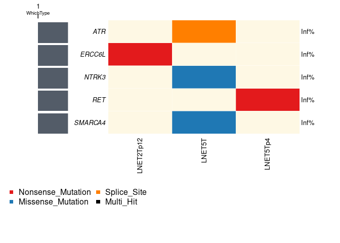
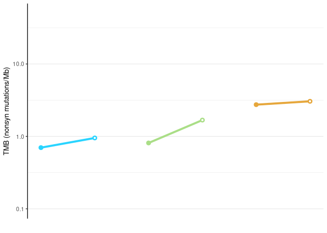
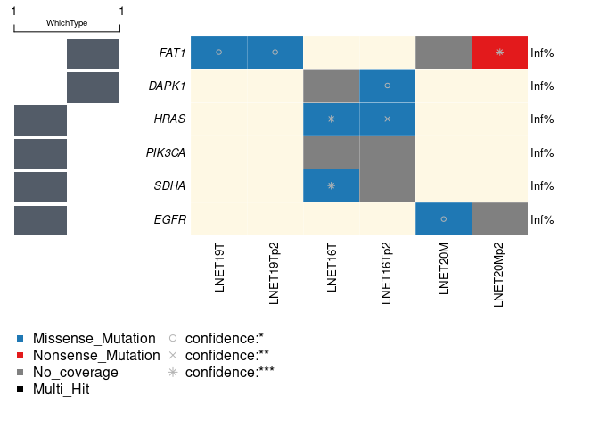

# Code to produce Figs. 4B, C from Dayton et al. (Submitted)

## load libraries 

```r
library(maftools)
library(tidyverse)
library(readxl)
library(ggpubr)
```

## Create useful vectors
Colors of experiments

```r
colors_org = c(LNET2="#aade87ff",LNET6="#5fd38dff",LNET13="#16502dff",LNET14="#6f917cff",
               LNET5="#e6a73cff",LNET10="#ff9955ff",LNET15="#ffd42aff", LNET16 = "#ff6600ff", LNET18= "#d0742fff", 
               LNET19="#2aff80ff", 
               LNET20 = "#f6e62bff", 
               LCNEC3="#ff8080ff",LCNEC4="#d35f5fff", LCNEC23 = "#ff5555ff", 
               LCNEC11="#ff5599ff",PANEC1="#8d5fd3ff",
               SINET7="#2ad4ffff",SINET8="#80b3ffff",SINET9="#5f8dd3ff",SINET12="#5fbcd3ff", SINET21="#0066ffff", SINET22="#2c5aa0ff")
```

List of samples:

```r
sampleOrder = c("SINET7M",	"SINET7Mp2",
  "SINET8M",	"SINET8Mp2",
  "SINET9M",	"SINET9Mp1",
  "LNET2T","LNET2Tp12",
  "LNET6T",	"LNET6Tp1",
  "LNET5T",	"LNET5Tp4",
  "LNET10T",	"LNET10Tp4",
  "LCNEC3T","LCNEC3Tp17",
  "LCNEC4T",	"LCNEC4Tp7", "LCNEC4Tp24",	
  "PANEC1T","PANEC1Tp4","PANEC1Tp14")

sampleOrder.lp = c("SINET7M",	"SINET7Mp2",
  "LNET2T","LNET2Tp12",
  "LNET5T",	"LNET5Tp4")

sampleOrder.hp = c("SINET8M",	"SINET8Mp2",
  "SINET9M",	"SINET9Mp1",
  "LNET6T",	"LNET6Tp1",
  "LNET10T",	"LNET10Tp4",
  "LCNEC3T","LCNEC3Tp17",
  "LCNEC4T",	"LCNEC4Tp7", "LCNEC4Tp24",	
  "PANEC1T","PANEC1Tp4","PANEC1Tp14")

sampleOrderRNA.hp = c("SINET21M",	"SINET21Mp2",
                   "SINET22M",	"SINET22Mp2",
                   "SINET12M",	"SINET12Mp1.1","SINET12Mp1.3",
                   "LNET13T",	"LNET13Tp1",
                   "LNET14T",	"LNET14Tp1",
                "LNET15M",	"LNET15Mp2",
                "LNET16M",	"LNET16Mp1",
                "LCNEC11M","LCNEC11Mp3",
                "LCNEC23Mp3")

sampleOrderRNA.lp = c("LNET19T",	"LNET19Tp2",
                "LNET16T",	"LNET16Tp2",
                "LNET18Tp2",
                "LNET20M",	"LNET20Mp2")

ExpOrder = c("SINET7", "SINET8", "SINET9",
             "LNET2","LNET6",
             "LNET5","LNET10",
             "LCNEC3","LCNEC4","PANEC1")

# high purity only
ExpOrder.hp = c("SINET8", "SINET9",
                "LNET6","LNET10",
                "LCNEC3","LCNEC4","PANEC1")                

# same for RNAseq in high-purity samples 
ExpOrderRNA.hp= c("SINET21","SINET22","SINET12","LNET13","LNET14","LNET15","LNET16","LCNEC11","LCNEC23")

# mixed samples
ExpOrderRNA.lp= c("LNET19","LNET16","LNET18","LNET20")
```

## Load data
Load list of damaging small variants from WGS from Table S4

```r
smallmuts = read_xlsx("TableS4.xlsx",sheet = 1,skip=2)
```

Load TMBs from Table S4

```r
TMB = read_xlsx("TableS4.xlsx",sheet = 2,skip=2) %>% mutate(TMB = as.numeric(TMB),Experiment=factor(Experiment,levels=ExpOrder), Sample = factor(Sample,levels=sampleOrder) )
```


Load list of driver genes from Table S4

```r
drivers = read_xlsx("TableS4.xlsx",sheet = 3,skip=2) %>% mutate(Type=as.factor(Type))
```

Load list of damaging small variants from RNA-seq from Table S4

```r
smallmutsRNA = read_xlsx("TableS4.xlsx",sheet = 4,skip=2)
```

### Order driver genes found in our experiments
Order driver genes based on frequency in cohort, and label type as -1, 0, 1, respectively for SINET drivers, drivers in both SINET and LNEN, and drivers in LNEN

```r
tabgenes_hp = smallmuts %>% filter(Hugo_Symbol%in%drivers$`Gene name`, Tumor_Sample_Barcode %in% sampleOrder.hp ) %>% 
  mutate(Exp=str_remove(Tumor_Sample_Barcode,"[MT]p*[0-9]*$")) %>% 
  group_by(Hugo_Symbol) %>% summarise(n=n(),nexp=length(unique(Exp)),Exp ) %>% left_join(drivers,by=c("Hugo_Symbol"="Gene name")) %>% 
  mutate(WhichType=(Type=="SINET")*(-1)+ (Type=="LNEN")*1) %>% 
  mutate(Exp=factor(Exp,levels =  ExpOrder.hp)) %>% 
  arrange(Exp,desc(nexp),desc(n))
```

```
## `summarise()` has grouped output by 'Hugo_Symbol'. You can override using the
## `.groups` argument.
```


## Oncoplot of WGS mutations (top panels of Figures 4B and S4B)
### High-purity samples (Figure 4B)

```r
vc_col = maftools:::get_vcColors(websafe = FALSE)
vc_col["Missense_Mutation"] = "#1f78b4ff"
vc_col["Frame_Shift_Del"] = "#782121ff"
vc_col["Frame_Shift_Ins"] = "#2ca089ff"

oncoplot(maf = MAF(nonSyn = smallmuts,syn = smallmuts[-(1:nrow(smallmuts)),]),
         showTumorSampleBarcodes = T, barcode_mar = 6, drawRowBar = F,drawColBar = F,  showTitle = F,
         leftBarData = tabgenes_hp[!duplicated(tabgenes_hp$Hugo_Symbol),c(1,9)], 
         sampleOrder = sampleOrder.hp,
         genes = unique(tabgenes_hp$Hugo_Symbol), 
         keepGeneOrder = TRUE,
         removeNonMutated = FALSE,
         colors = vc_col,
         borderCol= "white",
         bgCol = "#fef8e4ff")
```

```
## -Processing clinical data
## --Missing clinical data
```

<!-- -->

### Mixed samples (Figure S4B)

```r
tabgenes_lp = smallmuts %>% filter(Hugo_Symbol%in%drivers$`Gene name`, !Tumor_Sample_Barcode %in% sampleOrder.hp ) %>% 
  mutate(Exp=str_remove(Tumor_Sample_Barcode,"[MT]p*[0-9]*$")) %>% 
  group_by(Hugo_Symbol) %>% summarise(n=n(),nexp=length(unique(Exp)),Exp ) %>% left_join(drivers,by=c("Hugo_Symbol"="Gene name")) %>% 
  mutate(WhichType=(Type=="SINET")*(-1)+ (Type=="LNEN")*1) %>% 
  mutate(Exp=factor(Exp,levels =  ExpOrder.hp)) %>% 
  arrange(Exp,desc(nexp),desc(n))

oncoplot(maf = MAF(nonSyn = smallmuts,syn = smallmuts[-(1:nrow(smallmuts)),]), 
         showTumorSampleBarcodes = T, barcode_mar = 6, drawRowBar = F,drawColBar = F,  showTitle = F,
         leftBarData = tabgenes_lp[!duplicated(tabgenes_lp$Hugo_Symbol),c(1,9)], 
         sampleOrder = sampleOrder.lp,
         genes = unique(tabgenes_lp$Hugo_Symbol), 
         keepGeneOrder = TRUE,
         removeNonMutated = FALSE,
         colors = vc_col,
         borderCol= "white",
         bgCol = "#fef8e4ff")
```

```
## -Processing clinical data
## --Missing clinical data
```

<!-- -->

## Tumor mutational burden (bottom panel of Figures 4B and S4B)
### High-purity samples (Fig. 4B, bottom)

```r
TMB_hp = TMB %>% filter(Sample%in% sampleOrder.hp) %>% mutate(Sample = droplevels(Sample)) %>% arrange(Sample)

Fig4Bb <- ggplot( TMB_hp , aes(x=as.numeric(Sample),y=TMB,col=Experiment)) + 
  geom_path( mapping = aes(col=Experiment),cex=1.5) + 
  geom_point(shape=21,size=1.5,stroke=1.5,fill="white") + 
  geom_point(data = TMB_hp %>% filter(!PDTO) , shape=16,size=1.5,stroke=1.5) +
  scale_y_log10(lim=c(0.1,50)) + scale_color_manual(values = colors_org[ExpOrder]) + theme_classic() + grids(axis = "y") +
  theme(axis.ticks.x = element_blank(),axis.text.x = element_blank(),axis.line.x = element_blank()) +
  xlab("") + ylab("TMB (nonsyn mutations/Mb)")+ guides(col=F)
```

```
## Warning: `guides(<scale> = FALSE)` is deprecated. Please use `guides(<scale> =
## "none")` instead.
```

```r
Fig4Bb
```

<!-- -->

```r
ggsave("/data/lungNENomics/work/organoids/figures/Fig4Bb_raw_TMB.pdf",Fig4Bb,height = 2,width = 3.5)
```

### Mixed samples (Fig. S4B, bottom)

```r
TMB_lp = TMB %>% filter(Sample%in% sampleOrder.lp) %>% mutate(Sample = droplevels(Sample)) %>% arrange(Sample)

FigS4Bb <- ggplot( TMB_lp , aes(x=as.numeric(Sample),y=TMB,col=Experiment)) + 
  geom_path( mapping = aes(col=Experiment),cex=1.5) + 
  geom_point(shape=21,size=1.5,stroke=1.5,fill="white") + 
  geom_point(data = TMB_lp %>% filter(!PDTO) , shape=16,size=1.5,stroke=1.5) +
  scale_y_log10(lim=c(0.1,50)) + scale_color_manual(values = colors_org[ExpOrder]) + theme_classic() + grids(axis = "y") +
  theme(axis.ticks.x = element_blank(),axis.text.x = element_blank(),axis.line.x = element_blank()) +
  xlab("") + ylab("TMB (nonsyn mutations/Mb)")+ guides(col=F)
```

```
## Warning: `guides(<scale> = FALSE)` is deprecated. Please use `guides(<scale> =
## "none")` instead.
```

```r
FigS4Bb
```

<!-- -->

```r
ggsave("/data/lungNENomics/work/organoids/figures/Fig4SBb_raw_TMB.pdf",FigS4Bb,height = 2,width = 2.5)
```

## Oncoplot of RNA-seq mutations (Figures 4C and S4C)

### High-purity samples (Figure 4C)

```r
sampleOrder_onco = c(sampleOrder[17:22],sampleOrder[1:16])
levels_normalRNA = c("SINET21","SINET22","SINET7","SINET8","SINET12","LNET6","LNET13","LNET14","LNET19",
                  "LNET5","LNET10","LNET15","LNET16","LNET18","LNET20",
                  "LCNEC3","LCNEC4","LCNEC11","LCNEC23","PANEC1")

tabgenesRNA_hp = smallmutsRNA %>% filter(Hugo_Symbol%in%drivers$`Gene name`, Tumor_Sample_Barcode %in% sampleOrderRNA.hp ) %>% 
  mutate(Exp=str_remove(Tumor_Sample_Barcode,"[MT]p*[0-9]*$")) %>% 
  group_by(Hugo_Symbol) %>% summarise(n=n(),nexp=length(unique(Exp)),Exp ) %>% left_join(drivers,by=c("Hugo_Symbol"="Gene name")) %>% 
  mutate(WhichType=(Type=="SINET")*(-1)+ (Type=="LNEN")*1) %>% 
  mutate(Exp=factor(Exp,levels =  ExpOrderRNA.hp)) %>% 
  arrange(Exp,desc(nexp),desc(n))
```

```
## `summarise()` has grouped output by 'Hugo_Symbol'. You can override using the
## `.groups` argument.
```

```r
vc_col = maftools:::get_vcColors(websafe = FALSE)
vc_col["No_Coverage"] = rgb(0.5,0.5,0.5)
vc_col["Missense_Mutation"] = "#1f78b4ff"
vc_col["Frame_Shift_Del"] = "#782121ff"
vc_col["Frame_Shift_Ins"] = "#2ca089ff"

oncoplot(maf = MAF(nonSyn = smallmutsRNA %>% filter(Tumor_Sample_Barcode %in% sampleOrderRNA.hp),syn = smallmutsRNA[-(1:nrow(smallmutsRNA)),]),
         showTumorSampleBarcodes = T, barcode_mar = 6, drawRowBar = F,drawColBar = F,  showTitle = F,
         leftBarData = tabgenesRNA_hp[!duplicated(tabgenesRNA_hp$Hugo_Symbol),c(1,9)], 
         sampleOrder = sampleOrderRNA.hp,
         genes = unique(tabgenesRNA_hp$Hugo_Symbol), 
         keepGeneOrder = TRUE,
         removeNonMutated = FALSE,
         colors = vc_col,
         borderCol= "white",
         bgCol = "#fef8e4ff")
```

```
## -Processing clinical data
## --Missing clinical data
```

<!-- -->

### Mixed samples (Figure S4C)

```r
tabgenesRNA_lp = smallmutsRNA %>% filter(Hugo_Symbol%in%drivers$`Gene name`, Tumor_Sample_Barcode %in% sampleOrderRNA.lp ) %>% 
  mutate(Exp=str_remove(Tumor_Sample_Barcode,"[MT]p*[0-9]*$")) %>% 
  group_by(Hugo_Symbol) %>% summarise(n=n(),nexp=length(unique(Exp)),Exp ) %>% left_join(drivers,by=c("Hugo_Symbol"="Gene name")) %>% 
  mutate(WhichType=(Type=="SINET")*(-1)+ (Type=="LNEN")*1) %>% 
  mutate(Exp=factor(Exp,levels =  ExpOrderRNA.lp)) %>% 
  arrange(Exp,desc(nexp),desc(n))
```

```
## `summarise()` has grouped output by 'Hugo_Symbol'. You can override using the
## `.groups` argument.
```

```r
oncoplot(maf = MAF(nonSyn = smallmutsRNA %>% filter(Tumor_Sample_Barcode %in% sampleOrderRNA.lp),syn = smallmutsRNA[-(1:nrow(smallmutsRNA)),]),
         showTumorSampleBarcodes = T, barcode_mar = 6, drawRowBar = F,drawColBar = F,  showTitle = F,
         leftBarData = tabgenesRNA_lp[!duplicated(tabgenesRNA_lp$Hugo_Symbol),c(1,9)], 
         sampleOrder = sampleOrderRNA.lp,
         genes = unique(tabgenesRNA_lp$Hugo_Symbol), 
         keepGeneOrder = TRUE,
         removeNonMutated = FALSE,
         colors = vc_col,
         borderCol= "white",
         bgCol = "#fef8e4ff")
```

```
## -Processing clinical data
## --Missing clinical data
```

<!-- -->


## Session Info 

```r
sessionInfo()
```

```
## R version 4.1.2 (2021-11-01)
## Platform: x86_64-pc-linux-gnu (64-bit)
## Running under: CentOS Linux 7 (Core)
## 
## Matrix products: default
## BLAS/LAPACK: /usr/lib64/libopenblasp-r0.3.3.so
## 
## locale:
##  [1] LC_CTYPE=en_US.UTF-8       LC_NUMERIC=C              
##  [3] LC_TIME=en_US.UTF-8        LC_COLLATE=en_US.UTF-8    
##  [5] LC_MONETARY=en_US.UTF-8    LC_MESSAGES=en_US.UTF-8   
##  [7] LC_PAPER=en_US.UTF-8       LC_NAME=C                 
##  [9] LC_ADDRESS=C               LC_TELEPHONE=C            
## [11] LC_MEASUREMENT=en_US.UTF-8 LC_IDENTIFICATION=C       
## 
## attached base packages:
## [1] stats     graphics  grDevices utils     datasets  methods   base     
## 
## other attached packages:
##  [1] ggpubr_0.4.0     readxl_1.4.0     forcats_0.5.1    stringr_1.4.0   
##  [5] dplyr_1.0.9      purrr_0.3.4      readr_2.1.2      tidyr_1.2.0     
##  [9] tibble_3.1.7     ggplot2_3.3.5    tidyverse_1.3.1  maftools_2.10.05
## 
## loaded via a namespace (and not attached):
##  [1] lubridate_1.8.0     lattice_0.20-45     assertthat_0.2.1   
##  [4] digest_0.6.29       utf8_1.2.2          R6_2.5.1           
##  [7] cellranger_1.1.0    backports_1.4.1     reprex_2.0.1       
## [10] evaluate_0.15       highr_0.9           httr_1.4.2         
## [13] pillar_1.7.0        rlang_1.0.2         rstudioapi_0.13    
## [16] data.table_1.14.2   car_3.0-12          jquerylib_0.1.4    
## [19] Matrix_1.4-1        rmarkdown_2.14      labeling_0.4.2     
## [22] splines_4.1.2       munsell_0.5.0       broom_0.8.0        
## [25] compiler_4.1.2      modelr_0.1.8        xfun_0.30          
## [28] pkgconfig_2.0.3     htmltools_0.5.2     tidyselect_1.1.2   
## [31] fansi_1.0.3         crayon_1.5.1        tzdb_0.3.0         
## [34] dbplyr_2.1.1        withr_2.5.0         grid_4.1.2         
## [37] jsonlite_1.8.0      gtable_0.3.0        lifecycle_1.0.1    
## [40] DBI_1.1.2           magrittr_2.0.3.9000 scales_1.2.0       
## [43] carData_3.0-5       cli_3.3.0           stringi_1.7.6      
## [46] farver_2.1.0        ggsignif_0.6.3      fs_1.5.2           
## [49] xml2_1.3.3          bslib_0.3.1         ellipsis_0.3.2     
## [52] generics_0.1.2      vctrs_0.4.1         RColorBrewer_1.1-3 
## [55] tools_4.1.2         glue_1.6.2          hms_1.1.1          
## [58] abind_1.4-5         fastmap_1.1.0       survival_3.3-1     
## [61] yaml_2.3.5          colorspace_2.0-3    rstatix_0.7.0      
## [64] rvest_1.0.2         knitr_1.38          haven_2.5.0        
## [67] sass_0.4.1
```
