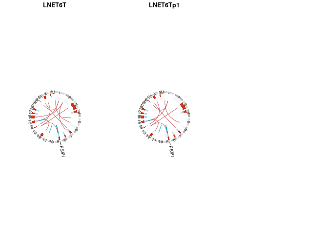
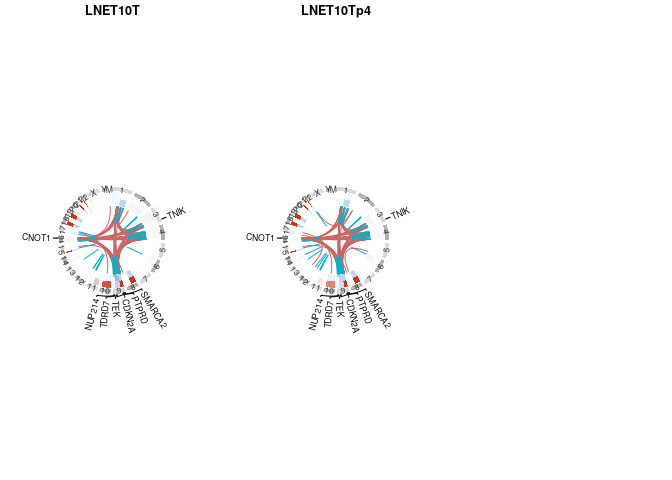
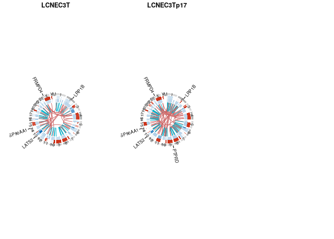
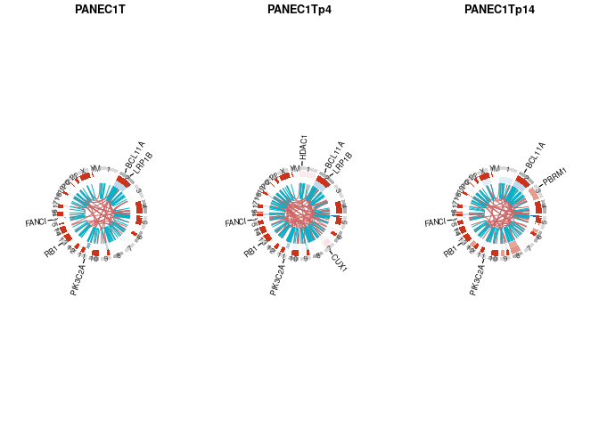
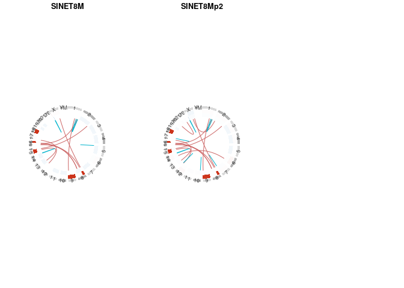
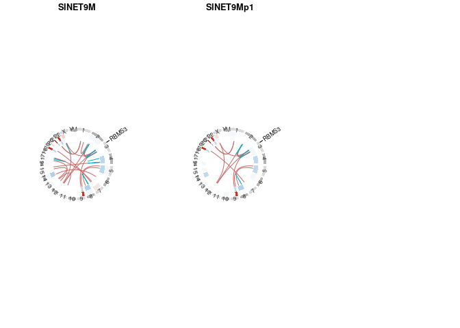
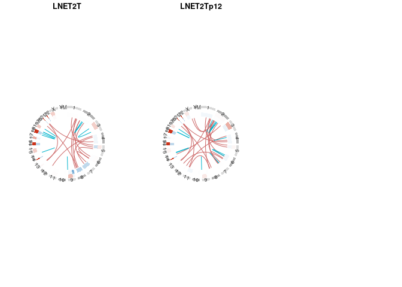
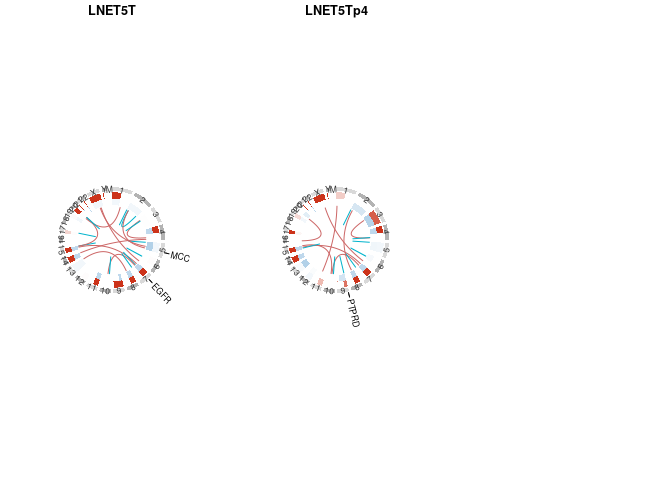
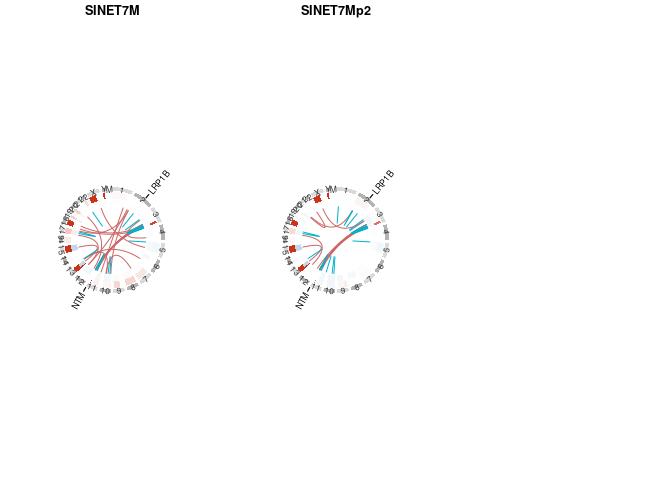

# Code to produce Fig. 4D and S4D from Dayton et al. (Submitted)

## load libraries 

```r
library(tidyverse)
library(readxl)
library(ggpubr)
library(AnnotationDbi)
library(TxDb.Hsapiens.UCSC.hg38.knownGene)
library(VariantAnnotation)
library(circlize)
library(RColorBrewer)
```

## Cosmetics
### ggplot

```r
theme_organoids <- theme_classic()+ grids()

colors_org = c(LNET2="#aade87ff",LNET6="#5fd38dff",LNET13="#16502dff",LNET14="#6f917cff",
               LNET5="#e6a73cff",LNET10="#ff9955ff",LNET15="#ffd42aff", LNET16 = "#ff6600ff", LNET18= "#d0742fff", 
               LNET19="#2aff80ff", 
               LNET20 = "#f6e62bff", 
               LCNEC3="#ff8080ff",LCNEC4="#d35f5fff", LCNEC23 = "#ff5555ff", 
               LCNEC11="#ff5599ff",PANEC1="#8d5fd3ff",
               SINET7="#2ad4ffff",SINET8="#80b3ffff",SINET9="#5f8dd3ff",SINET12="#5fbcd3ff", SINET21="#0066ffff", SINET22="#2c5aa0ff")

colCNVs = c( colorRampPalette(c(rgb(0.8,0.2,0.1), rgb(1,1,1)))(100) , colorRampPalette(c(rgb(1,1,1), rgb(0,0.4,0.7,1) ))(401) )
```

### Sample lists

```r
sampleOrderAll = c("LNET2T","LNET2Tp12","LNET2Np12",
  "LNET5T",	"LNET5Tp4",
  "LNET6T",	"LNET6Tp1",
  "LNET10T",	"LNET10Tp4",
  "LCNEC3T","LCNEC3Tp17",
  "LCNEC4T",	"LCNEC4Tp7", "LCNEC4Tp24",	
  "PANEC1T","PANEC1Tp4","PANEC1Tp14",
  "SINET7M",	"SINET7Mp2",
  "SINET8M",	"SINET8Mp2",
  "SINET9M",	"SINET9Mp1")


ExpOrder.hp = c("SINET8", "SINET9", "LNET6" , "LNET10", "LCNEC3", "LCNEC4", "PANEC1")
ExpOrder.lp = c("SINET7", "LNET2" , "LNET5")

samplesTime = as.data.frame(matrix(c("LNET2T","LNET2Tp12",NA,
                                     "LNET5T",	"LNET5Tp4",NA,
                                     "LNET6T",	"LNET6Tp1",NA,
                                     "LNET10T",	"LNET10Tp4",NA,
                                     "LCNEC3T","LCNEC3Tp17",NA,
                                     "LCNEC4T",	"LCNEC4Tp7", "LCNEC4Tp24",	
                                     "PANEC1T","PANEC1Tp4","PANEC1Tp14",
                                     "SINET7M",	"SINET7Mp2",NA,
                                     "SINET8M",	"SINET8Mp2",NA,
                                     "SINET9M",	"SINET9Mp1",NA) , ncol=3,byrow=T,dimnames = list(c("LNET2" , "LNET5", "LNET6", "LNET10","LCNEC3","LCNEC4","PANEC1","SINET7","SINET8","SINET9"),
                                                                                                 c("Parental","PDTO1","PDTO2"))) )
```

### Reference


```r
hg38_bed = data.frame(start=0,end= c( 248956422, 242193529, 198295559, 190214555, 181538259, 170805979, 159345973, 145138636, 138394717, 133797422, 135086622, 133275309, 114364328, 107043718, 101991189, 90338345,  83257441,  80373285,  58617616,  64444167,  46709983,  50818468,  156040895, 57227415, 16569 ),row.names = paste0("chr",c(1:22,"X","Y","M")) )
```

## Load data
Load list of driver genes from Table S4

```r
drivers = read_xlsx("TableS4.xlsx",sheet = 3,skip=2) %>% mutate(Type=as.factor(Type))
```

Load CNVs

```r
CNVsummary = read_xlsx("TableS4.xlsx",sheet = 5,skip=2)

CNVs = read_xlsx("TableS4.xlsx",sheet = 6,skip=2, col_types = c(rep("text",2),rep("numeric",6),rep("text",3),rep("numeric",6)) )
```

Load SVs

```r
SVs = read_xlsx("TableS4.xlsx",sheet = 7,skip=2,na = "NA")
```


## Figures 
Create function to do single sample circos plos with CNVs and SVs 

```r
plot_crc1 <- function(experiment){
  SVs.tmp = SVs[SVs$Experiment==experiment,]
  SVs.tmp$Gene = sapply(SVs.tmp$Gene, str_split,";")
  for(i in 1:sum(!is.na(samplesTime[experiment,]))){  
    sample.tmp = samplesTime[experiment,i]
    circos.clear()
    col_text <- rgb(0.2,0.2,0.2)
    circos.par("track.height" = 0.20, start.degree = 90, circle.margin = 0.35 , 
               gap.degree = 3,
               cell.padding = c(0, 0, 0, 0))
    circos.initialize(sectors = rownames(hg38_bed),xlim = hg38_bed )
    
    SVs_drivers.tmp = SVs.tmp 
    SVs_drivers.tmp1 = SVs_drivers.tmp[sapply(SVs_drivers.tmp$Gene,length)==2,]
    SVs_drivers.tmp1$Gene = sapply(SVs_drivers.tmp1$Gene,function(x) x[1])
    SVs_drivers.tmp1$Gene_breakpoint = 1
    SVs_drivers.tmp2 = SVs_drivers.tmp[sapply(SVs_drivers.tmp$Gene,length)==2,]
    SVs_drivers.tmp2$Gene = sapply(SVs_drivers.tmp2$Gene,function(x) x[2])
    SVs_drivers.tmp2$Gene_breakpoint = 2
    SVs_drivers.tmp = rbind(SVs_drivers.tmp[sapply(SVs_drivers.tmp$Gene,length)==1,],SVs_drivers.tmp1,SVs_drivers.tmp2)
    SVs_drivers.tmp = SVs_drivers.tmp %>% 
      filter(sapply( SVs_drivers.tmp$Gene, function(x) any(x%in%drivers$`Gene name`) ), SVs_drivers.tmp[,12+i]!="NO")
    SVs_drivers.tmp = SVs_drivers.tmp[!duplicated(sapply(SVs_drivers.tmp$Gene,sort)),]
    SVs_drivers.tmp$Gene = unlist(SVs_drivers.tmp$Gene)
    if(nrow(SVs_drivers.tmp)>0 ){
      SVs_drivers.tmp = SVs_drivers.tmp %>% filter(sapply(Gene,length)==1) %>% 
        mutate(chr   = case_when(Gene_breakpoint==1~CHROM,Gene_breakpoint==2~CHROM2,TRUE~NA_character_),
                                 start = case_when(Gene_breakpoint==1~start.B1,Gene_breakpoint==2~start.B2,TRUE~NA_real_),
                                 end   = case_when(Gene_breakpoint==1~end.B1,Gene_breakpoint==2~end.B2,TRUE~NA_real_) ) %>% dplyr::select(chr,start,end,Gene) %>% as.data.frame()
      
      circos.genomicLabels( SVs_drivers.tmp,labels.column=4, cex=0.8, col="black",line_lwd=1,line_col="black", #"grey80",
                            side="outside",connection_height=0.07,labels_height=0.04)
    }
    
    # genomes
    circos.track(ylim=c(0,1),panel.fun=function(x,y) {
      chr=str_remove(CELL_META$sector.index,"chr")
      xlim=CELL_META$xlim
      ylim=CELL_META$ylim
      circos.text(mean(xlim),mean(ylim),chr,cex=0.8,col="#333333",
                  facing="bending.inside",niceFacing=TRUE)
    },bg.col=rep(c(rgb(0.85,0.85,0.85),rgb(0.7,0.7,0.7)),12),bg.border=F,track.height=0.06)
    
    # add copy number
    CNVs_org.tmp = CNVs %>% filter(sample ==sample.tmp) %>% 
      mutate(chr = chromosome,value=1,value1=majorAlleleCopyNumber,value2=minorAlleleCopyNumber)
    circos.genomicTrack( CNVs_org.tmp %>% dplyr::select(chr,start,end,value,value1,value2) , ylim=c(0,4), bg.border=NA, 
                         panel.fun = function(region, value, ...) {
                           region1 = region[value$value1!=1,]
                           region2 = region[value$value2!=1,]
                           if(nrow(region1)>0) circos.genomicRect(region1,value[value$value1!=1,1],
                                                                  col=colCNVs[round(value$value1[value$value1!=1]*100+1)],
                                                                  border = NA, ytop = 2,ybottom = 0 )
                           if(nrow(region2)>0) circos.genomicRect(region2,value[value$value2!=1,1],
                                                                  col=colCNVs[round(value$value2[value$value2!=1]*100+1)],
                                                                  border = NA, ytop = 4,ybottom = 2 )
                         })
    
    # add rearrangements
    Link1 = SVs.tmp[as.data.frame(SVs.tmp)[,12+i]!="NO",] %>% mutate(chrom=CHROM,start=start.B1,end=end.B1) %>% dplyr::select(chrom,start,end) %>% as.data.frame()
    Link2 = SVs.tmp[as.data.frame(SVs.tmp)[,12+i]!="NO",] %>% mutate(chrom=CHROM2,start=start.B2,end=end.B2) %>% dplyr::select(chrom,start,end) %>% as.data.frame()
    circos.genomicLink(Link1,Link2,col = c(rgb(0.8,0.4,0.4),rgb(0,0.7,0.8))[as.numeric(SVs.tmp[as.data.frame(SVs.tmp)[,12+i]!="NO",]$chrom_type=="intra")+1]  )
    title( sample.tmp )
  }
}
```

## Fig. 4D : CNV + SV profiles of high-purity tumors

```r
par(mfrow=c(4,4))
for(exp.tmp in rownames(samplesTime)[rownames(samplesTime)%in%ExpOrder.hp]){ 
  par(mfrow=c(1,3),mar = c(3, 3, 3, 3)*0.5)
  plot_crc1(experiment=exp.tmp)
}
```

<!-- --><!-- --><!-- --><!-- --><!-- --><!-- --><!-- -->

## Fig. S4D : CNV + SV profiles of mixed tumors

```r
par(mfrow=c(2,4))
for(exp.tmp in rownames(samplesTime)[rownames(samplesTime)%in%ExpOrder.lp]){
  par(mfrow=c(1,3),mar = c(3, 3, 3, 3)*0.5)
  plot_crc1(experiment=exp.tmp)
}
```

<!-- --><!-- --><!-- -->

## Session Info 

```r
sessionInfo()
```

```
## R version 4.1.2 (2021-11-01)
## Platform: x86_64-pc-linux-gnu (64-bit)
## Running under: CentOS Linux 7 (Core)
## 
## Matrix products: default
## BLAS/LAPACK: /usr/lib64/libopenblasp-r0.3.3.so
## 
## locale:
##  [1] LC_CTYPE=en_US.UTF-8       LC_NUMERIC=C              
##  [3] LC_TIME=en_US.UTF-8        LC_COLLATE=en_US.UTF-8    
##  [5] LC_MONETARY=en_US.UTF-8    LC_MESSAGES=en_US.UTF-8   
##  [7] LC_PAPER=en_US.UTF-8       LC_NAME=C                 
##  [9] LC_ADDRESS=C               LC_TELEPHONE=C            
## [11] LC_MEASUREMENT=en_US.UTF-8 LC_IDENTIFICATION=C       
## 
## attached base packages:
## [1] stats4    stats     graphics  grDevices utils     datasets  methods  
## [8] base     
## 
## other attached packages:
##  [1] RColorBrewer_1.1-3                      
##  [2] circlize_0.4.15                         
##  [3] VariantAnnotation_1.40.0                
##  [4] Rsamtools_2.10.0                        
##  [5] Biostrings_2.62.0                       
##  [6] XVector_0.34.0                          
##  [7] SummarizedExperiment_1.24.0             
##  [8] MatrixGenerics_1.6.0                    
##  [9] matrixStats_0.62.0                      
## [10] TxDb.Hsapiens.UCSC.hg38.knownGene_3.14.0
## [11] GenomicFeatures_1.46.5                  
## [12] GenomicRanges_1.46.1                    
## [13] GenomeInfoDb_1.30.1                     
## [14] AnnotationDbi_1.56.2                    
## [15] IRanges_2.28.0                          
## [16] S4Vectors_0.32.3                        
## [17] Biobase_2.54.0                          
## [18] BiocGenerics_0.40.0                     
## [19] ggpubr_0.4.0                            
## [20] readxl_1.4.0                            
## [21] forcats_0.5.1                           
## [22] stringr_1.4.0                           
## [23] dplyr_1.0.9                             
## [24] purrr_0.3.4                             
## [25] readr_2.1.2                             
## [26] tidyr_1.2.0                             
## [27] tibble_3.1.7                            
## [28] ggplot2_3.3.5                           
## [29] tidyverse_1.3.1                         
## 
## loaded via a namespace (and not attached):
##  [1] colorspace_2.0-3         ggsignif_0.6.3           rjson_0.2.21            
##  [4] ellipsis_0.3.2           GlobalOptions_0.1.2      fs_1.5.2                
##  [7] rstudioapi_0.13          bit64_4.0.5              fansi_1.0.3             
## [10] lubridate_1.8.0          xml2_1.3.3               cachem_1.0.6            
## [13] knitr_1.38               jsonlite_1.8.0           broom_0.8.0             
## [16] dbplyr_2.1.1             png_0.1-7                compiler_4.1.2          
## [19] httr_1.4.2               backports_1.4.1          assertthat_0.2.1        
## [22] Matrix_1.4-1             fastmap_1.1.0            cli_3.3.0               
## [25] htmltools_0.5.2          prettyunits_1.1.1        tools_4.1.2             
## [28] gtable_0.3.0             glue_1.6.2               GenomeInfoDbData_1.2.7  
## [31] rappdirs_0.3.3           Rcpp_1.0.8.3             carData_3.0-5           
## [34] cellranger_1.1.0         jquerylib_0.1.4          vctrs_0.4.1             
## [37] rtracklayer_1.54.0       xfun_0.30                rvest_1.0.2             
## [40] lifecycle_1.0.1          restfulr_0.0.13          rstatix_0.7.0           
## [43] XML_3.99-0.9             zlibbioc_1.40.0          scales_1.2.0            
## [46] BSgenome_1.62.0          hms_1.1.1                parallel_4.1.2          
## [49] yaml_2.3.5               curl_4.3.2               memoise_2.0.1           
## [52] sass_0.4.1               biomaRt_2.50.3           stringi_1.7.6           
## [55] RSQLite_2.2.13           highr_0.9                BiocIO_1.4.0            
## [58] filelock_1.0.2           BiocParallel_1.28.3      shape_1.4.6             
## [61] rlang_1.0.2              pkgconfig_2.0.3          bitops_1.0-7            
## [64] evaluate_0.15            lattice_0.20-45          GenomicAlignments_1.30.0
## [67] bit_4.0.4                tidyselect_1.1.2         magrittr_2.0.3.9000     
## [70] R6_2.5.1                 generics_0.1.2           DelayedArray_0.20.0     
## [73] DBI_1.1.2                pillar_1.7.0             haven_2.5.0             
## [76] withr_2.5.0              KEGGREST_1.34.0          abind_1.4-5             
## [79] RCurl_1.98-1.6           modelr_0.1.8             crayon_1.5.1            
## [82] car_3.0-12               utf8_1.2.2               BiocFileCache_2.2.1     
## [85] tzdb_0.3.0               rmarkdown_2.14           progress_1.2.2          
## [88] grid_4.1.2               blob_1.2.3               reprex_2.0.1            
## [91] digest_0.6.29            munsell_0.5.0            bslib_0.3.1
```
