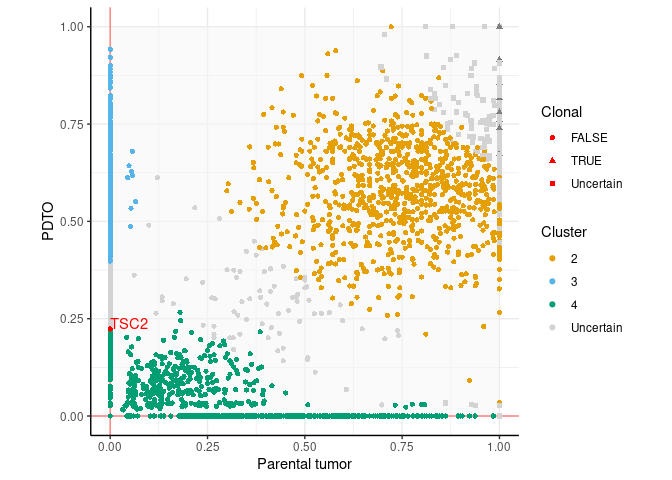
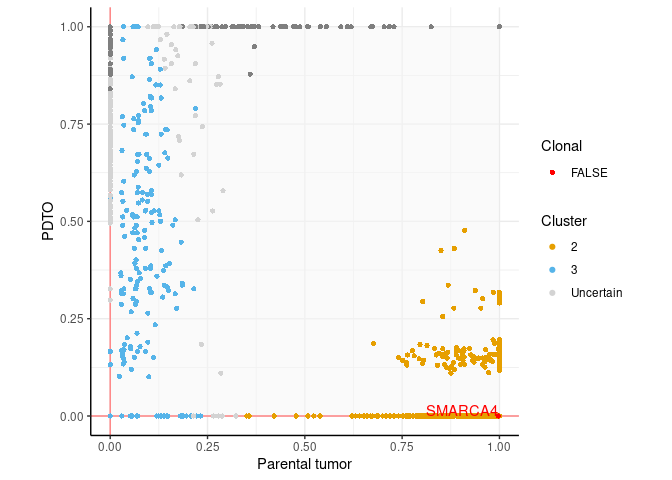
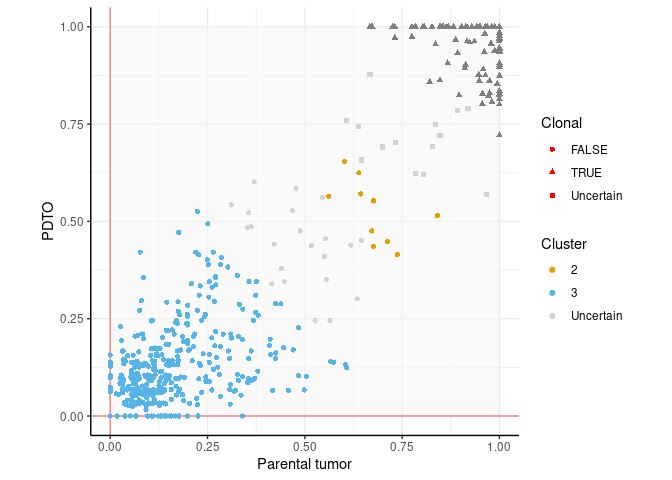
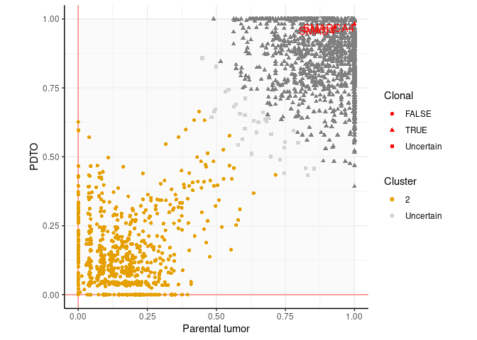
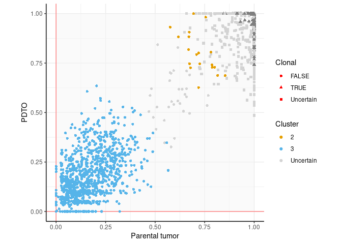
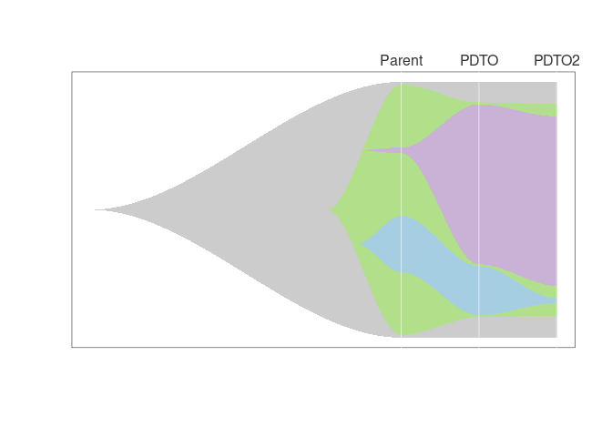
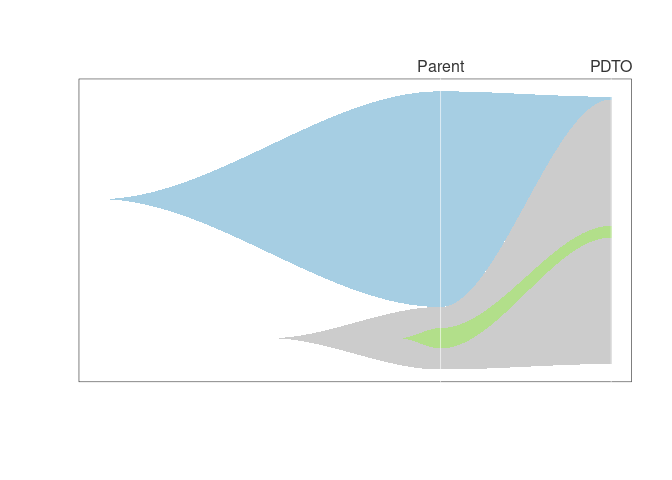

# Code to produce Figs. 5 and S5 from Dayton et al. (Submitted)

## load libraries 

```r
library(tidyverse)
library(readxl)
library(ggnewscale)
library(DPClust)
library(ggpubr)
library(eulerr)
library(GenomicRanges)
library(mobster)
```

```
## Warning: replacing previous import 'Biostrings::translate' by
## 'seqinr::translate' when loading 'dndscv'
```

```r
library(clonevol)
library(phylodyn)
library(fishplot)
```


## Create useful vectors
Colors for each experiment (organoid and parental tumor families), alteration clusters, and order of the experiments for display:

```r
colors_org = c(LNET2="#aade87ff",LNET6="#5fd38dff",LNET13="#16502dff",LNET14="#6f917cff",
               LNET5="#e6a73cff",LNET10="#ff9955ff",LNET15="#ffd42aff", LNET16 = "#ff6600ff", LNET18= "#d0742fff", 
               LNET19="#2aff80ff", 
               LNET20 = "#f6e62bff", 
               LCNEC3="#ff8080ff",LCNEC4="#d35f5fff", LCNEC23 = "#ff5555ff", 
               LCNEC11="#ff5599ff",PANEC1="#8d5fd3ff",
               SINET7="#2ad4ffff",SINET8="#80b3ffff",SINET9="#5f8dd3ff",SINET12="#5fbcd3ff", SINET21="#0066ffff", SINET22="#2c5aa0ff")

colors_clusters = c("Uncertain"="lightgray", "1"="#000000", "2"="#E69F00", "3"="#56B4E9", "4"="#009E73", "5"="#F0E442", "6"="#0072B2", "7"="#D55E00", "8"="#CC79A7","9"="black") 

exp_order = c("SINET7","SINET8","SINET9","LNET2","LNET6","LNET5","LNET10","LCNEC3","LCNEC4","PANEC1")
exp_order_high_pur = c("SINET8","SINET9","LNET6","LNET10","LCNEC3","LCNEC4","PANEC1")

sample_order = list("SINET7"=c("SINET7M","SINET7Mp2"),
                    "SINET8"=c("SINET8M","SINET8Mp2"),
                    "SINET9"=c("SINET9M","SINET9Mp1"),
                    "LNET2"=c("LNET2T","LNET2Tp12"),#,"LNET2Np12"),
                    "LNET6"=c("LNET6T","LNET6Tp1" ),
                    "LNET5"=c("LNET5T","LNET5Tp4"),
                    "LNET10"=c("LNET10T","LNET10Tp4"),
                    "LCNEC3"=c("LCNEC3T","LCNEC3Tp17"),
                    "LCNEC4"=c("LCNEC4T","LCNEC4Tp7","LCNEC4Tp24"),
                    "PANEC1"=c("PANEC1T", "PANEC1Tp4","PANEC1Tp14"))
```

## Read metadata
Read data from CNV summary (from TableS4, sheet 5), containing sample, sex, and ploidy info

```r
CNVsummary = read_xlsx("TableS4.xlsx",sheet=5,skip=2) %>%
  mutate(experiment=str_remove(tumor_id,"[TNM][p0-9.]*$")) %>% arrange(experiment,tumor_id) %>%
  filter(!str_detect(tumor_id,"N[p0-9]*$")) # we remove normal tissue
experiments = unique(CNVsummary$experiment)
```

## Pre-process data 
We start from the VCFs with somatic mutations and copy number calls (from manuscript TableS4) and run the script Fig5_S5_preproc.R (adapted from the preprocessing of ascat files from the dpclust github repository https://github.com/Wedge-lab/dpclust3p/blob/master/inst/example/preproc_pipeline_ascat_simple.R). The script also uses the fasta index file used for alignment to retrieve chromosome lists (here hs38DH.fa.fai, available from the bwakit github repo https://github.com/lh3/bwa/tree/master/bwakit), and a file listing chromosomes to ignore (all except the main assembly chromosomes here).


```r
vcfs = list.files("vcf",pattern = "vcf.gz$",full.names = T)

for(i in (1:length(experiments)) ){
  opt=list(samplename=unique(CNVsummary$experiment)[i],alignfolder="CRAM/",
         vcf=vcfs[i], 
         copynumber="TableS4.xlsx",
         sex=tolower(unique(CNVsummary$gender[CNVsummary$experiment==unique(CNVsummary$experiment)[i]])),
         output="DPclust/",
         fai="hs38DH.fa.fai",
         ign_file = "ign_file")

  source("Fig5_S5_preproc.R")
}
```
We remove the "chr" prefix from the DPclust files to avoid incompatibilities with the package

```r
system("for file in `ls *allDirichletProcessInfo.txt`; do sed -i '2,$s/chr//g' $file; done")
```

We remove alterations in low-coverage regions (<60X) and from regions with inconsistent CN across samples from a same experiment

```r
input_files = list.files("DPclust/",pattern = "allDirichletProcessInfo.txt",full.names = T)

for(i in 1:length(exp_order)){
  input.tmp.files = input_files[str_detect(input_files,exp_order[i])]
  input.tmp = lapply( input.tmp.files , read_tsv)
  ALT.tmp = sapply(input.tmp,function(x) x$mut.count )
  DP.tmp = sapply(input.tmp,function(x) x$WT.count + x$mut.count )
  CNT.tmp = sapply(input.tmp,function(x) x$subclonal.CN )
  CNmaj1.tmp = sapply(input.tmp,function(x) x$nMaj1 )
  CNmin1.tmp = sapply(input.tmp,function(x) x$nMin1 )
  
  # for LCNEC4Tp24, use lower coverage threshold and do not require CNVs to match because of lower coverage
  minDP = rep(60,length(input.tmp.files))
  minDP[str_detect(input.tmp.files,"LCNEC4Tp24")] = 30
  tokeep = which( apply(DP.tmp,1,function(x)all(x>=minDP)) & 
                    (rowSums(CNmaj1.tmp==CNmaj1.tmp[,1])>1 | rowSums(CNmaj1.tmp==CNmaj1.tmp[,2])>1) &
                    (rowSums(CNmin1.tmp==CNmin1.tmp[,1])>1 | rowSums(CNmin1.tmp==CNmin1.tmp[,2])>1) &
                    rowSums(is.na(CNmaj1.tmp))==0 & rowSums(ALT.tmp)>0  )
 
  for(j in 1:length(input.tmp)) write_tsv(input.tmp[[j]][tokeep,],input.tmp.files[j])
}
```

We create DPclust master files with info on file location for each sample

```r
rp_files = list.files("DPclust/",pattern = "rho_and_psi",full.names = T)

for(i in 1:length(experiments) ){
  samples.tmp = CNVsummary$tumor_id[CNVsummary$experiment==experiments[i]]
  opt = list(samplenames=paste0(samples.tmp,collapse = ",") , 
             donornames = paste(rep(experiments[i], length( samples.tmp )),collapse = "," ),
             rho_and_psi=paste(rp_files[str_detect( rp_files, experiments[i] )],collapse = ","),
             sex=tolower(CNVsummary$gender[CNVsummary$experiment==experiments[i]]),
             output=paste0("DPclust/", experiments[i], "_DPmasterfile.txt") ) 
  source("preproc_dpclust_master_file.R")
}
```

## Run DPClust
We first set parameter values, and then run the pipeline from  https://github.com/Wedge-lab/dpclust/blob/master/inst/example/dpclust_pipeline.R

```r
masterfiles = list.files("DPclust/","DPmasterfile.txt",full.names = T)

for(i in 1:length(masterfiles)){
  opt = list(run_sample= 1,
           data_path="DPclust/",
           outputdir="DPclust/",
           input=masterfiles[i],
           keep_temp_files=TRUE,
           analysis_type="nd_dp", 
           iterations=5000, burnin=1000,
           mut_assignment_type=1,
           min_muts_cluster=-1,min_frac_muts_cluster=0.02,num_muts_sample=50000,bin_size=NULL,seed=123, 
           assign_sampled_muts=TRUE )

  source("dpclust_pipeline.R")
}
```

## Analyze DPClust results
We first load the list of driver mutations from Table S4 in order to assess their clonality

```r
NENdrivers = read_xlsx("TableS4.xlsx",sheet=3,skip=1)
drivermuts = read_xlsx("TableS4.xlsx",sheet=1,skip=1) %>% filter(Hugo_Symbol %in% NENdrivers$`Gene name`)
```

### Pre-processing
We load the results for each sample, extract high-confidence clusters by finding independent clusters containing at least 2.5% of alterations assigned to a cluster with high confidence, merge interdependent clusters (with highligly correlated values), and assign alterations to clusters using a cutoff of 95% likelihood. We detect clonal clusters (if any) as those with a CCF greater than or equal to 0.95 in all samples, and classify alterations as clonal or subclonal using a 0.95 likelihood cutoff of belonging to a clonal or subclonal cluster. 


```r
DPclustsres.files = list.files("DPclust/",pattern = "bestConsensusResults.RData",recursive = T,all.files = F,full.names = T)
DPclustsres.files.names = str_extract(list.files("DPclust/",pattern = "bestConsensusResults.RData",recursive = T,all.files = F),"^[A-Z]+[0-9]+")

subclrect <- data.frame (xmin=0, xmax=1, ymin=0, ymax=1)

dataset_fracs_list=vector("list",length(DPclustsres.files))

for(i in 1:length(DPclustsres.files)){
  load(DPclustsres.files[i])
  # find cluster names
  masterfile = read_tsv(paste0("DPclust/",DPclustsres.files.names[i],"_DPmasterfile.txt"))
  dataset_fracs = bind_cols(chr=dataset$chromosome[,1] , pos=dataset$position[,1], subclonal.fractions=dataset$subclonal.fraction , best.assignment.likelihoods=clustering$best.assignment.likelihoods, all.assignment.likelihoods=clustering$all.assignment.likelihoods  , Cluster=clustering$best.node.assignments, DP=dataset$WTCount+dataset$mutCount, 
                            allSameCN = sapply(1:nrow(dataset$totalCopyNumber),function(i) all(dataset$totalCopyNumber[i,]==dataset$totalCopyNumber[i,1])&all(dataset$copyNumberAdjustment[i,]==dataset$copyNumberAdjustment[i,1]) ) )
  colnames(dataset_fracs$subclonal.fractions) = masterfile$subsample
  colnames(dataset_fracs$DP) = masterfile$subsample
  colnames(dataset_fracs$all.assignment.likelihoods) = clustering$cluster.locations$V1
  
  # merge clusters with uncertain clustering
  dataset_fracs$Cluster[dataset_fracs$best.assignment.likelihoods<0.95 | is.na(dataset_fracs$best.assignment.likelihoods)] = "Uncertain"
  clust_prop = table(dataset_fracs$Cluster[dataset_fracs$Cluster!="Uncertain"])/sum(dataset_fracs$Cluster!="Uncertain") # proportion of high-confidence mutations in each cluster
  # remove clusters with less than 2.5% of mutations assigned with high confidence, and recompute likelihoods
  all.assignment.likelihoods.tmp = dataset_fracs$all.assignment.likelihoods[,colnames(dataset_fracs$all.assignment.likelihoods) %in%names(clust_prop[clust_prop>=0.025])]
  dataset_fracs$all.assignment.likelihoods = sweep(all.assignment.likelihoods.tmp,1,rowSums(all.assignment.likelihoods.tmp),"/")
  dataset_fracs$Cluster = apply(dataset_fracs$all.assignment.likelihoods,1,function(x){ res=colnames(dataset_fracs$all.assignment.likelihoods)[which.max(x)];if(length(res)==0){res=NA};return(res)} )
  dataset_fracs$best.assignment.likelihoods = apply(dataset_fracs$all.assignment.likelihoods,1,function(x){ res=max(x);if(length(res)==0){res=NA};return(res)} )
  dataset_fracs$Cluster[dataset_fracs$best.assignment.likelihoods<0.95 | is.na(dataset_fracs$best.assignment.likelihoods)] = "Uncertain"

  # set to 1 CCF>1
  dataset_fracs$subclonal.fractions[dataset_fracs$subclonal.fractions>1] = 1
  
  # merge clonal clusters
  clonalclusts = clustering$cluster.locations$V1[which(rowMeans(clustering$cluster.locations[,-c(1,ncol(clustering$cluster.locations))]>0.95)==1)]
  ## set cluster numbering to 1 for all clonal clusters
  dataset_fracs$Cluster[dataset_fracs$Cluster%in%clonalclusts] = 1
  
  # rename clusters to have contiguous numbers
  dataset_fracs$Cluster = as.numeric(factor(dataset_fracs$Cluster))
  dataset_fracs$Cluster[dataset_fracs$Cluster==max(dataset_fracs$Cluster)] = "Uncertain"
  
  # find alterations belonging to a clonal cluster
  dataset_fracs$Clonal = "Uncertain"
  if(length(clonalclusts)==0){#when no clonal cluster detected, all alterations are considered subclonal
    dataset_fracs$Clonal = FALSE
  }else{
    if(length(clonalclusts)>1){#when there are multiple clonal clusters, sum their likelihoods
      # merge likelihoods
      all.assignment.likelihoods.tmp = dataset_fracs$all.assignment.likelihoods
      all.assignment.likelihoods.tmp[,clonalclusts[1]] = rowSums(all.assignment.likelihoods.tmp[,clonalclusts])
      dataset_fracs$all.assignment.likelihoods = all.assignment.likelihoods.tmp[,-clonalclusts[-1]]
      
      dataset_fracs$Clonal[dataset_fracs$all.assignment.likelihoods[,clonalclusts[1]]>=0.95 ] = TRUE
      if(ncol(dataset_fracs$all.assignment.likelihoods)>2){# if there more than 1 subclonal cluster, sum their likelihoods
        dataset_fracs$Clonal[rowSums(dataset_fracs$all.assignment.likelihoods[,-clonalclusts[1]])>=0.95 ] = FALSE
      }else{# when there is a single subclonal cluster, use its likelihood
        dataset_fracs$Clonal[dataset_fracs$all.assignment.likelihoods[,-clonalclusts[1]]>=0.95 ] = FALSE
      }
  }else{#when there is a single clonal cluster, use its likelihood
    dataset_fracs$Clonal[dataset_fracs$all.assignment.likelihoods[,clonalclusts]>=0.95 ] = TRUE
    if(ncol(dataset_fracs$all.assignment.likelihoods)>2){# if there more than 1 subclonal cluster, sum their likelihoods
      dataset_fracs$Clonal[rowSums(dataset_fracs$all.assignment.likelihoods[,-clonalclusts])>=0.95 ] = FALSE
    }else{# when there is a single subclonal cluster, use its likelihood
      dataset_fracs$Clonal[dataset_fracs$all.assignment.likelihoods[,-clonalclusts]>=0.95 ] = FALSE
    }
  }
  }
  dataset_fracs_list[[i]] = dataset_fracs
}
```

### Fig. 5A and S5B: Venn-Euler diagrams of shared clonal and subclonal alterations
We create Venn-Euler diagram of shared and private mutations in clonal and subclonal alterations with a minimum DP of 60

```r
for(i in 1:length(DPclustsres.files)){
  ## clonal alterations
  n.cl = c("T.cl&PDTO.cl" = sum( dataset_fracs_list[[i]]$Clonal=="TRUE",na.rm=T )  )
  ## subclonal alterations
  if(ncol(dataset_fracs_list[[i]]$subclonal.fractions)==2){#case of 2 samples
    n.subcl = c(sum( dataset_fracs_list[[i]]$Clonal=="FALSE" & 
                          dataset_fracs_list[[i]]$subclonal.fractions[,1]>0 & dataset_fracs_list[[i]]$subclonal.fractions[,2]==0,na.rm=T), 
              sum( dataset_fracs_list[[i]]$Clonal=="FALSE" & 
                          dataset_fracs_list[[i]]$subclonal.fractions[,1]==0 & dataset_fracs_list[[i]]$subclonal.fractions[,2]>0,na.rm=T), 
              sum( dataset_fracs_list[[i]]$Clonal=="FALSE" & 
                          dataset_fracs_list[[i]]$subclonal.fractions[,1]>0 & dataset_fracs_list[[i]]$subclonal.fractions[,2]>0,na.rm=T)
    )
    names(n.subcl) = c(paste0( colnames(dataset_fracs_list[[i]]$subclonal.fractions)[1], ".sub") , 
                       paste0( colnames(dataset_fracs_list[[i]]$subclonal.fractions)[2], ".sub"),  
                       paste(paste0( colnames(dataset_fracs_list[[i]]$subclonal.fractions)[1:2], ".sub"),collapse = "&") )
  }else{#case of 3 samples
    n.subcl = c("T.sub"    = sum( dataset_fracs_list[[i]]$Clonal=="FALSE" & 
                          dataset_fracs_list[[i]]$subclonal.fractions[,1]>0 & dataset_fracs_list[[i]]$subclonal.fractions[,2]==0 & dataset_fracs_list[[i]]$subclonal.fractions[,3]==0,na.rm=T), 
              "PDTO.sub" = sum( dataset_fracs_list[[i]]$Clonal=="FALSE"  & 
                          dataset_fracs_list[[i]]$subclonal.fractions[,1]==0 & dataset_fracs_list[[i]]$subclonal.fractions[,2]>0 & dataset_fracs_list[[i]]$subclonal.fractions[,3]==0,na.rm=T), 
              "PDTO2.sub" = sum( dataset_fracs_list[[i]]$Clonal=="FALSE" & 
                          dataset_fracs_list[[i]]$subclonal.fractions[,1]==0 & dataset_fracs_list[[i]]$subclonal.fractions[,2]==0 & dataset_fracs_list[[i]]$subclonal.fractions[,3]>0,na.rm=T), 
              "T.sub&PDTO.sub"= sum( dataset_fracs_list[[i]]$Clonal=="FALSE" & 
                          dataset_fracs_list[[i]]$subclonal.fractions[,1]>0 & dataset_fracs_list[[i]]$subclonal.fractions[,2]>0 & dataset_fracs_list[[i]]$subclonal.fractions[,3]==0,na.rm=T),
              "T.sub&PDTO2.sub"= sum( dataset_fracs_list[[i]]$Clonal=="FALSE" & 
                          dataset_fracs_list[[i]]$subclonal.fractions[,1]>0 & dataset_fracs_list[[i]]$subclonal.fractions[,2]==0 & dataset_fracs_list[[i]]$subclonal.fractions[,3]>0,na.rm=T),
              "PDTO.sub&PDTO2.sub"= sum( dataset_fracs_list[[i]]$Clonal=="FALSE" & 
                          dataset_fracs_list[[i]]$subclonal.fractions[,1]==0 & dataset_fracs_list[[i]]$subclonal.fractions[,2]>0 & dataset_fracs_list[[i]]$subclonal.fractions[,3]>0,na.rm=T),
              "T.sub&PDTO.sub&PDTO2.sub"= sum( dataset_fracs_list[[i]]$Clonal=="FALSE" & 
                          dataset_fracs_list[[i]]$subclonal.fractions[,1]>0 & dataset_fracs_list[[i]]$subclonal.fractions[,2]>0 & dataset_fracs_list[[i]]$subclonal.fractions[,3]>0,na.rm=T)
    )
    names(n.subcl) = c(paste0( colnames(dataset_fracs_list[[i]]$subclonal.fractions)[1], ".sub") , 
                       paste0( colnames(dataset_fracs_list[[i]]$subclonal.fractions)[2], ".sub"),
                       paste0( colnames(dataset_fracs_list[[i]]$subclonal.fractions)[3], ".sub"),
                       paste(paste0( colnames(dataset_fracs_list[[i]]$subclonal.fractions)[1:2], ".sub"),collapse = "&"),
                       paste(paste0( colnames(dataset_fracs_list[[i]]$subclonal.fractions)[c(1,3)], ".sub"),collapse = "&"),
                       paste(paste0( colnames(dataset_fracs_list[[i]]$subclonal.fractions)[2:3], ".sub"),collapse = "&"),
                       paste(paste0( colnames(dataset_fracs_list[[i]]$subclonal.fractions)[1:3], ".sub"),collapse = "&"))
  }
  
e.tmp = euler(c(n.cl,n.subcl))

pdf(paste0("Fig5A_S5B_euler_",DPclustsres.files.names[i],".pdf"),width = 1.7,height = 1.7*2)
print(plot(e.tmp,quantities=T,
     fills = c(rep(colors_org[DPclustsres.files.names[i]],2),"#eeeeeecc",rep(colors_org[DPclustsres.files.names[i]],2) ), 
     shape = "ellipse",col="white"))
dev.off()

write_tsv(file = paste0("TableS4_euler_",DPclustsres.files.names[i],".tsv") ,
          data.frame(Set=names(c(n.cl,n.subcl)), n=c(n.cl,n.subcl)) )
}
```

### Fig. S5A: CCF plots

We plot pairwise CCF values coloring points based on their cluster:

```r
for(i in 1:length(DPclustsres.files)){
  # find driver alterations
  drivermuts.tmp = drivermuts %>% filter(str_detect(Tumor_Sample_Barcode,DPclustsres.files.names[i])) %>% mutate(Chromosome=str_remove(Chromosome,"chr"))
  drivermuts.tmp = drivermuts.tmp[!duplicated(drivermuts.tmp[,c(1:5)]),]
  wh.drivermut = sapply(1:nrow(drivermuts.tmp), function(j){
    res=which(dataset_fracs_list[[i]]$chr==drivermuts.tmp$Chromosome[j] &
                dataset_fracs_list[[i]]$pos==drivermuts.tmp$End_Position[j]);if(length(res)==0){res=NA};return(res)} )
  if(all(is.na(wh.drivermut))){
    dataset_fracs.drivermuts = dataset_fracs_list[[i]][1,]
    for(k in 1:length(dataset_fracs.drivermuts$subclonal.fractions)) dataset_fracs.drivermuts$subclonal.fractions[k]=-1
    dataset_fracs.drivermuts$Gene = ""
  }else{
    dataset_fracs.drivermuts = dataset_fracs_list[[i]][wh.drivermut,]
    dataset_fracs.drivermuts$Gene = drivermuts.tmp$Hugo_Symbol
  }
  
  # plot
  FigS5A <-  ggplot(dataset_fracs_list[[i]], aes(x=subclonal.fractions[,1],y=subclonal.fractions[,2],col=Cluster,shape=Clonal)) + 
    geom_rect(data = subclrect , mapping = aes(xmin=xmin,xmax=xmax,ymin=ymin,ymax=ymax),fill= "#f5f5f588", inherit.aes = F) + 
    geom_vline(xintercept = 0,col="#ff8080ff") + geom_hline(yintercept = 0,col="#ff8080ff") + geom_point() +
    scale_color_manual(values = colors_clusters[sort(unique(dataset_fracs_list[[i]]$Cluster[dataset_fracs_list[[i]]$Cluster!=1]))]) + 
    geom_point( data = dataset_fracs.drivermuts, color="red" ) + 
    geom_text(data = dataset_fracs.drivermuts, aes(label=Gene),col="red" , face="italic", vjust = "inward" , hjust = 'inward') +
    theme_classic() + grids() + coord_fixed(xlim = c(0,1),ylim=c(0,1)) + xlab("Parental tumor") + ylab("PDTO")
  
  if(ncol(dataset_fracs_list[[i]]$subclonal.fractions)>2){
   FigS5Ab <-  ggplot(dataset_fracs_list[[i]] ,aes(x=subclonal.fractions[,1],y=subclonal.fractions[,3],col=Cluster,shape=Clonal)) + 
    geom_rect(data = subclrect , mapping = aes(xmin=xmin,xmax=xmax,ymin=ymin,ymax=ymax),fill= "#f5f5f588", inherit.aes = F) + 
    geom_vline(xintercept = 0,col="#ff8080ff") + geom_hline(yintercept = 0,col="#ff8080ff") + geom_point() +
    scale_color_manual(values = colors_clusters[sort(unique(dataset_fracs_list[[i]]$Cluster[dataset_fracs_list[[i]]$Cluster!=1]))]) + 
    geom_point( data = dataset_fracs.drivermuts, color="red" ) + 
     geom_text(data = dataset_fracs.drivermuts, aes(label=Gene),col="red", face="italic" , vjust = "inward" , hjust = 'inward') +
    theme_classic() + grids() + coord_fixed(xlim = c(0,1),ylim=c(0,1)) + xlab("Parental tumor") + ylab("PDTO")
  
    ggsave( filename = paste0("FigS5A_draft_",DPclustsres.files.names[i],"2.svg"), FigS5Ab, width = 3.5,height = 3.5) 
    print(FigS5Ab)
  }
  
  ggsave( filename = paste0("FigS5A_draft_",DPclustsres.files.names[i],".svg"), FigS5A, width = 3.5,height = 3.5)
  print(FigS5A)
}
```

<!-- --><!-- --><!-- --><!-- --><!-- --><!-- --><!-- --><!-- --><!-- --><!-- --><!-- --><!-- -->

## Fig. 5C and S5D: Fishplots of subclonal temporal dynamics
We compute phylogenies for each experiment using clonevol with the cluster assignments from DPclust, sampling cluster positions from a distribution centered around the observed median and with standard deviation equal to the observed one to account for uncertainty in cluster position. 

```r
dmatl = vector(mode = "list",length = length(dataset_fracs_list) )
clonevoll = vector(mode = "list",length = length(dataset_fracs_list) )

for(i in 1:length(dataset_fracs_list)){
  ccf.cols = colnames(dataset_fracs_list[[i]]$subclonal.fractions)
  variants.tmp = dataset_fracs_list[[i]] %>% filter(Cluster!="Uncertain") %>% rename("Cluster"="cluster") %>%
    mutate(sample_id=DPclustsres.files.names[i]) %>% do.call(data.frame, .) %>% 
    as_tibble %>% dplyr::select(cluster,paste0("subclonal.fractions.",ccf.cols))
  if(sum(dataset_fracs_list[[i]]$Clonal=="TRUE",na.rm=T) > 0){# if some clonal alterations, use monoclonal model and ccf input as proportions
    variants.tmp[variants.tmp$cluster==1,-1]=1
    model.tmp = "monoclonal"
    vaf.in.percent = FALSE
  }else{ # if no clonal alterations, use polyclonal model and ccf input as percentage
    model.tmp = "polyclonal"
    variants.tmp[,-1] = variants.tmp[,-1]*100 # to prevent bug for bootstrapping when CCF in proportion
    vaf.in.percent = TRUE
  }
  if(length(unique(variants.tmp$cluster))>4){
    min.cluster.vaf = 0.02
  }else{
    min.cluster.vaf = 0.005
  }
  # reorder columns
  variants.tmp = variants.tmp[,c(1,sapply(sample_order[[DPclustsres.files.names[i]]], function(x) which(str_detect(colnames(variants.tmp),paste0(x,"$") ))) )]
  
# run clonevol phylogenetic reconstruction
y = infer.clonal.models(variants = variants.tmp, 
                        cluster.col.name = 'cluster',
                        model = model.tmp,
                        ccf.col.names = paste0("subclonal.fractions.",ccf.cols), 
                        subclonal.test = 'bootstrap', subclonal.test.model = 'non-parametric', num.boots = 1000,
                        founding.cluster = 1,
                        cluster.center = 'median',
                        min.cluster.vaf = min.cluster.vaf,sum.p = 0.05,alpha = 0.05,vaf.in.percent = vaf.in.percent)
ylist = list(y)
if(is.null(y)) y = list(num.matched.models=0)
if(y$num.matched.models==0){# if no consensus is found, try with alternative cluster positions within CI
  # find cluster centroids and CI
  if(length(variants.tmp)==3){
  CI = as.data.frame(t(sapply(sort(unique(variants.tmp$cluster)), function(k) c(cluster=as.numeric(k),
                                                                  meanT=mean(variants.tmp[[2]][variants.tmp$cluster==k]),
                                                          meanO=mean(variants.tmp[[3]][variants.tmp$cluster==k]),
                                                          sdT=sd(variants.tmp[[2]][variants.tmp$cluster==k]),
                                                          sdO=sd(variants.tmp[[3]][variants.tmp$cluster==k]),
                                                          n=sum(variants.tmp$cluster==k,na.rm=T)) )))
  }else{
    CI = as.data.frame(t(sapply(sort(unique(variants.tmp$cluster)), 
                                function(k) c(cluster=as.numeric(k), 
                                              meanT=mean(variants.tmp[[2]][variants.tmp$cluster==k]),
                                              meanO=mean(variants.tmp[[3]][variants.tmp$cluster==k]), 
                                              meanO2=mean(variants.tmp[[4]][variants.tmp$cluster==k]),
                                              sdT=sd(variants.tmp[[2]][variants.tmp$cluster==k]), 
                                              sdO=sd(variants.tmp[[3]][variants.tmp$cluster==k]),
                                              sdO2=sd(variants.tmp[[4]][variants.tmp$cluster==k]),
                                                          n=sum(variants.tmp$cluster==k,na.rm=T)) )))
  }
  CI2 = CI[,1:length(variants.tmp)]
  ylist = vector("list",length=20)
  # find clonal cluster and define max and min values for sampling
  clonal.tmp = which( rowMeans(CI2[,-1]==1)==1 )
  nclonal.tmp = length(clonal.tmp)
  if(model.tmp=="polyclonal"){
      clonal.tmp = ncol(CI)+1 #sample all clusters
      maxCCF = 99
      minCCF = 1
      totCCF = 100
  }else{
      maxCCF = 0.99
      minCCF = 0.01
      totCCF = 1
  }
  set.seed(123)
  while(sum(sapply(ylist,length)>0)<20){
    # try other values within cluster position distribution
    for(k in 1:(length(variants.tmp)-1)){
      CI2[-clonal.tmp,k+1] = rnorm(nrow(CI2)-nclonal.tmp,mean=CI[-clonal.tmp,k+1],sd = CI[-clonal.tmp,length(variants.tmp)+k])
      CI2[CI2[,k+1]>=totCCF,k+1] = pmin( (maxCCF+seq(0,0.001,length=nrow(CI2[CI2[,k+1]>=totCCF,])))[sample(nrow(CI2[CI2[,k+1]>=totCCF,] ))], CI2[CI2[,k+1]>=totCCF,k+1]) # prevents subclonal from becoming clonal
      CI2[CI2[,k+1]<=0,k+1] = pmax( (minCCF+seq(0,0.001,length=nrow(CI2[CI2[,k+1]<=0,])))[sample(nrow(CI2[CI2[,k+1]<=0,]))], CI2[CI2[,k+1]<=0,k+1]) # prevents detected subclones to disappear from sample
      CI2[which( rowMeans(CI[,2:length(variants.tmp)]==1)==1 ),-1] = 1
      CI2[CI[,1:length(variants.tmp)]==0] = 0
    }
    
   ytmp = infer.clonal.models(variants = CI2, cluster.col.name = 'cluster',
                        model = model.tmp,
                        ccf.col.names = colnames(CI2)[-1],
                        founding.cluster = 1,
                        min.cluster.vaf = 0.005,sum.p = 0.05,alpha = 0.05,vaf.in.percent = vaf.in.percent)

    if(is.null(ytmp)) ytmp = list(num.matched.models=0)
    if(ytmp$num.matched.models>0) ylist[[sum(sapply(ylist,length)>0)+1]] = ytmp
  }
}
 clonevoll[[i]] = ylist
 save(clonevoll,file = "clonevoll.RData")
}
```

We plot phylogenies and construct fishplots of the clone proportion dynamics

```r
treesl = vector(mode = "list",length = length(dataset_fracs_list) )

load("clonevoll.RData")
for(i in 1:length(dataset_fracs_list)){
  # find cluster locations
  ccf.cols = colnames(dataset_fracs_list[[i]]$subclonal.fractions)
  variants.tmp = dataset_fracs_list[[i]] %>% filter(Cluster!="Uncertain") %>% rename("Cluster"="cluster") %>%
    mutate(sample_id=DPclustsres.files.names[i]) %>% do.call(data.frame, .) %>% 
    as_tibble %>% dplyr::select(cluster,paste0("subclonal.fractions.",ccf.cols))
  ## reorder columns
  variants.tmp = variants.tmp[,c(1,sapply(sample_order[[DPclustsres.files.names[i]]], function(x) which(str_detect(colnames(variants.tmp),paste0(x,"$") ))) )]
  if(length(variants.tmp)==3){
  CI = as.data.frame(t(sapply(sort(unique(variants.tmp$cluster)), function(k) c(cluster=as.numeric(k),
                                                                  meanT=mean(variants.tmp[[2]][variants.tmp$cluster==k]),
                                                          meanO=mean(variants.tmp[[3]][variants.tmp$cluster==k]),
                                                          sdT=sd(variants.tmp[[2]][variants.tmp$cluster==k]),
                                                          sdO=sd(variants.tmp[[3]][variants.tmp$cluster==k]),
                                                          n=sum(variants.tmp$cluster==k,na.rm=T)) )))
  }else{
    CI = as.data.frame(t(sapply(sort(unique(variants.tmp$cluster)), 
                                function(k) c(cluster=as.numeric(k), 
                                              meanT=mean(variants.tmp[[2]][variants.tmp$cluster==k]),
                                              meanO=mean(variants.tmp[[3]][variants.tmp$cluster==k]), 
                                              meanO2=mean(variants.tmp[[4]][variants.tmp$cluster==k]),
                                              sdT=sd(variants.tmp[[2]][variants.tmp$cluster==k]), 
                                              sdO=sd(variants.tmp[[3]][variants.tmp$cluster==k]),
                                              sdO2=sd(variants.tmp[[4]][variants.tmp$cluster==k]),
                                                          n=sum(variants.tmp$cluster==k,na.rm=T)) )))
  }
  
  ylist = clonevoll[[i]]
  if(sum(dataset_fracs_list[[i]]$Clonal=="TRUE",na.rm=T) > 0){# if some clonal alterations, use monoclonal model
    model.tmp = "monoclonal"
  }else{ # if no clonal alterations, use polyclonal model
    model.tmp = "polyclonal"
  }
  # find tree closest to estimated cluster positions
  if(length(ylist)==20){
  if(model.tmp=="polyclonal"){ # in polyclonal model, clonevol adds normal cluster in first 100 rows
    torem=1:100
    tot = 100
  }else{
    torem=200
    tot=1
  }
  dsitccf = sapply(ylist, function(x) sum( ((x$variants[-torem,-1] - CI[,2:length(variants.tmp)]/2)/100)**2 ))

# find median tree
 graphlist = lapply(1:20, function(k)clonevol:::make.graph(ylist[[k]]$models[[1]][ylist[[k]]$matched$index[1,1]][[1]])[[1]] ) 
 treesl[[i]] = graphlist
 ## keep trees with all clones
 which_all_scl = sapply( graphlist, function(x) length( V(x) ) )
 which_all_scl  = which_all_scl ==max(which_all_scl)
 
 best = which.min(dsitccf[which_all_scl])
 ybest = ylist[which_all_scl][[best]]
}else{
  ybest = ylist
}
  if(length(ybest)==1) ybest = ybest[[1]]
# plot in file all phylogenies
 y2 <- convert.consensus.tree.clone.to.branch(ybest, branch.scale = 'sqrt')
 plots = plot.clonal.models(y2,
                   # box plot parameters
                   box.plot = TRUE,fancy.boxplot = TRUE,
                   # bell plot parameters
                   clone.shape = 'bell',bell.event = TRUE,bell.event.label.color = 'blue',bell.event.label.angle = 60,
                   clone.time.step.scale = 1,bell.curve.step = 2,
                   # node-based consensus tree parameters
                   merged.tree.plot = TRUE,tree.node.label.split.character = NULL,tree.node.shape = 'circle',
                   tree.node.size = 30,tree.node.text.size = 0.5,merged.tree.node.size.scale = 1.25,
                   merged.tree.node.text.size.scale = 2.5,merged.tree.cell.frac.ci = FALSE,
                   # branch-based consensus tree parameters
                   merged.tree.clone.as.branch = TRUE,mtcab.event.sep.char = ',',
                   mtcab.branch.text.size = 1,mtcab.branch.width = 0.75,mtcab.node.size = 3,
                   mtcab.node.label.size = 1,mtcab.node.text.size = 1.5,
                   # cellular population parameters
                   cell.plot = TRUE,num.cells = 100,cell.border.size = 0.25,cell.border.color = 'black',clone.grouping = 'horizontal',
                   #meta-parameters
                   scale.monoclonal.cell.frac = TRUE,show.score = FALSE,cell.frac.ci = TRUE,disable.cell.frac = FALSE,
                   # output figure parameters
                   out.dir = paste0('',experiments[i]),
                   out.format = 'pdf',overwrite.output = TRUE,width = 8,height = 4,
                   # vector of width scales for each panel from left to right
                   panel.widths = c(3,4,2,4,2))

          # fishplot 
          #create a list of fish objects 
          f = generateFishplotInputs(results=ybest)
          fishes = createFishPlotObjects(f)
          
          if(length(variants.tmp)>3){
            vlab = c("Parent","PDTO","PDTO2")
          }else{
            vlab = c("Parent","PDTO")
          }
          # best tree
          fish = layoutClones(fishes[[1]])
          fish = setCol(fish,f$clonevol.clone.colors)
          fishPlot(fish,shape="spline", title.btm="Patient", cex.title=0.5,
                     vlines=fish@timepoints, border = 1,col.border = rgb(0,0,0,0),cex.vlab = 1,bg.type = "solid", bg.col = rgb(0,0,0,0),
                     vlab=vlab, pad.left=2)
          
          write_tsv(bind_cols(Clone=fish@clone.labels,fish@frac.table,Parents=fish@parents),
                    paste0("/data/lungNENomics/work/organoids/figures/TableS4_clones_",DPclustsres.files.names[i],".tsv") )
          
          # other tree
          fish = layoutClones(fishes[[sample(1:length(fishes),size = 1)]])
          fish = setCol(fish,f$clonevol.clone.colors)
          fishPlot(fish,shape="spline", title.btm="Patient", cex.title=0.5,
                   vlines=fish@timepoints, border = 1,col.border = rgb(0,0,0,0),cex.vlab = 1,bg.type = "solid", bg.col = rgb(0,0,0,0),
                   vlab=vlab, pad.left=2)
}
```

```
## Plotting pruned consensus trees...
```

```
## Output plots are in: LCNEC3
## [1] 1
```

```
## [1] "WARNING: there were not 3 background gradient colors set - falling back to defaults"
```

```
## [1] "WARNING: there were not 3 background gradient colors set - falling back to defaults"
```

```
## Plotting pruned consensus trees...
```

<!-- -->

```
## Output plots are in: LCNEC4
## [1] 1
```

```
## [1] "WARNING: there were not 3 background gradient colors set - falling back to defaults"
```

```
## [1] "WARNING: there were not 3 background gradient colors set - falling back to defaults"
```

```
## Plotting pruned consensus trees...
```

<!-- -->

```
## Output plots are in: LNET10
## [1] 1
```

```
## [1] "WARNING: there were not 3 background gradient colors set - falling back to defaults"
```

```
## [1] "WARNING: there were not 3 background gradient colors set - falling back to defaults"
```

```
## Plotting pruned consensus trees...
```

<!-- -->

```
## Output plots are in: LNET2
## [1] 1
```

```
## [1] "WARNING: there were not 3 background gradient colors set - falling back to defaults"
```

<!-- -->

```
## [1] "WARNING: there were not 3 background gradient colors set - falling back to defaults"
```

```
## Plotting pruned consensus trees...
```

```
## Output plots are in: LNET5
## [1] 1
```

```
## [1] "WARNING: there were not 3 background gradient colors set - falling back to defaults"
```

<!-- -->

```
## [1] "WARNING: there were not 3 background gradient colors set - falling back to defaults"
```

```
## Plotting pruned consensus trees...
```

```
## Output plots are in: LNET6
## [1] 1
## [1] 2
```

```
## [1] "WARNING: there were not 3 background gradient colors set - falling back to defaults"
```

<!-- -->

```
## [1] "WARNING: there were not 3 background gradient colors set - falling back to defaults"
```

```
## Plotting pruned consensus trees...
```

```
## Output plots are in: PANEC1
## [1] 1
## [1] 2
## [1] 3
## [1] 4
## [1] 5
## [1] 6
```

```
## [1] "WARNING: there were not 3 background gradient colors set - falling back to defaults"
```

```
## [1] "WARNING: there were not 3 background gradient colors set - falling back to defaults"
```

```
## Plotting pruned consensus trees...
```

<!-- -->

```
## Output plots are in: SINET7
## [1] 1
## [1] 2
```

```
## [1] "WARNING: there were not 3 background gradient colors set - falling back to defaults"
```

```
## [1] "WARNING: there were not 3 background gradient colors set - falling back to defaults"
```

```
## Plotting pruned consensus trees...
```

<!-- -->

```
## Output plots are in: SINET8
## [1] 1
```

```
## [1] "WARNING: there were not 3 background gradient colors set - falling back to defaults"
```

<!-- -->

```
## [1] "WARNING: there were not 3 background gradient colors set - falling back to defaults"
```

```
## Plotting pruned consensus trees...
```

```
## Output plots are in: SINET9
## [1] 1
## [1] 2
```

```
## [1] "WARNING: there were not 3 background gradient colors set - falling back to defaults"
```

<!-- -->

```
## [1] "WARNING: there were not 3 background gradient colors set - falling back to defaults"
```

## Fig. 5D and S5F: Genetic diversity metrics
We define a function to compute the effective number of alternative alleles

```r
comp.diversity <- function(DP,CCF){
  Htmp.all = DP/(DP-1)*(1-(CCF**2 + (1-CCF)**2)) # Nei and Chesser's estimator of H
  DeltsubSum = colSums(1/(1-Htmp.all)-1,na.rm=T)
  return(DeltsubSum)
}
```

We compute the effective number of alternative alleles for each sample, sum across alleles and divide by the genome size taken into account for clustering (clonal CN regions) to obtain an effective number per Mb

```r
Div.Mb = c()

for(i in 1:length(dataset_fracs_list)){
  # get subclonal alterations and their depth
  subCCFs.DP = dataset_fracs_list[[i]] %>% filter(Clonal=="FALSE") %>% dplyr::select(subclonal.fractions,DP)
  # compute diversity
  div.tmp = comp.diversity(subCCFs.DP$DP,subCCFs.DP$subclonal.fractions)
  # load CNVs included in call
  CNcl = lapply(colnames(subCCFs.DP$subclonal.fractions), function(x)
    read_tsv(paste0("DPclust/",x,"_subclones.txt")) )
  # transform into GRanges objects
  CNcl.gr = lapply(CNcl, function(x) GRanges(seqnames=x$chr,ranges = IRanges(start=x$startpos,end = x$endpos)))
  # compute intersection
  CNcl.gr.inter = intersect(CNcl.gr[[1]],CNcl.gr[[2]])
  if(length(CNcl.gr)>2){
    CNcl.gr.inter = intersect(CNcl.gr.inter,CNcl.gr[[3]])
  }
  
  sizeMb.tmp = sum(width(CNcl.gr.inter))/10**6
  Div.Mb = bind_rows(Div.Mb , 
                     tibble(Experiment=DPclustsres.files.names[i],Sample=names(div.tmp),
                            Diversity=div.tmp/sizeMb.tmp, Organoid=str_detect(names(div.tmp),"p") ) )
}

Div.Mb = Div.Mb %>% mutate(Experiment=factor(Experiment, levels=exp_order)) %>% 
  mutate(Passage=replace_na(as.numeric(str_extract(Sample,"[0-9]+$")),0) ) %>% group_by(Experiment) %>%
  mutate(Passage.rank=rank(Passage,ties.method = "average"))  %>% ungroup()
Div.Mb$Passage.rank[Div.Mb$Passage.rank==2.5] = c(2,"2b") # for alternative samples

write_tsv(Div.Mb,"TableS4_diversities.tsv")
```

We then plot diversities for all samples (Fig. S5F)

```r
FigS5F_div <- ggplot(Div.Mb,aes(x=Experiment,y=Diversity,col=Experiment,shape=Organoid)) + 
  scale_color_manual(values=colors_org) + scale_shape_manual(values=c("FALSE"=16,"TRUE"=21)) + 
  scale_fill_manual(values=colors_org) +
  geom_curve(data=Div.Mb %>% pivot_wider(values_from =Diversity,id_cols = Experiment,names_from = Passage.rank),
             aes(x=Experiment,xend=Experiment,y=`1`,yend=`2`,col=Experiment),inherit.aes = F,size=1.5)+
  geom_curve(data=Div.Mb %>% pivot_wider(values_from =Diversity,id_cols = Experiment,names_from = Passage.rank),
             aes(x=Experiment,xend=Experiment,y=`2`,yend=`3`,col=Experiment),inherit.aes = F,size=1.5)+
  geom_point(data = Div.Mb %>% filter(!Organoid), aes(fill=Sample), shape=21, size=1.5,stroke=1.5) + 
  geom_point(size=1.5,stroke=1.5,fill="white") + 
  theme_classic() + grids() + theme(axis.text.x = element_text(angle = 90, vjust = 0.5, hjust=1),axis.title.x = element_blank()) + 
  scale_y_log10() + ylab("Intra-tumor diversity\n(effective number of alterations/Mb)") + guides(color=FALSE,shape=FALSE,fill=FALSE)

ggsave( filename = "FigS5F_diversity_raw.pdf", FigS5F_div ,h=3,w=3)

FigS5F_div
```

<!-- -->

We do the same for the high-purity samples (Fig. 5D):

```r
Div.Mb.hp = Div.Mb %>% filter(Experiment %in% exp_order_high_pur)

Fig5D_div <- ggplot(Div.Mb.hp,aes(x=Experiment,y=Diversity,col=Experiment,shape=Organoid)) + 
  scale_color_manual(values=colors_org) + scale_shape_manual(values=c("FALSE"=16,"TRUE"=21)) + 
  scale_fill_manual(values=colors_org) +
  geom_curve(data=Div.Mb.hp %>% pivot_wider(values_from =Diversity,id_cols = Experiment,names_from = Passage.rank),
             aes(x=Experiment,xend=Experiment,y=`1`,yend=`2`,col=Experiment),inherit.aes = F,size=1.5)+
  geom_curve(data=Div.Mb.hp %>% pivot_wider(values_from =Diversity,id_cols = Experiment,names_from = Passage.rank),
             aes(x=Experiment,xend=Experiment,y=`2`,yend=`3`,col=Experiment),inherit.aes = F,size=1.5)+
  geom_point(data = Div.Mb.hp %>% filter(!Organoid), aes(fill=Sample), shape=21, size=1.5,stroke=1.5) + 
  geom_point(size=1.5,stroke=1.5,fill="white") + 
  theme_classic() + grids() + theme(axis.text.x = element_text(angle = 90, vjust = 0.5, hjust=1),axis.title.x = element_blank()) + 
  scale_y_log10() + ylab("Intra-tumor diversity\n(effective number of alterations/Mb)") + guides(color=FALSE,shape=FALSE,fill=FALSE)

ggsave( filename = "Fig5D_diversity_raw.pdf", Fig5D_div ,h=2.5,w=2.5)

Fig5D_div
```

<!-- -->

## Fig. 5E and S5F: estimating the mode of evolution
We check the presence of a neutral tail and its size in CCF distributions using MOBSTER. We first fit the models

```r
mob_list = vector("list",length(dataset_fracs_list))

for(i in 1:length(dataset_fracs_list)){
  mob_list_i = vector("list",ncol(dataset_fracs_list[[i]]$subclonal.fractions))
  for(k in 1:ncol(dataset_fracs_list[[i]]$subclonal.fractions)){
   data.tmp = data.frame(VAF=dataset_fracs_list[[i]]$subclonal.fractions[,k],
                          chr=as.character(dataset_fracs_list[[i]]$chr), 
                                 from = dataset_fracs_list[[i]]$pos, 
                                 ref= "A", alt="T")
   mob_list_i[[k]] = mobster_fit(data.tmp %>% filter(VAF>=0.05, VAF<1),tail=c(FALSE,TRUE),K=1:4,init="peaks",samples = 2,parallel = F,
                                 maxIter = 250,description = colnames(dataset_fracs_list[[i]]$subclonal.fractions)[k],
                                 model.selection = "ICL",silent=T)
  }
  mob_list[[i]] = mob_list_i
  save(mob_list,file = "mob_list.RData")
}
```
We then extract the size of the tail component

```r
load("mob_list.RData")

prop.tail = c()
for(i in 1:length(mob_list)){
  for(j in 1:length(mob_list[[i]])){
    best = which.min(mob_list[[i]][[j]]$fits.table$reICL)
    plot(mob_list[[i]][[j]]$runs[[best]])
    prop.tail = bind_rows(prop.tail , tibble(Experiment = experiments[i], Sample=mob_list[[i]][[j]]$best$Call$description,
                                             Proportion=mob_list[[i]][[j]]$runs[[best]]$pi["Tail"] ) ) 
  }
}
```

We plot the sizes (Fig. S5G)

```r
prop.tail = prop.tail %>% mutate(Passage=replace_na(as.numeric(str_extract(Sample,"[0-9]+$")),0) ) %>% group_by(Experiment) %>%
  mutate(Passage.rank=rank(Passage,ties.method = "average"))  %>% ungroup() %>% 
  mutate(Experiment = factor(Experiment,levels=exp_order))
prop.tail$Passage.rank[prop.tail$Passage.rank==1] = c("T")
prop.tail$Passage.rank[prop.tail$Passage.rank==2] = c("PDTO")
prop.tail$Passage.rank[prop.tail$Passage.rank==3] = c("PDTO2")
prop.tail$Passage.rank[prop.tail$Passage.rank==2.5] = c("PDTO","PDTOalt") # for alternative samples
prop.tail = prop.tail %>% mutate(Passage.rank=factor(Passage.rank,levels=c("PDTOalt","PDTO2","PDTO","T")))

FigS5G <- ggplot(prop.tail ,aes(y=Passage.rank,x=Experiment,size=Proportion,col=Proportion)) +
  geom_point() + geom_text(aes(label=format(Proportion*100,digits = 1)),col="black",size=5) + 
  scale_color_gradient(low="white", high="#009194") + scale_size(range=c(0,15)) +
  theme_minimal() + 
  theme(axis.title.x = element_blank(),axis.title.y = element_blank(),axis.text.x = element_text(angle = 90, vjust = 0.5, hjust=1)) +
  scale_x_discrete(position = "top") 

ggsave( filename = "FigS5G_neutrality_raw.pdf", FigS5G ,h=4,w=6)

FigS5G
```

<!-- -->

```r
write_tsv(prop.tail,"TableS4_proportion_neutral_tail.tsv")
```

Same but restricted to high-purity samples (Fig. 5E)

```r
Fig5E <- ggplot(prop.tail %>% filter(Experiment%in%exp_order_high_pur),
                aes(y=Passage.rank,x=Experiment,size=Proportion,col=Proportion)) +
  geom_point() + geom_text(aes(label=format(Proportion*100,digits = 1)),col="black",size=5) + 
  scale_color_gradient(low="white", high="#009194") + scale_size(range=c(0,15)) +
  theme_minimal() + 
  theme(axis.title.x = element_blank(),axis.title.y = element_blank(),axis.text.x = element_text(angle = 90, vjust = 0.5, hjust=1)) +
  scale_x_discrete(position = "top") 

ggsave( filename = "Fig5E_neutrality_raw.pdf", Fig5E ,h=4,w=4.5)

Fig5E
```

<!-- -->


## Session Info 

```r
sessionInfo()
```

```
## R version 4.1.2 (2021-11-01)
## Platform: x86_64-pc-linux-gnu (64-bit)
## Running under: CentOS Linux 7 (Core)
## 
## Matrix products: default
## BLAS/LAPACK: /usr/lib64/libopenblasp-r0.3.3.so
## 
## locale:
##  [1] LC_CTYPE=en_US.UTF-8       LC_NUMERIC=C              
##  [3] LC_TIME=en_US.UTF-8        LC_COLLATE=en_US.UTF-8    
##  [5] LC_MONETARY=en_US.UTF-8    LC_MESSAGES=en_US.UTF-8   
##  [7] LC_PAPER=en_US.UTF-8       LC_NAME=C                 
##  [9] LC_ADDRESS=C               LC_TELEPHONE=C            
## [11] LC_MEASUREMENT=en_US.UTF-8 LC_IDENTIFICATION=C       
## 
## attached base packages:
## [1] grid      stats4    stats     graphics  grDevices utils     datasets 
## [8] methods   base     
## 
## other attached packages:
##  [1] igraph_1.2.11        packcircles_0.3.4    gridBase_0.4-7      
##  [4] fishplot_0.5.1       phylodyn_0.9.01      clonevol_0.99.11    
##  [7] mobster_1.0.0        GenomicRanges_1.46.1 GenomeInfoDb_1.30.1 
## [10] IRanges_2.28.0       S4Vectors_0.32.4     BiocGenerics_0.40.0 
## [13] eulerr_6.1.1         ggpubr_0.4.0         DPClust_2.2.8       
## [16] gridExtra_2.3        lattice_0.20-45      ks_1.13.5           
## [19] KernSmooth_2.23-20   ggnewscale_0.4.6     readxl_1.4.0        
## [22] forcats_0.5.1        stringr_1.4.0        dplyr_1.0.9         
## [25] purrr_0.3.4          readr_2.1.2          tidyr_1.2.0         
## [28] tibble_3.1.7         ggplot2_3.3.6        tidyverse_1.3.1     
## 
## loaded via a namespace (and not attached):
##   [1] backports_1.4.1        VGAM_1.1-6             systemfonts_1.0.4     
##   [4] plyr_1.8.6             easypar_0.2.0          polylabelr_0.2.0      
##   [7] splines_4.1.2          dndscv_0.0.1.0         entropy_1.3.1         
##  [10] BiocParallel_1.28.3    GUILDS_1.4.4           digest_0.6.29         
##  [13] foreach_1.5.2          htmltools_0.5.2        matrixcalc_1.0-5      
##  [16] viridis_0.6.2          fansi_1.0.3            magrittr_2.0.3.9000   
##  [19] doParallel_1.0.17      tzdb_0.3.0             pio_0.1.0             
##  [22] Biostrings_2.62.0      graphlayouts_0.8.0     modelr_0.1.8          
##  [25] vroom_1.5.7            svglite_2.1.0          bdsmatrix_1.3-6       
##  [28] prettyunits_1.1.1      colorspace_2.0-3       rvest_1.0.2           
##  [31] ggrepel_0.9.1          haven_2.5.0            xfun_0.31             
##  [34] crayon_1.5.1           RCurl_1.98-1.7         jsonlite_1.8.0        
##  [37] iterators_1.0.14       glue_1.6.2             ctree_0.1.2           
##  [40] polyclip_1.10-0        gtable_0.3.0           zlibbioc_1.40.0       
##  [43] XVector_0.34.0         seqinr_4.2-8           car_3.0-12            
##  [46] abind_1.4-5            scales_1.2.0           mvtnorm_1.1-3         
##  [49] DBI_1.1.3              rstatix_0.7.0          Rcpp_1.0.8.3          
##  [52] plotrix_3.8-2          viridisLite_0.4.0      progress_1.2.2        
##  [55] bit_4.0.4              mclust_5.4.9           clisymbols_1.2.0      
##  [58] httr_1.4.3             RColorBrewer_1.1-3     ellipsis_0.3.2        
##  [61] pkgconfig_2.0.3        farver_2.1.0           sass_0.4.1            
##  [64] dbplyr_2.2.1           utf8_1.2.2             labeling_0.4.2        
##  [67] tidyselect_1.1.2       rlang_1.0.4            reshape2_1.4.4        
##  [70] munsell_0.5.0          cellranger_1.1.0       tools_4.1.2           
##  [73] cli_3.3.0              generics_0.1.2         ade4_1.7-18           
##  [76] broom_0.8.0            evaluate_0.15          fastmap_1.1.0         
##  [79] yaml_2.3.5             bit64_4.0.5            knitr_1.38            
##  [82] fs_1.5.2               tidygraph_1.2.0        ggraph_2.0.5          
##  [85] pracma_2.3.8           xml2_1.3.3             compiler_4.1.2        
##  [88] rstudioapi_0.13        png_0.1-7              ggsignif_0.6.3        
##  [91] reprex_2.0.1           tweenr_1.0.2           bslib_0.3.1           
##  [94] stringi_1.7.6          highr_0.9              Matrix_1.4-1          
##  [97] sads_0.4.2             vctrs_0.4.1            pillar_1.7.0          
## [100] lifecycle_1.0.1        jquerylib_0.1.4        poilog_0.4            
## [103] cowplot_1.1.1          bitops_1.0-7           R6_2.5.1              
## [106] codetools_0.2-18       MASS_7.3-57            assertthat_0.2.1      
## [109] withr_2.5.0            Rsamtools_2.10.0       GenomeInfoDbData_1.2.7
## [112] parallel_4.1.2         hms_1.1.1              rmarkdown_2.14        
## [115] carData_3.0-5          bbmle_1.0.25           ggforce_0.3.3         
## [118] numDeriv_2016.8-1.1    lubridate_1.8.0
```
