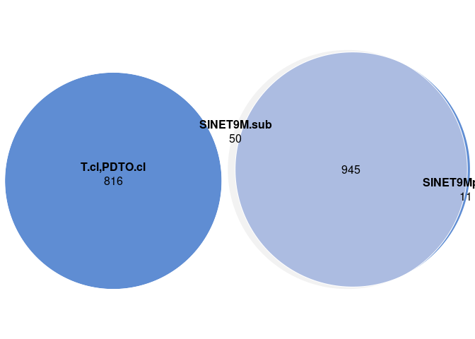
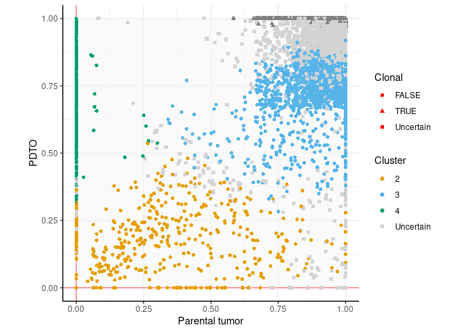
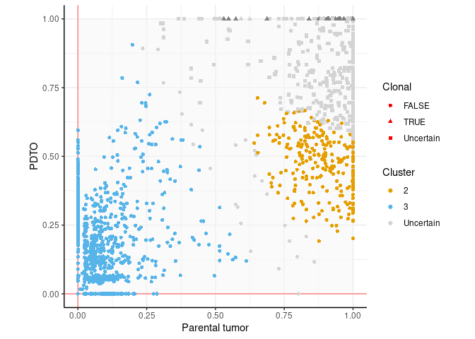

# Code to produce Figs. 5 and S5 from Dayton et al. (Submitted)

## load libraries 

```r
library(tidyverse)
library(readxl)
library(ggnewscale)
library(DPClust)
library(ggpubr)
library(eulerr)
```


## Create useful vectors
Colors for each experiment (organoid and parental tumor families), LNEN clusters and SI groups:

```r
colors_org = c(LNET2="#aade87ff",LNET6="#5fd38dff",LNET13="#16502dff",LNET14="#6f917cff",
               LNET5="#e6a73cff",LNET10="#ff9955ff",LNET15="#ffd42aff", LNET16 = "#ff6600ff", LNET18= "#d0742fff", 
               LNET19="#2aff80ff", 
               LNET20 = "#f6e62bff", 
               LCNEC3="#ff8080ff",LCNEC4="#d35f5fff", LCNEC23 = "#ff5555ff", 
               LCNEC11="#ff5599ff",PANEC1="#8d5fd3ff",
               SINET7="#2ad4ffff",SINET8="#80b3ffff",SINET9="#5f8dd3ff",SINET12="#5fbcd3ff", SINET21="#0066ffff", SINET22="#2c5aa0ff")

colors_clusters = c("Uncertain"="lightgray", "1"="#000000", "2"="#E69F00", "3"="#56B4E9", "4"="#009E73", "5"="#F0E442", "6"="#0072B2", "7"="#D55E00", "8"="#CC79A7","9"="black") 
```

## Read metadata
Read data from CNV summary (from TableS4, sheet 5), containing sample, sex, and ploidy info

```r
CNVsummary = read_xlsx("TableS4.xlsx",sheet=5,skip=2) %>%
  mutate(experiment=str_remove(tumor_id,"[TNM][p0-9.]*$")) %>% arrange(experiment,tumor_id)
experiments = unique(CNVsummary$experiment)
```

## Pre-process data 
We start from the VCFs with somatic mutations and copy number calls (from manuscript TableS4) and run the script Fig5_S5_preproc.R (adapted from the preprocessing of ascat files from the dpclust github repository https://github.com/Wedge-lab/dpclust3p/blob/master/inst/example/preproc_pipeline_ascat_simple.R). The script also uses the fasta index file used for alignment to retrieve chromosome lists (here hs38DH.fa.fai, available from the bwakit github repo https://github.com/lh3/bwa/tree/master/bwakit), and a file listing chromosomes to ignore (all except the main assembly chromosomes here).


```r
vcfs = list.files("vcf",pattern = "vcf.gz$",full.names = T)

for(i in (1:length(experiments)) ){
  opt=list(samplename=unique(CNVsummary$experiment)[i],alignfolder="CRAM/",
         vcf=vcfs[i], 
         copynumber="TableS4.xlsx",
         sex=tolower(unique(CNVsummary$gender[CNVsummary$experiment==unique(CNVsummary$experiment)[i]])),
         output="/data/lungNENomics/work/organoids/evolution/DPclust/",
         fai="hs38DH.fa.fai",
         ign_file = "ign_file")

  source("Fig5_S5_preproc.R")
}
```
We remove the "chr" prefix from the DPclust files to avoid incompatibilities with the package

```r
system("for file in `ls *allDirichletProcessInfo.txt`; do sed -i '2,$s/chr//g' $file; done")
```

We create DPclust master files with info on file location for each sample

```r
rp_files = list.files("/data/lungNENomics/work/organoids/evolution/DPclust/",pattern = "rho_and_psi",full.names = T)

for(i in 1:length(experiments) ){
  samples.tmp = CNVsummary$tumor_id[CNVsummary$experiment==experiments[i]]
  opt = list(samplenames=paste0(samples.tmp,collapse = ",") , 
             donornames = paste(rep(experiments[i], length( samples.tmp )),collapse = "," ),
             rho_and_psi=paste(rp_files[str_detect( rp_files, experiments[i] )],collapse = ","),
             sex=tolower(CNVsummary$gender[CNVsummary$experiment==experiments[i]]),
             output=paste0("/data/lungNENomics/work/organoids/evolution/DPclust/", experiments[i], "_DPmasterfile.txt") ) 
  source("preproc_dpclust_master_file.R")
}
```

## Run DPClust
We first set parameter values, and then run the pipeline from  https://github.com/Wedge-lab/dpclust/blob/master/inst/example/dpclust_pipeline.R

```r
masterfiles = list.files("/data/lungNENomics/work/organoids/evolution/DPclust/","DPmasterfile.txt",full.names = T)

for(i in 1:length(masterfiles)){
  opt = list(run_sample= 1,
           data_path="/data/lungNENomics/work/organoids/evolution/DPclust/",
           outputdir="/data/lungNENomics/work/organoids/evolution/DPclust/",
           input=masterfiles[i],
           keep_temp_files=TRUE,
           analysis_type="nd_dp", 
           iterations=2000, burnin=1000,
           mut_assignment_type=1,
           min_muts_cluster=-1,min_frac_muts_cluster=0.01,num_muts_sample=50000,bin_size=NULL,seed=123, 
           assign_sampled_muts=TRUE )

  source("dpclust_pipeline.R")
}
```

## Analyze DPClust results
We first load the list of driver mutations from Table S4 in order to assess their clonality

```r
NENdrivers = read_xlsx("TableS4.xlsx",sheet=3,skip=1)
drivermuts = read_xlsx("TableS4.xlsx",sheet=1,skip=1) %>% filter(Hugo_Symbol %in% NENdrivers$`Gene name`)
```

### Pre-processing
We load the results for each sample, detect clonal clusters (if any) as those with a CCF greater than or equal to 0.95 in all samples, and classify alterations as clonal or subclonal using a 0.95 likelihood cutoff of belonging to a clonal or subclonal cluster. 


```r
DPclustsres.files = list.files("/data/lungNENomics/work/organoids/evolution/DPclust/",pattern = "bestConsensusResults.RData",recursive = T,all.files = F,full.names = T)
DPclustsres.files.names = str_extract(list.files("/data/lungNENomics/work/organoids/evolution/DPclust/",pattern = "bestConsensusResults.RData",recursive = T,all.files = F),"^[A-Z]+[0-9]+")

subclrect <- data.frame (xmin=0, xmax=1, ymin=0, ymax=1)

dataset_fracs_list=vector("list",length(DPclustsres.files))

for(i in 1:length(DPclustsres.files)){
  load(DPclustsres.files[i])
  # find cluster names
  masterfile = read_tsv(paste0("/data/lungNENomics/work/organoids/evolution/DPclust/",DPclustsres.files.names[i],"_DPmasterfile.txt"))
  dataset_fracs = bind_cols(chr=dataset$chromosome[,1] , pos=dataset$position[,1], subclonal.fractions=dataset$subclonal.fraction , best.assignment.likelihoods=clustering$best.assignment.likelihoods, all.assignment.likelihoods=clustering$all.assignment.likelihoods  , Cluster=clustering$best.node.assignments, DP=dataset$WTCount+dataset$mutCount)
  colnames(dataset_fracs$subclonal.fractions) = masterfile$subsample
  # merge clonal clusters
  clonalclusts = clustering$cluster.locations$V1[which(rowMeans(clustering$cluster.locations[,-c(1,ncol(clustering$cluster.locations))]>0.95)==1)]
  ## set cluster numbering to 1 for all clonal clusters
  dataset_fracs$Cluster[dataset_fracs$Cluster%in%clonalclusts] = 1
  # find alterations belonging to a clonal cluster
  dataset_fracs$Clonal = NA
  if(length(clonalclusts)==0){#when no clonal cluster detected, all alterations are considered subclonal
    dataset_fracs$Clonal = FALSE
  }else{
    if(length(clonalclusts)>1){#when there are multiple clonal clusters, sum their likelihoods
    dataset_fracs$Clonal[rowSums(dataset_fracs$all.assignment.likelihoods[,clonalclusts])>=0.95 ] = TRUE
    dataset_fracs$Clonal[rowSums(dataset_fracs$all.assignment.likelihoods[,-clonalclusts])>=0.95 ] = FALSE
  }else{#when there is a single clonal cluster, use its likelihood
    dataset_fracs$Clonal[dataset_fracs$all.assignment.likelihoods[,clonalclusts]>=0.95 ] = TRUE
    if(ncol(dataset_fracs$all.assignment.likelihoods)>2){# if there more than 1 subclonal cluster, sum their likelihoods
      dataset_fracs$Clonal[rowSums(dataset_fracs$all.assignment.likelihoods[,-clonalclusts])>=0.95 ] = FALSE
    }else{# when there is a single subclonal cluster, use its likelihood
      dataset_fracs$Clonal[dataset_fracs$all.assignment.likelihoods[,-clonalclusts]>=0.95 ] = FALSE
    }
  }
  }
  dataset_fracs_list[[i]] = dataset_fracs
}
```

### Fig. 5A and S5B: Venn-Euler diagrams of shared clonal and subclonal alterations
We create Venn-Euler diagram of shared and private mutations in clonal and subclonal alterations with a minimum DP of 30

```r
for(i in 1:length(DPclustsres.files)){
  ## clonal alterations
  n.cl = c("T.cl&PDTO.cl" = sum( dataset_fracs_list[[i]]$Clonal & rowMeans(dataset_fracs_list[[i]]$DP>=30)==1,na.rm=T) ) 
  ## subclonal alterations
  if(ncol(dataset_fracs_list[[i]]$subclonal.fractions)==2){#case of 2 samples
    n.subcl = c(sum( !dataset_fracs_list[[i]]$Clonal & rowMeans(dataset_fracs_list[[i]]$DP>=30)==1 & 
                          dataset_fracs_list[[i]]$subclonal.fractions[,1]>0 & dataset_fracs_list[[i]]$subclonal.fractions[,2]==0,na.rm=T), 
              sum( !dataset_fracs_list[[i]]$Clonal & rowMeans(dataset_fracs_list[[i]]$DP>=30)==1 & 
                          dataset_fracs_list[[i]]$subclonal.fractions[,1]==0 & dataset_fracs_list[[i]]$subclonal.fractions[,2]>0,na.rm=T), 
              sum( !dataset_fracs_list[[i]]$Clonal & rowMeans(dataset_fracs_list[[i]]$DP>=30)==1 & 
                          dataset_fracs_list[[i]]$subclonal.fractions[,1]>0 & dataset_fracs_list[[i]]$subclonal.fractions[,2]>0,na.rm=T)
    )
    names(n.subcl) = c(paste0( colnames(dataset_fracs_list[[i]]$subclonal.fractions)[1], ".sub") , 
                       paste0( colnames(dataset_fracs_list[[i]]$subclonal.fractions)[2], ".sub"),  
                       paste(paste0( colnames(dataset_fracs_list[[i]]$subclonal.fractions)[1:2], ".sub"),collapse = "&") )
  }else{#case of 3 samples
    n.subcl = c("T.sub"    = sum( !dataset_fracs_list[[i]]$Clonal & rowMeans(dataset_fracs_list[[i]]$DP>=30)==1 & 
                          dataset_fracs_list[[i]]$subclonal.fractions[,1]>0 & dataset_fracs_list[[i]]$subclonal.fractions[,2]==0 & dataset_fracs_list[[i]]$subclonal.fractions[,3]==0,na.rm=T), 
              "PDTO.sub" = sum( !dataset_fracs_list[[i]]$Clonal & rowMeans(dataset_fracs_list[[i]]$DP>=30)==1 & 
                          dataset_fracs_list[[i]]$subclonal.fractions[,1]==0 & dataset_fracs_list[[i]]$subclonal.fractions[,2]>0 & dataset_fracs_list[[i]]$subclonal.fractions[,3]==0,na.rm=T), 
              "PDTO2.sub" = sum( !dataset_fracs_list[[i]]$Clonal & rowMeans(dataset_fracs_list[[i]]$DP>=30)==1 & 
                          dataset_fracs_list[[i]]$subclonal.fractions[,1]==0 & dataset_fracs_list[[i]]$subclonal.fractions[,2]==0 & dataset_fracs_list[[i]]$subclonal.fractions[,3]>0,na.rm=T), 
              "T.sub&PDTO.sub"= sum( !dataset_fracs_list[[i]]$Clonal & rowMeans(dataset_fracs_list[[i]]$DP>=30)==1 & 
                          dataset_fracs_list[[i]]$subclonal.fractions[,1]>0 & dataset_fracs_list[[i]]$subclonal.fractions[,2]>0 & dataset_fracs_list[[i]]$subclonal.fractions[,3]==0,na.rm=T),
              "T.sub&PDTO2.sub"= sum( !dataset_fracs_list[[i]]$Clonal & rowMeans(dataset_fracs_list[[i]]$DP>=30)==1 & 
                          dataset_fracs_list[[i]]$subclonal.fractions[,1]==0 & dataset_fracs_list[[i]]$subclonal.fractions[,2]>0 & dataset_fracs_list[[i]]$subclonal.fractions[,3]>0,na.rm=T),
              "PDTO.sub&PDTO2.sub"= sum( !dataset_fracs_list[[i]]$Clonal & rowMeans(dataset_fracs_list[[i]]$DP>=30)==1 & 
                          dataset_fracs_list[[i]]$subclonal.fractions[,1]==0 & dataset_fracs_list[[i]]$subclonal.fractions[,2]>0 & dataset_fracs_list[[i]]$subclonal.fractions[,3]>0,na.rm=T),
              "T.sub&PDTO.sub&PDTO2.sub"= sum( !dataset_fracs_list[[i]]$Clonal & rowMeans(dataset_fracs_list[[i]]$DP>=30)==1 & 
                          dataset_fracs_list[[i]]$subclonal.fractions[,1]>0 & dataset_fracs_list[[i]]$subclonal.fractions[,2]>0 & dataset_fracs_list[[i]]$subclonal.fractions[,3]>0,na.rm=T)
    )
    names(n.subcl) = c(paste0( colnames(dataset_fracs_list[[i]]$subclonal.fractions)[1], ".sub") , 
                       paste0( colnames(dataset_fracs_list[[i]]$subclonal.fractions)[2], ".sub"),
                       paste0( colnames(dataset_fracs_list[[i]]$subclonal.fractions)[3], ".sub"),
                       paste(paste0( colnames(dataset_fracs_list[[i]]$subclonal.fractions)[1:2], ".sub"),collapse = "&"),
                       paste(paste0( colnames(dataset_fracs_list[[i]]$subclonal.fractions)[c(1,3)], ".sub"),collapse = "&"),
                       paste(paste0( colnames(dataset_fracs_list[[i]]$subclonal.fractions)[2:3], ".sub"),collapse = "&"),
                       paste(paste0( colnames(dataset_fracs_list[[i]]$subclonal.fractions)[1:3], ".sub"),collapse = "&"))
  }
  
e.tmp = euler(c(n.cl,n.subcl))

pdf(paste0("/data/lungNENomics/work/organoids/figures/Fig5A_S5B_euler_",DPclustsres.files.names[i],".pdf"),width = 1.7,height = 1.7)
print(plot(e.tmp,quantities=T,
     fills = c(rep(colors_org[DPclustsres.files.names[i]],2),"#eeeeeecc",rep(colors_org[DPclustsres.files.names[i]],2) ), 
     shape = "ellipse",col="white"))
dev.off()

print(plot(e.tmp,quantities=T,
     fills = c(rep(colors_org[DPclustsres.files.names[i]],2),"#eeeeeecc",rep(colors_org[DPclustsres.files.names[i]],2) ), 
     shape = "ellipse",col="white"))
}
```

<!-- --><!-- --><!-- --><!-- --><!-- --><!-- --><!-- --><!-- --><!-- --><!-- -->

### Fig. S5A: CCF plots

We extract high-confidence clusters by finding independent clusters containing at least 1% of alterations assigned to a cluster with high confidence, merge interdependent clusters (with highligly correlated values), remove alterations in low coverage regions (less than 30 DP), and assign alterations to clusters using a cutoff of 95% likelihood. We then plot pairwise CCF values coloring points based on their cluster:

```r
for(i in 1:length(DPclustsres.files)){
  load(DPclustsres.files[i])
  # merge clusters with uncertain clustering
  corassign = cor(clustering$all.assignment.likelihoods>=0.05)
  corassign[lower.tri(corassign,diag = T)] = 0
  highcor.clusts = which(corassign  >0.5,arr.ind = T) # clusters with highly correlated non-zero attributions
  if(nrow(highcor.clusts)>0){
    dataset_fracs_list[[i]]$Cluster[rowSums(clustering$all.assignment.likelihoods[,highcor.clusts[1,]])>=0.95] = paste0(clustering$cluster.locations$V1[highcor.clusts],collapse = "-")
  dataset_fracs_list[[i]]$best.assignment.likelihoods[rowSums(clustering$all.assignment.likelihoods[,highcor.clusts[1,]])>=0.95] = rowSums(clustering$all.assignment.likelihoods[,highcor.clusts[1,]])[rowSums(clustering$all.assignment.likelihoods[,highcor.clusts[1,]])>=0.95]
  }
  dataset_fracs_list[[i]]$Cluster[dataset_fracs_list[[i]]$best.assignment.likelihoods<0.95 | is.na(dataset_fracs_list[[i]]$best.assignment.likelihoods)] = "Uncertain"
  # remove low coverage mutations
  dataset_fracs_list[[i]] = dataset_fracs_list[[i]][rowMeans(dataset_fracs_list[[i]]$DP>=30)==1,]
  
  clust_prop = table(dataset_fracs_list[[i]]$Cluster[dataset_fracs_list[[i]]$Cluster!="Uncertain"])/sum(dataset_fracs_list[[i]]$Cluster!="Uncertain") # proportion of high-confidence mutations in each cluster
  dataset_fracs_list[[i]]$Cluster[!dataset_fracs_list[[i]]$Cluster %in% names(clust_prop[clust_prop>=0.01])] = "Uncertain" # remove clusters with less than 1% of mutations assigned with high confidence
  
  # set to 1 CCF>1
  dataset_fracs_list[[i]]$subclonal.fractions[dataset_fracs_list[[i]]$subclonal.fractions>1] = 1
  
  # rename clusters to have contiguous numbers
  dataset_fracs_list[[i]]$Cluster = as.numeric(factor(dataset_fracs_list[[i]]$Cluster))
  dataset_fracs_list[[i]]$Cluster[dataset_fracs_list[[i]]$Cluster==max(dataset_fracs_list[[i]]$Cluster)] = "Uncertain"
  # Rename uncertain clonality
  dataset_fracs_list[[i]]$Clonal[is.na(dataset_fracs_list[[i]]$Clonal)] = "Uncertain"
  
  # find driver alterations
  drivermuts.tmp = drivermuts %>% filter(str_detect(Tumor_Sample_Barcode,DPclustsres.files.names[i])) %>% mutate(Chromosome=str_remove(Chromosome,"chr"))
  drivermuts.tmp = drivermuts.tmp[!duplicated(drivermuts.tmp[,c(1:5)]),]
  wh.drivermut = sapply(1:nrow(drivermuts.tmp), function(j){
    res=which(dataset_fracs_list[[i]]$chr==drivermuts.tmp$Chromosome[j] &
                dataset_fracs_list[[i]]$pos==drivermuts.tmp$End_Position[j]);if(length(res)==0){res=NA};return(res)} )
  if(all(is.na(wh.drivermut))){
    dataset_fracs.drivermuts = dataset_fracs_list[[i]][1,]
    for(k in 1:length(dataset_fracs.drivermuts$subclonal.fractions)) dataset_fracs.drivermuts$subclonal.fractions[k]=-1
    dataset_fracs.drivermuts$Gene = ""
  }else{
    dataset_fracs.drivermuts = dataset_fracs_list[[i]][wh.drivermut,]
    dataset_fracs.drivermuts$Gene = drivermuts.tmp$Hugo_Symbol
  }
  
  # plot
  FigS5A <-  ggplot(dataset_fracs_list[[i]], aes(x=subclonal.fractions[,1],y=subclonal.fractions[,2],col=Cluster,shape=Clonal)) + 
    geom_rect(data = subclrect , mapping = aes(xmin=xmin,xmax=xmax,ymin=ymin,ymax=ymax),fill= "#f5f5f588", inherit.aes = F) + 
    geom_vline(xintercept = 0,col="#ff8080ff") + geom_hline(yintercept = 0,col="#ff8080ff") + geom_point() +
    scale_color_manual(values = colors_clusters[sort(unique(dataset_fracs_list[[i]]$Cluster[dataset_fracs_list[[i]]$Cluster!=1]))]) + 
    geom_point( data = dataset_fracs.drivermuts, color="red" ) + 
    geom_text(data = dataset_fracs.drivermuts, aes(label=Gene),col="red" , face="italic", vjust = "inward" , hjust = 'inward') +
    theme_classic() + grids() + coord_fixed(xlim = c(0,1),ylim=c(0,1)) + xlab("Parental tumor") + ylab("PDTO")
  
  if(ncol(dataset_fracs_list[[i]]$subclonal.fractions)>2){
   FigS5Ab <-  ggplot(dataset_fracs_list[[i]] ,aes(x=subclonal.fractions[,1],y=subclonal.fractions[,3],col=Cluster)) + 
    geom_rect(data = subclrect , mapping = aes(xmin=xmin,xmax=xmax,ymin=ymin,ymax=ymax),fill= "#f5f5f588", inherit.aes = F) + 
    geom_vline(xintercept = 0,col="#ff8080ff") + geom_hline(yintercept = 0,col="#ff8080ff") + geom_point() +
    scale_color_manual(values = colors_clusters[sort(unique(dataset_fracs_list[[i]]$Cluster[dataset_fracs_list[[i]]$Cluster!=1]))]) + 
    geom_point( data = dataset_fracs.drivermuts, color="red" ) + geom_text(data = dataset_fracs.drivermuts, aes(label=Gene),col="red" , vjust = "inward" , hjust = 'inward') +
    theme_classic() + grids() + coord_fixed(xlim = c(0,1),ylim=c(0,1)) + xlab("Parental tumor") + ylab("PDTO")
  
    ggsave( filename = paste0("/data/lungNENomics/work/organoids/figures/FigS5A_draft_",DPclustsres.files.names[i],"2.svg"), FigS5Ab, width = 3.5,height = 3.5) 
    print(FigS5Ab)
  }
  
  ggsave( filename = paste0("/data/lungNENomics/work/organoids/figures/FigS5A_draft_",DPclustsres.files.names[i],".svg"), FigS5A, width = 3.5,height = 3.5)
  print(FigS5A)
  
   write_tsv( file = paste0("/data/lungNENomics/work/organoids/evolution/DPclust/",DPclustsres.files.names[i],"_clustersRefined.tsv"),
              x = dataset_fracs_list[[i]] %>% do.call(data.frame, .) %>% as_tibble )
}
```

<!-- --><!-- --><!-- --><!-- --><!-- --><!-- --><!-- --><!-- --><!-- --><!-- --><!-- --><!-- --><!-- -->

## Fig. 5D and S5F: Genetic diversity metrics


## Fig. 5D and S5E: Natural selection estimation


## Fig. 5C and S5D: Fishplots of subclonal temporal dynamics


## Session Info 

```r
sessionInfo()
```

```
## R version 4.1.2 (2021-11-01)
## Platform: x86_64-pc-linux-gnu (64-bit)
## Running under: CentOS Linux 7 (Core)
## 
## Matrix products: default
## BLAS/LAPACK: /usr/lib64/libopenblasp-r0.3.3.so
## 
## locale:
##  [1] LC_CTYPE=en_US.UTF-8       LC_NUMERIC=C              
##  [3] LC_TIME=en_US.UTF-8        LC_COLLATE=en_US.UTF-8    
##  [5] LC_MONETARY=en_US.UTF-8    LC_MESSAGES=en_US.UTF-8   
##  [7] LC_PAPER=en_US.UTF-8       LC_NAME=C                 
##  [9] LC_ADDRESS=C               LC_TELEPHONE=C            
## [11] LC_MEASUREMENT=en_US.UTF-8 LC_IDENTIFICATION=C       
## 
## attached base packages:
## [1] stats4    stats     graphics  grDevices utils     datasets  methods  
## [8] base     
## 
## other attached packages:
##  [1] optparse_1.7.1              dpclust3p_1.0.8            
##  [3] reshape2_1.4.4              VariantAnnotation_1.40.0   
##  [5] Rsamtools_2.10.0            Biostrings_2.62.0          
##  [7] XVector_0.34.0              SummarizedExperiment_1.24.0
##  [9] Biobase_2.54.0              GenomicRanges_1.46.1       
## [11] GenomeInfoDb_1.30.1         IRanges_2.28.0             
## [13] S4Vectors_0.32.4            MatrixGenerics_1.6.0       
## [15] matrixStats_0.62.0          BiocGenerics_0.40.0        
## [17] eulerr_6.1.1                ggpubr_0.4.0               
## [19] DPClust_2.2.8               gridExtra_2.3              
## [21] lattice_0.20-45             ks_1.13.5                  
## [23] KernSmooth_2.23-20          ggnewscale_0.4.6           
## [25] readxl_1.4.0                forcats_0.5.1              
## [27] stringr_1.4.0               dplyr_1.0.9                
## [29] purrr_0.3.4                 readr_2.1.2                
## [31] tidyr_1.2.0                 tibble_3.1.7               
## [33] ggplot2_3.3.6               tidyverse_1.3.1            
## 
## loaded via a namespace (and not attached):
##   [1] backports_1.4.1          BiocFileCache_2.2.1      systemfonts_1.0.4       
##   [4] plyr_1.8.6               polylabelr_0.2.0         BiocParallel_1.28.3     
##   [7] digest_0.6.29            htmltools_0.5.2          fansi_1.0.3             
##  [10] magrittr_2.0.3.9000      memoise_2.0.1            BSgenome_1.62.0         
##  [13] tzdb_0.3.0               modelr_0.1.8             vroom_1.5.7             
##  [16] svglite_2.1.0            prettyunits_1.1.1        colorspace_2.0-3        
##  [19] blob_1.2.3               rvest_1.0.2              rappdirs_0.3.3          
##  [22] haven_2.5.0              xfun_0.31                crayon_1.5.1            
##  [25] RCurl_1.98-1.7           jsonlite_1.8.0           glue_1.6.2              
##  [28] polyclip_1.10-0          gtable_0.3.0             zlibbioc_1.40.0         
##  [31] DelayedArray_0.20.0      car_3.0-12               abind_1.4-5             
##  [34] scales_1.2.0             mvtnorm_1.1-3            DBI_1.1.3               
##  [37] rstatix_0.7.0            Rcpp_1.0.8.3             progress_1.2.2          
##  [40] bit_4.0.4                mclust_5.4.9             httr_1.4.3              
##  [43] getopt_1.20.3            ellipsis_0.3.2           pkgconfig_2.0.3         
##  [46] XML_3.99-0.9             farver_2.1.0             sass_0.4.1              
##  [49] dbplyr_2.2.1             utf8_1.2.2               tidyselect_1.1.2        
##  [52] labeling_0.4.2           rlang_1.0.4              AnnotationDbi_1.56.2    
##  [55] munsell_0.5.0            cellranger_1.1.0         tools_4.1.2             
##  [58] cachem_1.0.6             cli_3.3.0                generics_0.1.2          
##  [61] RSQLite_2.2.14           broom_0.8.0              evaluate_0.15           
##  [64] fastmap_1.1.0            yaml_2.3.5               knitr_1.38              
##  [67] bit64_4.0.5              fs_1.5.2                 KEGGREST_1.34.0         
##  [70] pracma_2.3.8             xml2_1.3.3               biomaRt_2.50.3          
##  [73] compiler_4.1.2           rstudioapi_0.13          filelock_1.0.2          
##  [76] curl_4.3.2               png_0.1-7                ggsignif_0.6.3          
##  [79] reprex_2.0.1             bslib_0.3.1              stringi_1.7.6           
##  [82] highr_0.9                GenomicFeatures_1.46.5   Matrix_1.4-1            
##  [85] vctrs_0.4.1              pillar_1.7.0             lifecycle_1.0.1         
##  [88] jquerylib_0.1.4          bitops_1.0-7             rtracklayer_1.54.0      
##  [91] R6_2.5.1                 BiocIO_1.4.0             assertthat_0.2.1        
##  [94] rjson_0.2.21             withr_2.5.0              GenomicAlignments_1.30.0
##  [97] GenomeInfoDbData_1.2.7   parallel_4.1.2           hms_1.1.1               
## [100] grid_4.1.2               rmarkdown_2.14           carData_3.0-5           
## [103] lubridate_1.8.0          restfulr_0.0.13
```
